# Akira Ransomware

[English](./CMDB-TR-006-Akira-Report-EN.md) | **Português (Brasil)**

> **Universidade Federal de Pernambuco — UFPE**  
> **Centro de Tecnologia e Geociências — CTG**  
> **Pós-Graduação Lato Sensu em Segurança Ofensiva e Inteligência Cibernética**  
> **Caatinga Malware DB (CMDB) · Relatório técnico acadêmico**

**Subtítulo:** análise dinâmica comparativa e limites do Avast Decryption Tool em Windows 7

**Romário J. O. Veloso¹**

¹ Bacharelando em Engenharia Eletrônica, Universidade Federal de Pernambuco (UFPE), Recife — PE, Brasil.

> **Aviso de segurança:** este documento registra experimentos já realizados com software malicioso para estudo e defesa. Não execute amostras fora de laboratório isolado, autorizado e preparado para restauração.

Modelo adaptado do *Cyber Malware Analysis Report Template v1* (2021), da [FIRST Malware Analysis SIG](https://www.first.org/global/sigs/malware/ma-framework/), e da estrutura editorial da UFPE/CTG adotada pelo projeto.

## Controle do documento

| Campo | Informação |
|---|---|
| Identificador | `CMDB-TR-006` |
| Versão | `0.1.0` |
| Data de publicação | `2026-09-01` |
| Estado editorial | Rascunho |
| Local | Recife — PE, Brasil |

## Como citar

> VELOSO, Romário J. O. **Akira Ransomware: análise dinâmica comparativa e limites do Avast Decryption Tool em Windows 7**. Caatinga Malware DB (CMDB). Recife: UFPE/CTG, 2026. Relatório técnico `CMDB-TR-006`, versão 0.1.0. Disponível em: [URL permanente após publicação]. Acesso em: [data].

## Controle de versões

| Versão | Data | Descrição da alteração | Responsável |
|---|---|---|---|
| 0.1.0 | 2026-09-01 | Organização inicial do relatório, separação dos dois ensaios e seleção das evidências. | Romário J. O. Veloso |

## Assinatura da versão

| Papel | Nome | Data | Versão validada |
|---|---|---|---|
| Autor responsável | Romário J. O. Veloso | Pendente | — |
| Revisor técnico | Pendente | — | — |
| Orientador ou docente responsável, quando aplicável | Pendente | — | — |
| Aprovação editorial do CMDB | Pendente | — | — |

- **Artefato versionado:** `CMDB-TR-006-Akira-Report-pt-BR.md`, versão `0.1.0`.
- **Amostras:** não incluídas junto ao relatório.

## Sumário

1. [Resumo](#1-resumo)
2. [Aviso legal](#2-aviso-legal)
3. [O que é o malware analisado](#3-o-que-é-o-malware-analisado)
4. [Atividades realizadas](#4-atividades-realizadas)
5. [Ambiente de laboratório](#5-ambiente-de-laboratório)
6. [Evidências da análise dinâmica](#6-evidências-da-análise-dinâmica)
7. [Conclusão](#7-conclusão)
8. [Referências](#8-referências)

## 1. Resumo

Este relatório documenta dois ensaios acadêmicos distintos com amostras atribuídas ao ransomware Akira em uma máquina virtual Windows 7. No primeiro, foram observados arquivos com extensão `.akira`, notas de resgate com ameaças de divulgação de dados e uma falha de inicialização do Microsoft Edge coincidente com a cifragem de arquivos auxiliares do navegador. Uma amostra de 2023, cujo SHA-256 consta no manual oficial do Avast Decryption Tool, foi reconhecida pela ferramenta: um par formado pelo arquivo cifrado e pelo original permitiu localizar o parâmetro de recuperação, e a interface informou `790/790` arquivos decifrados. A inspeção visual mostrou miniaturas novamente renderizadas, mas não foram preservados hashes posteriores; o resultado é, portanto, uma recuperação funcional aparente, e não prova de igualdade byte a byte. No segundo ensaio, a ferramenta não reconheceu um arquivo produzido pela amostra `def3fe8d07d5370ac6e105b1a7872c77e193b4b39a6e1cc9cfc815a36e909904.exe`, registrada no MalwareBazaar em 2025. A diferença de tamanho de 592 bytes anotada nesse ensaio diverge do rodapé de 534 bytes documentado para a geração inicial, mas não determina, isoladamente, a variante nem a causa da incompatibilidade. Os resultados evidenciam que decifradores dependem da geração e da construção criptográfica do ransomware e que SHA-256, registros de origem e logs completos são indispensáveis para sustentar uma conclusão de recuperação integral.

**Palavras-chave:** Akira; ransomware; análise dinâmica; decifragem; SHA-256; recuperação de arquivos.

## 2. Aviso legal

Este relatório destina-se ao ensino, à pesquisa e à defesa cibernética. Aplicam-se o [aviso legal](../../../DISCLAIMER.pt-BR.md), as [orientações de segurança](../../../SECURITY.pt-BR.md) e as regras de acesso e uso do repositório.

Os nomes, hashes e links são apresentados para identificação, rastreabilidade e defesa. O documento não autoriza execução em sistemas de terceiros, evasão de controles, propagação ou uso ofensivo não consentido. As ações são descritas no passado como registro do laboratório, não como instruções de ativação do malware.

## 3. O que é o malware analisado

O Akira é uma operação de ransomware observada desde março de 2023. A geração inicial possuía binários Windows de 64 bits escritos em C++, e uma implementação Linux surgiu posteriormente. O esquema descrito pela equipe da Avast para essa geração utilizava ChaCha 2008 para cifrar dados e RSA-4096 para proteger a chave simétrica anexada aos arquivos [2]. O alerta conjunto atualizado por autoridades norte-americanas registra a evolução da família para diferentes implementações e extensões, além do uso de dupla extorsão, combinando cifragem e ameaça de divulgação de dados [1].

A Avast lançou em 2023 um decifrador que explorava uma falha presente em versões iniciais. Os operadores corrigiram essa falha, e a própria interface alerta que variantes posteriores ao período suportado não podem ser recuperadas pela ferramenta [2, 3]. Por isso, a extensão `.akira` ou a disponibilidade de um arquivo original correspondente não comprovam compatibilidade com o decifrador.

Este laboratório executou diretamente arquivos já obtidos para análise. Ele não reproduziu nem avaliou as técnicas de acesso inicial, movimentação lateral ou exfiltração descritas em incidentes reais.

## 4. Atividades realizadas

- Foram comparados dois ensaios independentes, um com uma amostra de 2023 e outro com uma amostra registrada em 2025.
- Um arquivo de referência foi preservado fora da área de trabalho infectada e transportado por mídia óptica virtual junto a seu manifesto SHA-256.
- O Avast Decryption Tool for Akira foi avaliado com pares conhecidos formados por arquivo original e arquivo cifrado.
- Foram registrados os resultados declarados pela ferramenta, as limitações do par escolhido e a inspeção visual posterior.
- O catálogo do No More Ransom e o manual oficial do decifrador [4, 5], os registros do MalwareBazaar [6, 7] e orientações defensivas oficiais [1–3] foram consultados para correlacionar as amostras e interpretar os resultados.

### 4.1. Rastreabilidade das amostras

| Campo | Ensaio A — geração inicial | Ensaio B — amostra recente |
|---|---|---|
| Nome do arquivo | `1b6af2fbbc636180dd7bae825486ccc45e42aefbb304d5f83fafca4d637c13cc.exe` | `def3fe8d07d5370ac6e105b1a7872c77e193b4b39a6e1cc9cfc815a36e909904.exe` |
| Objeto analisado | Executável extraído; pacote não disponibilizado nesta revisão | Executável extraído; pacote não disponibilizado nesta revisão |
| SHA-256 do pacote | Pendente — pacote efetivamente usado não foi preservado no relatório | Pendente — pacote efetivamente usado não foi preservado no relatório |
| SHA-256 do executável | `1b6af2fbbc636180dd7bae825486ccc45e42aefbb304d5f83fafca4d637c13cc` | `def3fe8d07d5370ac6e105b1a7872c77e193b4b39a6e1cc9cfc815a36e909904` |
| Estado do hash | Transcrito da fonte e do manual; não recalculado nesta revisão | Transcrito da fonte; não recalculado nesta revisão |
| SHA-1 | Não registrado | `fd623c62aa8c7319bf6e6a93ace9b30d82030269` |
| MD5 | Não registrado | `ae454079c93a7a1ce276756b9d62d196` |
| Fonte informada | MalwareBazaar | MalwareBazaar |
| Registro da fonte | [Amostra de 2023](https://bazaar.abuse.ch/sample/1b6af2fbbc636180dd7bae825486ccc45e42aefbb304d5f83fafca4d637c13cc/) | [Amostra de 2025](https://bazaar.abuse.ch/sample/def3fe8d07d5370ac6e105b1a7872c77e193b4b39a6e1cc9cfc815a36e909904/) |
| Primeiro registro na fonte | Não registrado nas notas | `2025-08-26 09:06:02 UTC`; não equivale à data de criação |
| Tamanho e tipo | A captura do autor mostra aproximadamente 573 KB; tamanho exato não registrado | 1.081.856 bytes; `exe`; MIME `application/x-dosexec`, segundo a fonte |
| Identificação independente | O SHA-256 aparece entre os indicadores Windows do manual oficial [5] | MalwareBazaar e mecanismos de análise vinculados ao registro [7] |
| Resultado do ensaio | Par reconhecido; recuperação funcional aparente | Arquivo cifrado não reconhecido pela ferramenta, segundo as notas do autor |

SHA-1 e MD5 são mantidos apenas para correlação com bases legadas. O SHA-256 é o identificador preferencial, mas um valor transcrito de uma fonte não substitui o cálculo sobre o arquivo efetivamente analisado.

### 4.2. Arquivos de referência e ferramentas

| Objeto | Registro |
|---|---|
| Arquivo de referência | ZIP de aproximadamente 4,5 GiB, preservado separadamente; esse tamanho foi uma escolha do ensaio, não requisito universal do decifrador |
| Manifesto | Arquivo `.sha256` visível na mídia; o valor e o resultado da verificação não foram preservados nas evidências fornecidas |
| Avast Decryption Tool | Versão `1.0.0.838 (64-bit)`, conforme a interface |
| Manual consultado | *User Manual — Akira Decryptor*, 10 páginas [5] |
| SHA-256 do manual local consultado | `e0585a803ab934fbc4d106eb9825fdc60307fcfade65248359ba4a5b27c0ae4e` |
| Geração da mídia | A invocação específica de `genisoimage` usada pelo autor recusou o arquivo maior que 4 GiB; `xorriso` produziu a imagem. Isso não estabelece um limite universal de todos os formatos ISO ou de todas as versões das ferramentas. Consulte o [guia de criação e validação de mídia ISO](../../guides/iso-media/CMDB-GD-004-ISO-Data-Media-Guide-pt-BR.md). |

### 4.3. Por que o arquivo original é necessário

O decifrador avaliado não trabalha apenas com a extensão `.akira`: para a geração vulnerável, ele solicita um **par conhecido**, formado pelo arquivo cifrado e pelo original exato que existia antes da cifragem [2, 5]. O conteúdo desse par permite à ferramenta procurar o parâmetro necessário à recuperação e calcular até que tamanho outros arquivos podem ser processados. Um arquivo diferente, ainda que possua nome, extensão ou tamanho semelhante, não constitui o mesmo original.

No ensaio, o original foi preservado fora da área infectada e uma cópia foi apresentada por uma ISO montada como mídia óptica. A ISO reduziu alterações acidentais no meio de transporte, mas não substituiu isolamento ou validação. O manifesto SHA-256 deveria demonstrar que a cópia transportada continuava idêntica à referência preservada e, depois da recuperação, permitir a comparação entre original e resultado.

Para repetir somente essa preparação com dados sintéticos e sem conteúdo pessoal, consulte:

- o [Guia CMDB de criação e preservação de dados sintéticos](../../guides/synthetic-reference-data/CMDB-GD-001-Synthetic-Reference-Data-Guide-pt-BR.md), que abrange o arquivo sintético e a cópia preservada;
- o [Guia CMDB de criação e validação de mídia ISO](../../guides/iso-media/CMDB-GD-004-ISO-Data-Media-Guide-pt-BR.md), que abrange o transporte somente leitura; e
- o [Guia CMDB de validação de recuperação com SHA-256](../../guides/sha256-validation/CMDB-GD-002-SHA256-Recovery-Validation-Guide-pt-BR.md), que diferencia identidade, integridade, recuperação parcial e resultado inconclusivo.

Esses guias documentam preparação e verificação defensivas; eles não orientam a obtenção ou a execução de malware.

## 5. Ambiente de laboratório

| Item | Descrição |
|---|---|
| Autorização e responsável | Atividade acadêmica informada pelo autor; responsável: Romário J. O. Veloso |
| Sistema operacional | Windows 7; edição, arquitetura e nível de atualização não registrados |
| Isolamento | Máquina virtual; hipervisor, versão, integrações e topologia não registrados |
| Transferência de dados | Imagem ISO montada como unidade óptica virtual; a captura demonstra a mídia montada, mas não valida sozinha seu conteúdo |
| Rede | Houve acesso a serviços web; segmentação e filtragem de saída não documentadas |
| Controles de segurança | Estado do UAC, Firewall do Windows e Windows Defender não registrado neste ensaio |
| Ferramentas | Avast Decryption Tool for Akira `1.0.0.838 (64-bit)`; `xorriso`; `genisoimage`; versões das duas últimas não registradas |
| Restauração | Snapshot ou imagem de restauração não documentados |
| Data da análise | `2026-08-31`, conforme as capturas |

As lacunas de configuração reduzem a reprodutibilidade. Uma mídia virtual somente leitura ajuda a preservar o arquivo nela gravado, mas não torna segura uma VM nem substitui segmentação, desativação de integrações host–convidado e restauração validada.

## 6. Evidências da análise dinâmica

As treze figuras abaixo foram selecionadas entre dezessete capturas do autor. Foram omitidas somente etapas redundantes. As figuras documentam apenas o **Ensaio A**. O resultado do Ensaio B está disponível nas notas do autor, sem captura correspondente neste conjunto.

### 6.1. Obtenção e identificação da amostra

O ensaio começou pela obtenção controlada da amostra de 2023 a partir do registro correspondente no MalwareBazaar [6]. O pacote exibido na pasta de downloads recebeu como nome o SHA-256 atribuído ao executável. Essa correspondência visual registra a procedência declarada, mas não substitui o cálculo local do hash do pacote e do executável extraído antes da análise.

**Figura 1 — Amostra de 2023 obtida a partir do registro do MalwareBazaar**

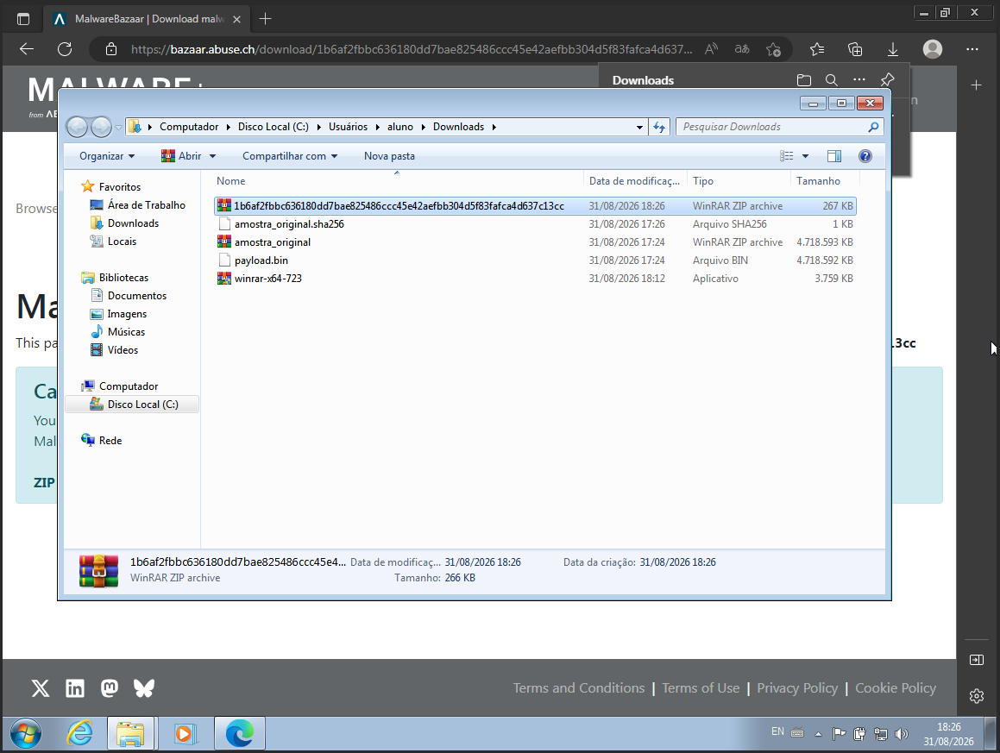

**Fonte:** Acervo do autor (2026).

### 6.2. Impacto observado

Logo após a execução, o laboratório registrou uma janela de console e uma mensagem do Windows informando ausência de disco na unidade `D:`. A relação temporal sustenta que o evento ocorreu durante o ensaio, mas a captura isolada não permite atribuir a causa exata nem afirmar que a mensagem seja um comportamento constante da família.

**Figura 2 — Estado observado imediatamente após a execução**

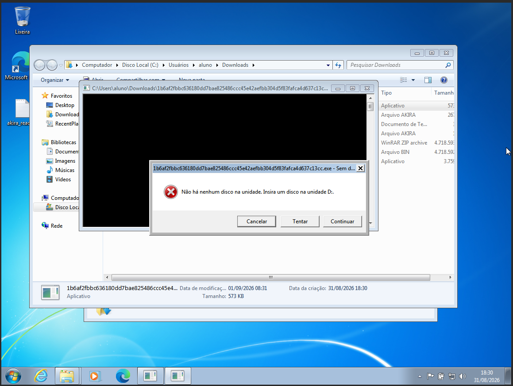

**Fonte:** Acervo do autor (2026).

O diretório de trabalho passou a apresentar o arquivo de referência e seu manifesto com a extensão `.akira`, além de notas `akira_readme`. Essa alteração é evidência visual do impacto sobre os objetos presentes no diretório; a extensão, isoladamente, não comprova qual algoritmo foi aplicado.

**Figura 3 — Arquivos com extensão `.akira` e notas de resgate**

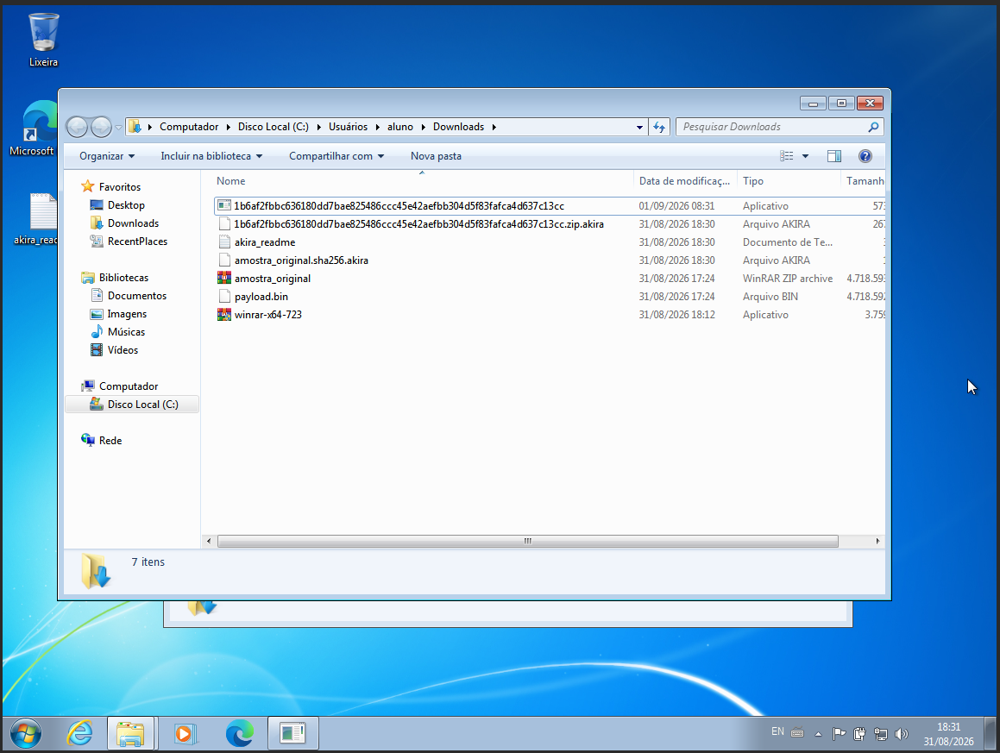

**Fonte:** Acervo do autor (2026).

A nota de resgate empregava pressão temporal e ameaçava vender ou divulgar informações caso não houvesse acordo. Esse discurso busca induzir medo, urgência e pagamento, compondo a dimensão de coerção psicológica da dupla extorsão descrita em alertas sobre o Akira [1]. A mensagem não comprova que exfiltração tenha ocorrido no laboratório. A figura preserva um endereço e um código gerados durante o ensaio exclusivamente como evidência histórica; eles não devem ser acessados ou reutilizados.

**Figura 4 — Linguagem coercitiva na nota de resgate**

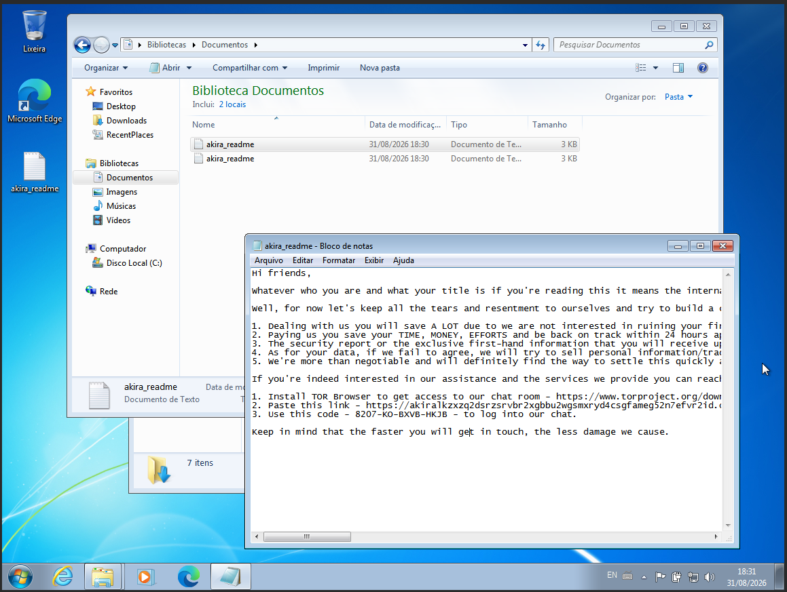

**Fonte:** Acervo do autor (2026).

Também foi registrada uma falha de inicialização do Microsoft Edge. No mesmo diretório da aplicação, arquivos auxiliares como `delegatedWebFeatures.sccd`, `master_preferences` e `msedge.VisualElementsManifest.xml` apareciam com o sufixo `.akira`, enquanto o Windows relatava configuração lado a lado incorreta. A evidência sustenta que dependências do navegador foram alteradas e que ele não iniciou naquele estado. Ela não demonstra que o executável principal tenha sido cifrado nem permite generalizar que toda variante do Akira desabilite todos os navegadores.

**Figura 5 — Falha do Edge associada a arquivos auxiliares cifrados**

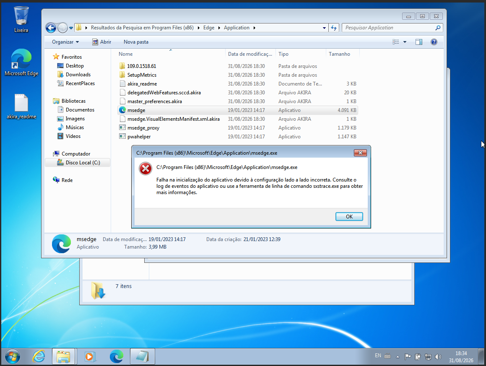

**Fonte:** Acervo do autor (2026).

A ausência aparente de cifragem de alguns instaladores também não deve ser generalizada para todas as gerações; a lista de exclusão publicada para a variante inicial incluía extensões executáveis específicas [2].

### 6.3. Ensaio A — amostra reconhecida pelo decifrador

Somente após documentar a contaminação e seus efeitos, a mídia óptica virtual de recuperação foi montada na máquina. Ela reuniu o arquivo de referência, seu manifesto SHA-256 e as ferramentas necessárias à avaliação defensiva. A captura comprova os itens visíveis, não o processo de criação da ISO nem o resultado da verificação do manifesto.

O [guia de dados sintéticos](../../guides/synthetic-reference-data/CMDB-GD-001-Synthetic-Reference-Data-Guide-pt-BR.md) descreve como produzir e preservar o original. O [guia de mídia ISO](../../guides/iso-media/CMDB-GD-004-ISO-Data-Media-Guide-pt-BR.md) trata da criação e validação do transporte somente leitura. O [guia de validação com SHA-256](../../guides/sha256-validation/CMDB-GD-002-SHA256-Recovery-Validation-Guide-pt-BR.md) apresenta a verificação antes da exposição e depois da recuperação.

**Figura 6 — Mídia de recuperação montada após a contaminação**

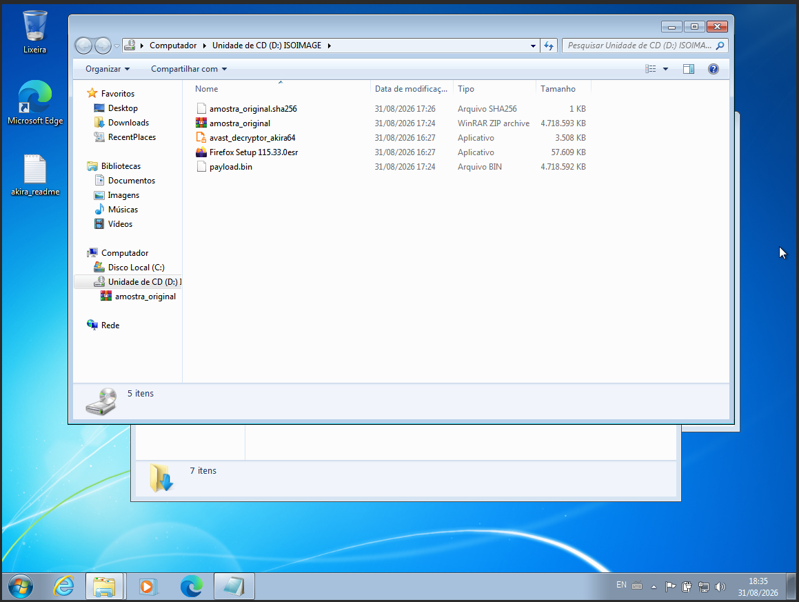

**Fonte:** Acervo do autor (2026).

Em seguida, uma cópia preservada do original foi transferida da mídia óptica para compor o par conhecido. Os nomes e tamanhos visíveis não substituem a validação por hash.

**Figura 7 — Preparação do par conhecido após a infecção**

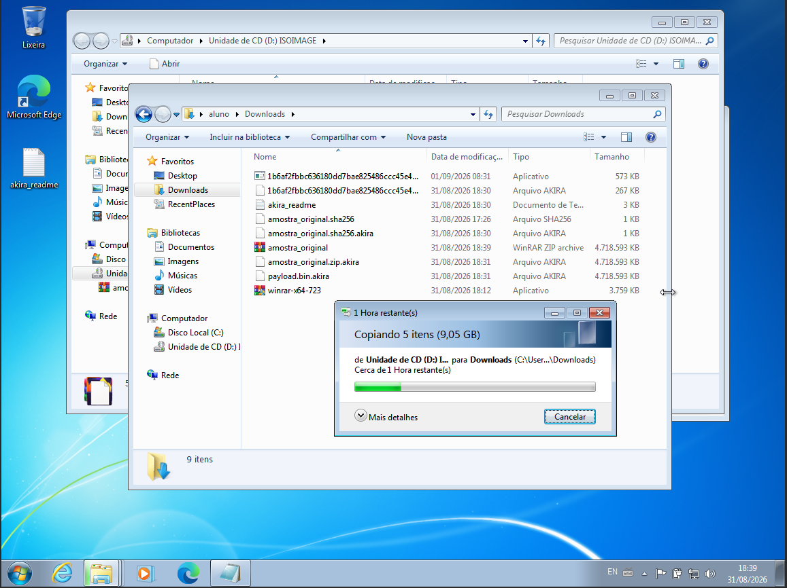

**Fonte:** Acervo do autor (2026).

Ao ser aberto, o decifrador informou explicitamente que variantes posteriores ao período suportado não eram recuperáveis. A mensagem define o escopo da ferramenta, mas não identifica sozinha a geração de uma amostra.

**Figura 8 — Alerta de incompatibilidade entre gerações**

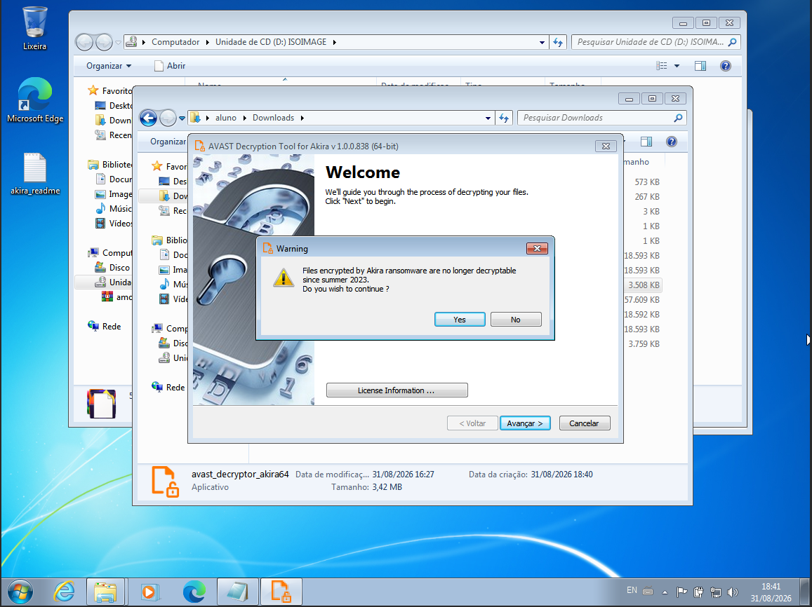

**Fonte:** Interface do Avast Decryption Tool; captura do autor (2026) [5].

O arquivo cifrado e o original correspondente foram selecionados como par conhecido. A documentação recomenda arquivos correspondentes e tão grandes quanto possível, pois o conteúdo do par condiciona a cobertura; ela não estabelece 4 GiB como tamanho mínimo obrigatório [2, 5].

**Figura 9 — Par de arquivo cifrado e original fornecido à ferramenta**

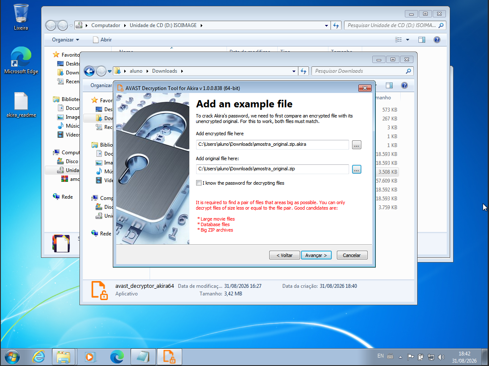

**Fonte:** Interface do Avast Decryption Tool; captura do autor (2026) [5].

Para esse par e essa execução, a ferramenta calculou que poderia recuperar arquivos de até 1.152 MB. Trata-se de um limite derivado do par selecionado, não de uma capacidade universal do decifrador.

**Figura 10 — Cobertura calculada para o par selecionado**

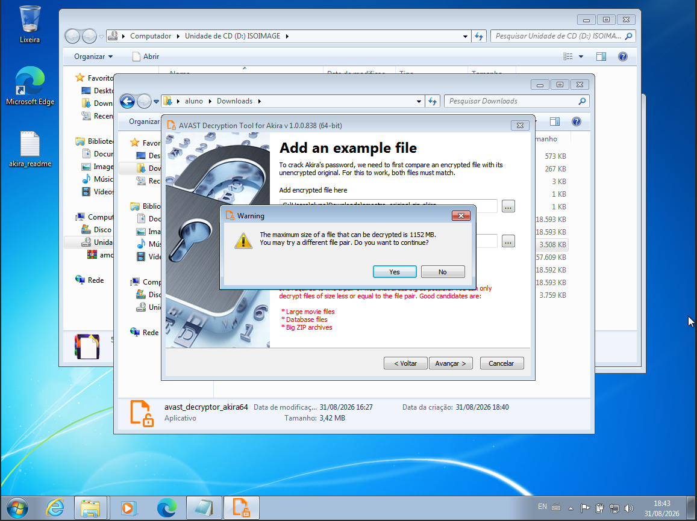

**Fonte:** Interface do Avast Decryption Tool; captura do autor (2026) [5].

Em seguida, a interface informou que o parâmetro de recuperação havia sido localizado.

**Figura 11 — Parâmetro de recuperação localizado**

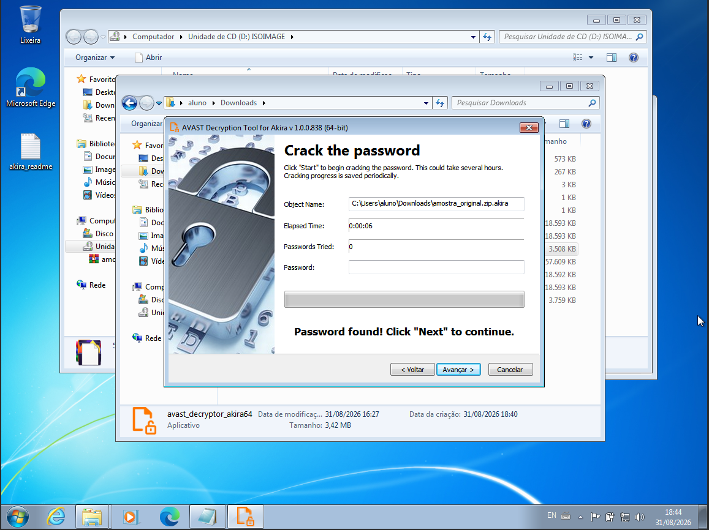

**Fonte:** Interface do Avast Decryption Tool; captura do autor (2026) [5].

Durante a operação, o contador atingiu `790/790` arquivos em dois segundos. Esse número é um resultado declarado pela própria ferramenta, não uma verificação independente de cada saída.

**Figura 12 — Contador operacional da decifragem**

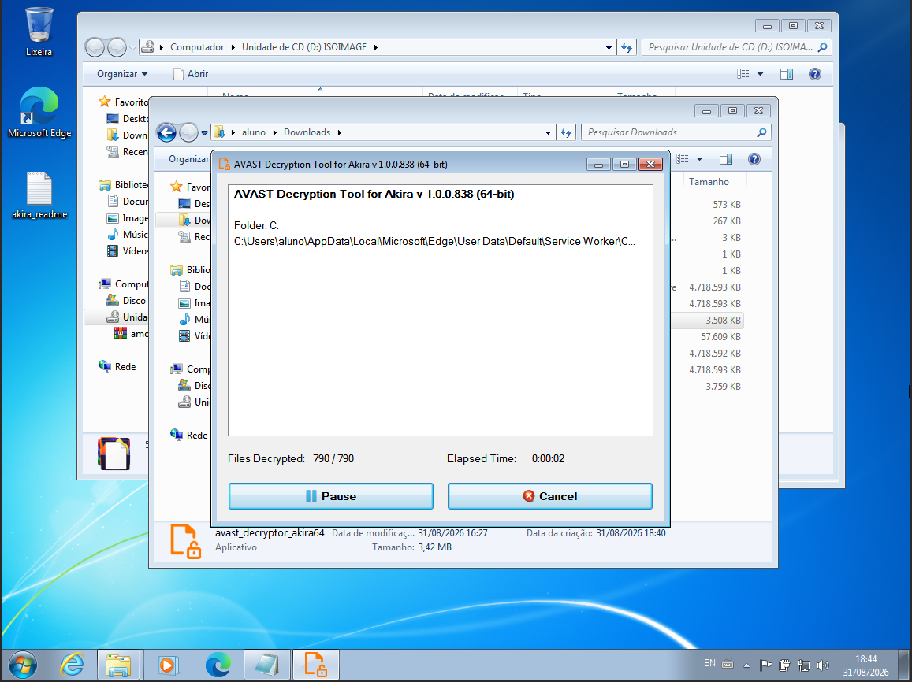

**Fonte:** Interface do Avast Decryption Tool; captura do autor (2026) [5].

A inspeção posterior mostrou miniaturas novamente renderizadas e cópias cifradas preservadas com o sufixo `.akira.backup`. Isso sustenta recuperação funcional aparente de parte do conjunto visualizado, mas não comprova identidade byte a byte de 790 arquivos.

**Figura 13 — Arquivos renderizados após a recuperação e cópias cifradas**

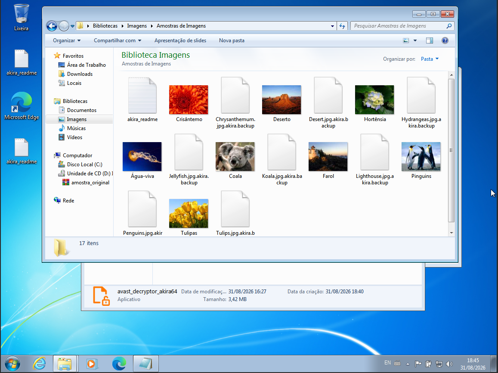

**Fonte:** Acervo do autor (2026).

### 6.4. Ensaio B — amostra recente não reconhecida

Em um ensaio independente, a amostra `def3fe8d07d5370ac6e105b1a7872c77e193b4b39a6e1cc9cfc815a36e909904.exe`, de SHA-256 `def3fe8d07d5370ac6e105b1a7872c77e193b4b39a6e1cc9cfc815a36e909904` e primeiro registro no MalwareBazaar em 26 de agosto de 2025, produziu um arquivo `.akira`. Ao receber o par conhecido, o Avast Decryption Tool apresentou, segundo as notas do autor, a mensagem `The file is not encrypted or was not recognized.` Não foi fornecida captura ou log dessa execução, portanto o resultado permanece uma observação declarada pelo autor.

O arquivo de referência possuía 4.831.838.496 bytes, e o arquivo processado, 4.831.839.088 bytes: acréscimo medido de 592 bytes. A geração inicial descrita pela Avast anexava um rodapé de 534 bytes [2, 5]. A divergência é um indício de formato ou metadados diferentes, mas o tamanho isolado não identifica algoritmo, variante ou causa exata da rejeição. De modo semelhante, “first seen” registra quando a fonte observou o arquivo, não quando ele foi criado ou compilado.

O resultado é consistente com a limitação pública de que a falha explorada pelo decifrador foi corrigida em gerações posteriores [3]. Ainda assim, sem análise estática, logs e validação do par por hash, a conclusão tecnicamente sustentada é apenas que **o artefato produzido no Ensaio B não foi reconhecido pelo decifrador testado**.

### 6.5. Validação, limitações e interpretação

O Ensaio A não preservou hashes SHA-256 posteriores à recuperação, log completo nem uma relação entre o contador e cada saída. Por isso, o resultado foi classificado como **recuperação funcional aparente**, e não como recuperação integral. Uma conclusão de igualdade byte a byte exige comparar, em ambiente confiável, o SHA-256 de cada arquivo recuperado com o valor do original preservado.

O relatório também não possui os pacotes efetivamente usados para recalcular seus hashes e confirmar localmente os hashes dos executáveis. Enquanto essas pendências de integridade não forem resolvidas, o documento deve permanecer como rascunho e não atende aos critérios editoriais do CMDB para publicação final.

Os próximos ensaios devem:

- calcular separadamente o SHA-256 do pacote, do executável extraído, do original preservado, do arquivo cifrado e do arquivo recuperado;
- manter o manifesto fora da VM comprometida e verificá-lo novamente em ambiente confiável;
- registrar tamanho exato, horário, versão das ferramentas, configuração da VM e logs completos;
- testar arquivos de diferentes tipos e tamanhos, pois um único ZIP grande não representa todo o conjunto de dados; e
- classificar o resultado como recuperação exata, parcial/funcional, falha ou inconclusivo.

Os procedimentos reutilizáveis estão documentados no [guia de dados sintéticos](../../guides/synthetic-reference-data/CMDB-GD-001-Synthetic-Reference-Data-Guide-pt-BR.md), no [guia de mídia ISO](../../guides/iso-media/CMDB-GD-004-ISO-Data-Media-Guide-pt-BR.md) e no [guia de validação de recuperação com SHA-256](../../guides/sha256-validation/CMDB-GD-002-SHA256-Recovery-Validation-Guide-pt-BR.md).

## 7. Conclusão

Os ensaios demonstraram dois comportamentos que não devem ser confundidos. No Ensaio A, foram documentados arquivos `.akira`, distribuição de notas de resgate, coerção por ameaça de divulgação de dados e falha do Edge associada a arquivos auxiliares cifrados; a amostra de 2023 foi reconhecida pelo decifrador e produziu sinais de recuperação funcional. No Ensaio B, o artefato gerado pela amostra registrada em 2025 não foi reconhecido. O contraste é compatível com a evolução do Akira e com o escopo limitado declarado pela Avast, mas não prova qual alteração criptográfica causou a incompatibilidade.

O número `790/790`, a mensagem `Password found` e a renderização de miniaturas são evidências úteis, porém insuficientes para declarar recuperação integral sem hashes posteriores. Em incidentes reais, a prioridade permanece isolar o sistema, preservar evidências, acionar resposta especializada e restaurar dados de backups confiáveis. Um decifrador deve ser tratado como recurso específico de variante, e nunca como garantia universal de recuperação.

## 8. Referências

1. FEDERAL BUREAU OF INVESTIGATION et al. *#StopRansomware: Akira Ransomware*. Atualizado em 13 nov. 2025. Disponível em: <https://www.fbi.gov/file-repository/cyber-alerts/stopransomware-akira-ransomware.pdf>. Acesso em: 1 set. 2026.
2. AVAST THREAT RESEARCH TEAM. *Decrypted: Akira ransomware*. 29 jun. 2023. Disponível em: <https://decoded.avast.io/threatresearch/decrypted-akira-ransomware/>. Acesso em: 1 set. 2026.
3. AVAST THREAT RESEARCH TEAM. *Avast Q2/2023 Threat Report*. 2023. Disponível em: <https://decoded.avast.io/threatresearch/avast-q2-2023-threat-report/>. Acesso em: 1 set. 2026.
4. NO MORE RANSOM. *Decryption Tools: Akira*. Disponível em: <https://www.nomoreransom.org/en/decryption-tools.html>. Acesso em: 1 set. 2026.
5. AVAST. *User Manual — Akira Decryptor*. Disponível em: <https://www.nomoreransom.org/uploads/User%20Manual%20-%20Akira_Decryptor.pdf>. Acesso em: 1 set. 2026.
6. MALWAREBAZAAR. *Database entry: SHA-256 1b6af2fbbc636180dd7bae825486ccc45e42aefbb304d5f83fafca4d637c13cc*. abuse.ch. Disponível em: <https://bazaar.abuse.ch/sample/1b6af2fbbc636180dd7bae825486ccc45e42aefbb304d5f83fafca4d637c13cc/>. Acesso em: 1 set. 2026.
7. MALWAREBAZAAR. *Database entry: SHA-256 def3fe8d07d5370ac6e105b1a7872c77e193b4b39a6e1cc9cfc815a36e909904*. abuse.ch. Disponível em: <https://bazaar.abuse.ch/sample/def3fe8d07d5370ac6e105b1a7872c77e193b4b39a6e1cc9cfc815a36e909904/>. Acesso em: 1 set. 2026.
