# Alcatraz Locker Ransomware

**English** | [Português (Brasil)](./CMDB-TR-003-Alcatraz-Report-pt-BR.md)

> **Federal University of Pernambuco — UFPE** \
> **Center for Technology and Geosciences — CTG** \
> **Lato Sensu Graduate Program in Offensive Security and Cyber Intelligence** \
> **Caatinga Malware DB (CMDB) · Academic technical report**

**Subtitle:** Dynamic analysis and defensive file recovery on Windows 7

**Romário J. O. Veloso¹**

¹ Undergraduate student in Electronic Engineering, Federal University of Pernambuco (UFPE), Recife — PE, Brazil.

**Author contribution:** laboratory planning and execution, evidence collection, result analysis, and report writing.

> **Safety notice:** this document describes a real ransomware sample for study and defense. Reproducing the experiment requires formal authorization, verifiable isolation, and restoration capability. The evidence below records actions already performed; it does not provide instructions for executing malware or weakening security controls.

This report follows the Caatinga Malware DB (CMDB) template, adapted from the [FIRST Malware Analysis SIG](https://www.first.org/global/sigs/malware/ma-framework/) _Cyber Malware Analysis Report Template v1_ (2021) and the UFPE/CTG editorial structure adopted by the project.

## Document control

| Field            | Information          |
| ---------------- | -------------------- |
| Identifier       | `CMDB-TR-003`        |
| Version          | `0.1.0`              |
| Publication date | `2026-08-27` (draft) |
| Editorial status | Draft                |
| Location         | Recife — PE, Brazil  |

## How to cite

> VELOSO, Romário J. O. **Alcatraz Locker: dynamic analysis and defensive file recovery on Windows 7**. Caatinga Malware DB (CMDB). Recife: UFPE/CTG, 2026. Technical report `CMDB-TR-003`, version 0.1.0. Available at: https://github.com/UFPE-Seguranca-Ofensiva/caatinga-malware-db/blob/main/docs/reports/alcatraz/CMDB-TR-003-Alcatraz-Report-EN.md. Accessed: 27 Aug. 2026.

## Version history

| Version | Date       | Change description                                                             | Responsible person   |
| ------- | ---------- | ------------------------------------------------------------------------------ | -------------------- |
| 0.1.0   | 2026-08-27 | Initial version based on evidence from the laboratory performed on 2026-08-24. | Romário J. O. Veloso |

## Version sign-off

| Role                                  | Name                 | Date       | Validated version |
| ------------------------------------- | -------------------- | ---------- | ----------------- |
| Responsible author                    | Romário J. O. Veloso | 2026-08-27 | 0.1.0             |
| Technical reviewer                    | Pending              | —          | —                 |
| Advisor or responsible faculty member | Pending              | —          | —                 |
| CMDB editorial approval               | Pending              | —          | —                 |

- **Versioned package:** `918504ede26bb9a3aa315319da4d3549d64531afba593bfad71a653292899fec.zip`
- **Contained artifact:** `918504ede26bb9a3aa315319da4d3549d64531afba593bfad71a653292899fec.exe`

## Table of contents

1. [Abstract](#1-abstract)
2. [Legal disclaimer](#2-legal-disclaimer)
3. [About the analyzed malware](#3-about-the-analyzed-malware)
4. [Activities performed](#4-activities-performed)
5. [Laboratory environment](#5-laboratory-environment)
6. [Dynamic analysis evidence](#6-dynamic-analysis-evidence)
7. [Conclusion](#7-conclusion)
8. [References](#8-references)

## 1. Abstract

This report documents an academic dynamic analysis of Alcatraz Locker ransomware in a Windows 7 virtual machine. The author obtained the sample from MalwareBazaar, verified it locally through SHA-256 `918504ede26bb9a3aa315319da4d3549d64531afba593bfad71a653292899fec`, and executed it in a laboratory on 24 August 2026. The experiment observed the `.Alcatraz` extension being added to accessible files and the creation of the `ransomed.html` ransom note. Avast Decryption Tool for AlcatrazLocker, located through No More Ransom, recovered 22 of 22 files in the evaluated set. The ransom note remained on the system after recovery; therefore, the result demonstrates file restoration but does not establish complete malware eradication or full environmental cleanup.

**Keywords:** Alcatraz Locker; ransomware; dynamic analysis; file recovery; No More Ransom.

## 2. Legal disclaimer

This report is intended for teaching, research, and cyber defense. The repository [disclaimer](../../../DISCLAIMER.md), [security guidance](../../../SECURITY.md), and access and use rules apply.

The sample is distributed exclusively as an AES-encrypted ZIP protected with the conventional `infected` password. This protection reduces accidental-opening risk but does not replace isolation or access control. Names, hashes, and links are included for identification, traceability, and defense. No part of this document authorizes execution on third-party systems, control evasion, propagation, or non-consensual offensive use.

## 3. About the analyzed malware

Alcatraz Locker is a ransomware family publicly observed since November 2016. According to Avast, it encrypts accessible files in the user profile, appends the `.Alcatraz` extension, and presents the `ransomed.html` ransom note. Avast's technical description reports AES-256 encryption combined with Base64 encoding [2, 3].

The consulted MalwareBazaar record classifies the sample as `Alcatraz`, identifies it as an `exe`, and aggregates intelligence from multiple services indicating malicious and ransomware behavior [1]. The service itself cautions that the presence of a file in its database does not, by itself, guarantee that the file is malicious. In this study, the identification was also consistent with the laboratory evidence: files received the `.Alcatraz` extension, and `ransomed.html` identified the infection as “Alcatraz Locker.”

### 3.1. Indicators recorded by the source

| Indicator               | Value                                                                                              |
| ----------------------- | -------------------------------------------------------------------------------------------------- |
| SHA-256                 | `918504ede26bb9a3aa315319da4d3549d64531afba593bfad71a653292899fec`                                 |
| SHA3-384                | `521756f91f6dc6e4ce19d634a12692e833b29835128f8492ca166359b514d064b48fd4f9d8f51dbefbec3c7a5ad401fc` |
| SHA-1                   | `03c94534ae4471187d9ab10ad0802deb51103de1`                                                         |
| MD5                     | `76ffbb43f6ac003cacf391b95d462362`                                                                 |
| imphash                 | `983d9930adf4e1f4a55db167dd5f3c89`                                                                 |
| ssdeep                  | `3072:JKTECsVTYGVMuCz0a3gcGiR4idFyEco3I74o+w5jZ:JKA7xYg44+wVZ`                                     |
| TLSH                    | `T112B36C11B5C1C071D4B3193459B8DAB11A6CF9300F686EEBA3D8117A4FB41D17A3AEAF`                         |
| MalwareBazaar humanhash | `jupiter-edward-dakota-west`                                                                       |

The values in this table were transcribed from the MalwareBazaar record accessed on 27 August 2026 [1]. MD5 and SHA-1 are retained only for correlation with legacy databases and should not be used alone as modern integrity guarantees. The `humanhash` is a service convenience identifier, not a cryptographic hash.

## 4. Activities performed

- The No More Ransom decryption-tool catalog was consulted, and the “Alcatraz Ransom” entry was located.
- The `ytisf/theZoo` repository was consulted; no nominal Alcatraz entry was located in the public [binary](https://github.com/ytisf/theZoo/tree/master/malware/Binaries), [original source](https://github.com/ytisf/theZoo/tree/master/malware/Source/Original), or [reversed source](https://github.com/ytisf/theZoo/tree/master/malware/Source/Reversed) trees searched on 27 August 2026 [6]. This is a point-in-time observation and does not establish historical or future absence.
- The author obtained the sample from its specific MalwareBazaar record and extracted it inside the virtual machine.
- Sample behavior was observed on Windows 7, including filename changes and display of the ransom note.
- The recovery tool referenced by No More Ransom was evaluated according to the Avast guide.
- Screen captures recorded the results shown by the tool and the recovered files.

| Sample field               | Value                                                                                                                                                                                                                            |
| -------------------------- | -------------------------------------------------------------------------------------------------------------------------------------------------------------------------------------------------------------------------------- |
| File name                  | `918504ede26bb9a3aa315319da4d3549d64531afba593bfad71a653292899fec.exe`                                                                                                                                                           |
| Analyzed object            | Executable extracted from a package obtained from MalwareBazaar                                                                                                                                                                  |
| Package protection         | AES-encrypted ZIP; conventional password `infected`; protection verified locally with 7-Zip 23.01                                                                                                                               |
| Package SHA-256            | `26a4de2976398fed3d435bf2d95ad5f1ee11285f2f75b66fa4b03c326e903ce4`                                                                                                                                                              |
| Extracted artifact SHA-256 | `918504ede26bb9a3aa315319da4d3549d64531afba593bfad71a653292899fec` — calculated locally as a stream without writing or executing the artifact; matches the MalwareBazaar record                                                  |
| Acquisition source         | MalwareBazaar, operated by abuse.ch                                                                                                                                                                                              |
| Source URL or record       | [MalwareBazaar sample record](https://bazaar.abuse.ch/sample/918504ede26bb9a3aa315319da4d3549d64531afba593bfad71a653292899fec/)                                                                                                  |
| Acquisition date           | `2026-08-24`, based on the date visible in the laboratory evidence                                                                                                                                                               |
| Source identifier          | Sample SHA-256                                                                                                                                                                                                                   |
| Source timestamps          | First seen: `2022-04-11 04:00:30 UTC`; last seen: `2022-04-11 04:32:05 UTC`                                                                                                                                                      |
| Validation sources         | Avast technical documentation and the behavioral identification observed in the laboratory                                                                                                                                       |
| Defensive references       | [No More Ransom](https://www.nomoreransom.org/en/decryption-tools.html), [Avast guide](https://www.nomoreransom.org/uploads/Avast_how-to-guide.pdf), and [Avast tool catalog](https://www.avast.com/ransomware-decryption-tools) |
| Size and type              | 117,760 bytes; `exe`; MIME `application/x-dosexec`, according to MalwareBazaar                                                                                                                                                   |

> **Integrity verification:** on 27 August 2026, the versioned package was tested with the `infected` password, an invalid password was rejected, and the single internal executable was streamed through SHA-256 calculation without extraction to the file system or execution. Its hash matches the identifier published by MalwareBazaar. This verifies the package currently present in the repository but does not replace a chain of custody produced at the time of the original experiment.

## 5. Laboratory environment

| Item                                 | Description                                                                                                                               |
| ------------------------------------ | ----------------------------------------------------------------------------------------------------------------------------------------- |
| Authorization and responsible person | Academic activity reported by the author; responsible person: Romário J. O. Veloso                                                        |
| Operating system                     | Windows 7; architecture and patch level not recorded                                                                                      |
| Isolation                            | Virtual machine; hypervisor and integration settings not recorded                                                                         |
| Network                              | Internet access was used to obtain the sample and recovery tool; segmentation, egress filtering, and shared resources were not documented |
| Tools and versions                   | WinRAR, version not recorded; web browsers; Windows Task Manager; Avast Decryption Tool for AlcatrazLocker `1.0.0.838`                    |
| Recovery-tool integrity              | SHA-256 not recorded; required before final publication                                                                                   |
| Restoration                          | Snapshot or restoration image not documented                                                                                              |
| Analysis date                        | `2026-08-24`                                                                                                                              |

Windows 7 is a legacy environment whose general Microsoft support ended on 14 January 2020 [7]. Its use in this study describes the performed reproduction and is not a platform recommendation.

These gaps limit reproducibility and assessment of the isolation controls. Future analyses should record the hypervisor, clean snapshot, network topology, absence of shared folders, security-control state, and virtual-machine disposal method.

## 6. Dynamic analysis evidence

The images are presented in the sequence supplied by the author. They record the experiment but do not replace logs, locally calculated hashes, or a forensic image of the system. The infection identifier and decryption password visible in Figures 3, 8, and 12 were generated exclusively inside this laboratory's disposable virtual machine; according to the author, they do not correspond to a real victim, personal credential, or production system.

### 6.1. Sample acquisition and preparation

The author obtained the sample from MalwareBazaar. WinRAR was used to enter the package password. The ZIP later incorporated into the repository was verified with the conventional `infected` password, and its single executable has the same SHA-256 as the source record. Before execution, the User Account Control (UAC) notification level was lowered to “Never notify.” This change is recorded as a historical laboratory condition, not as a requirement or recommendation.

**UAC (User Account Control)** is a Windows safeguard that requests confirmation when a program attempts to make administrative changes to the system. Lowering its notification level allows such changes to occur without warning and increases exposure to malicious actions.

**Figure 1 — User Account Control configured to “Never notify”**

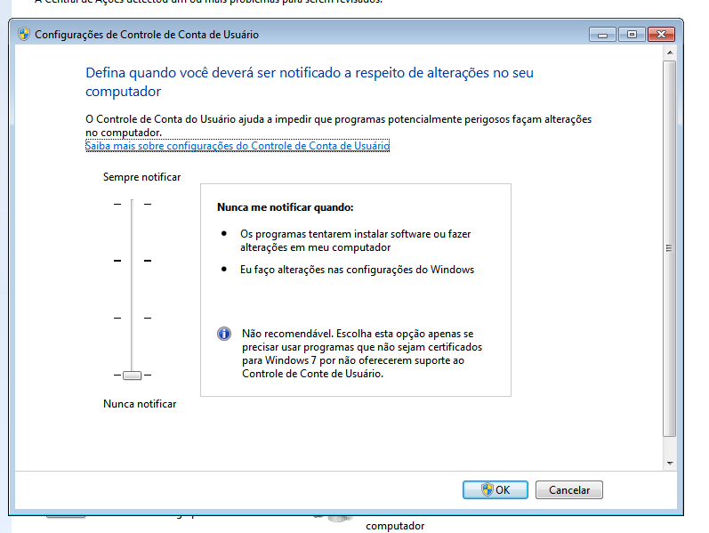

**Source:** Author's collection (2026).

The author also reported that antimalware protection was disabled because it detected the sample. However, Figure 1 documents UAC, which is a different control, while Figure 5 shows the `WinDefend` service as “Running.” The effective Windows Defender state at execution time could therefore not be confirmed from the available evidence.

### 6.2. Execution and infection

After execution in the laboratory, files in the working directory received the `.Alcatraz` extension. Visible items included the sample package, legitimate installers used during the experiment, and `desktop.ini`.

**Figure 2 — Files with the `.Alcatraz` extension after infection**

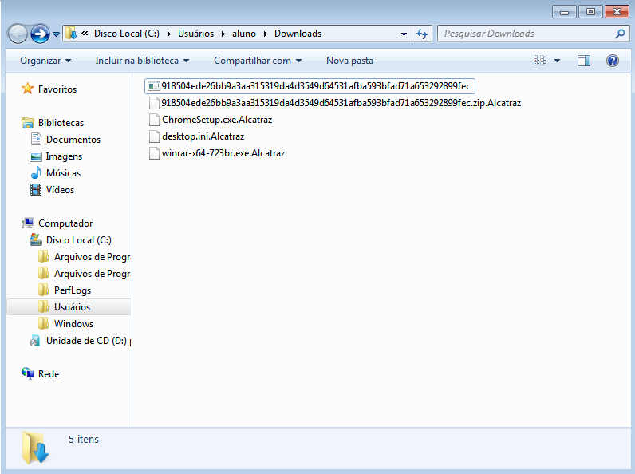

**Source:** Author's collection (2026).

The `ransomed.html` document was also created on the desktop. It displayed a Bitcoin ransom demand and identified the incident as an “Alcatraz Locker” infection, consistent with Avast's documentation [2, 3].

**Figure 3 — Ransom note opened from `ransomed.html`**

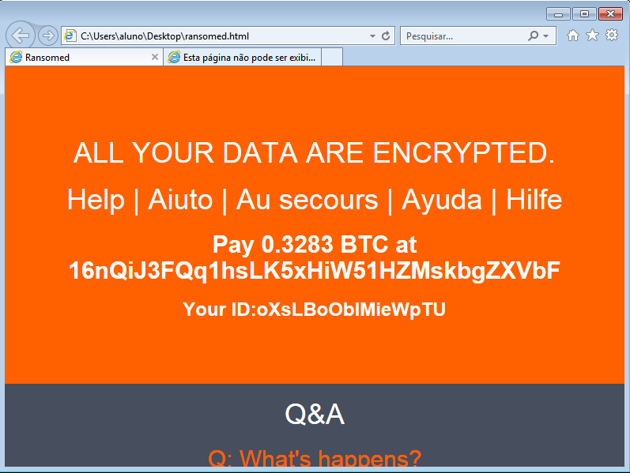

**Source:** Author's collection (2026).

Windows Task Manager was consulted after infection to record processes and services. The isolated captures do not support reliable attribution of a specific process to the sample or a conclusion that the system was free from persistence.

**Figure 4 — Processes visible after sample execution**

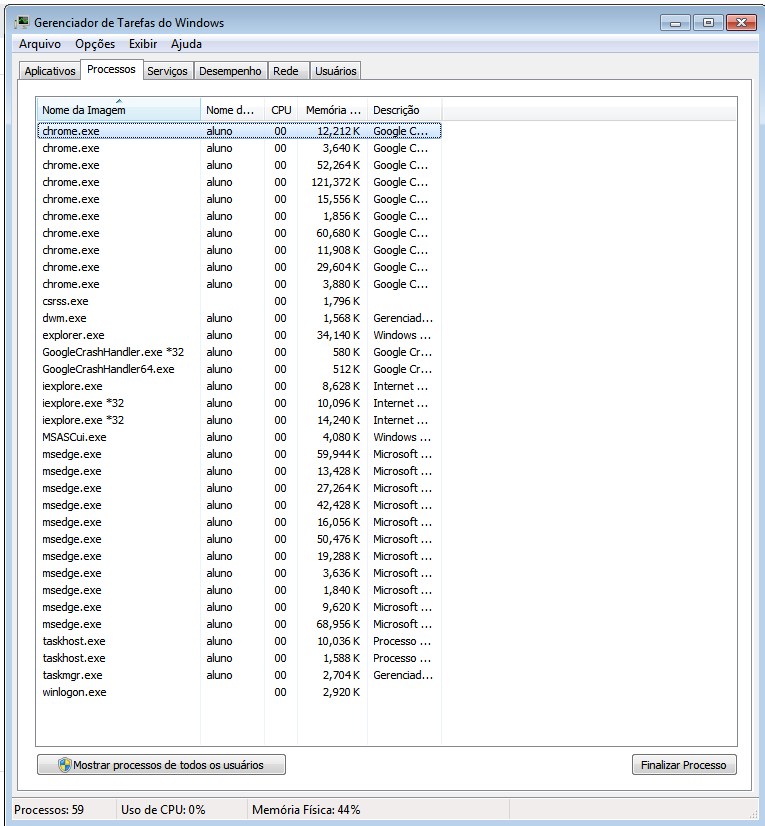

**Source:** Author's collection (2026).

**Figure 5 — Services visible after sample execution**

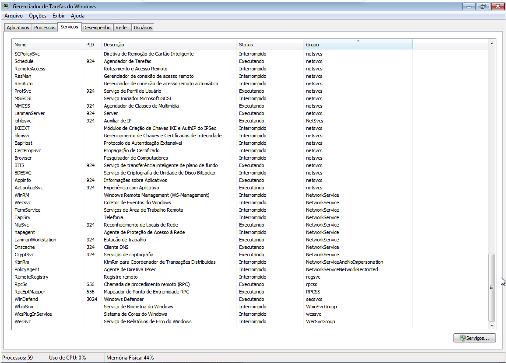

**Source:** Author's collection (2026).

### 6.3. Disinfection or response

The No More Ransom catalog was consulted and presented an Avast-developed tool for “Alcatraz Ransom” [4]. The catalog itself instructs users to read the guide and remove the malware before decryption. The referenced PDF is a general guide to Avast decryption tools, not an Alcatraz-specific study [5]. The available evidence does not demonstrate an independent eradication step before recovery; this section therefore establishes the response attempt but not complete system disinfection.

**Figure 6 — Alcatraz entry in the No More Ransom catalog**

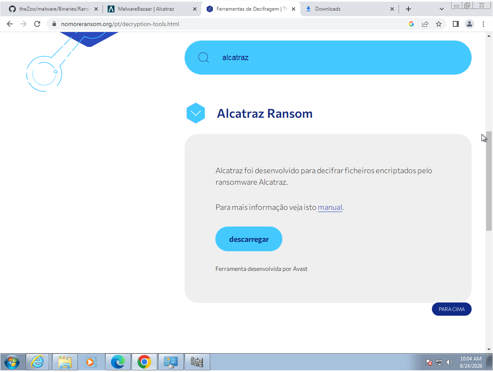

**Source:** Reproduction of No More Ransom; capture by the author (2026).

Avast Decryption Tool for AlcatrazLocker version `1.0.0.838` was launched in the affected environment.

**Figure 7 — Initial screen of the Avast recovery tool**

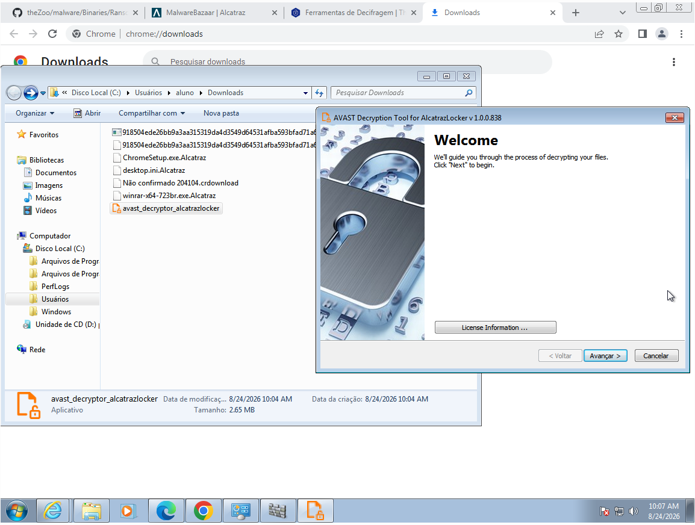

**Source:** Avast interface; capture by the author (2026).

The tool analyzed an encrypted file selected in the laboratory and reported finding the password needed to proceed with recovery.

**Figure 8 — Tool reporting that the decryption password was found**

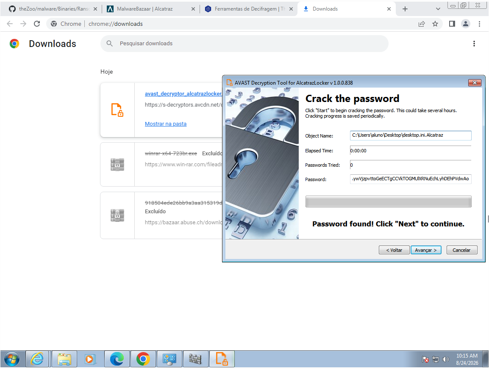

**Source:** Avast interface; capture by the author (2026).

### 6.4. Recovery and verification

At the end of processing, the tool displayed “Decryption Complete.”

**Figure 9 — Completion of the decryption process**

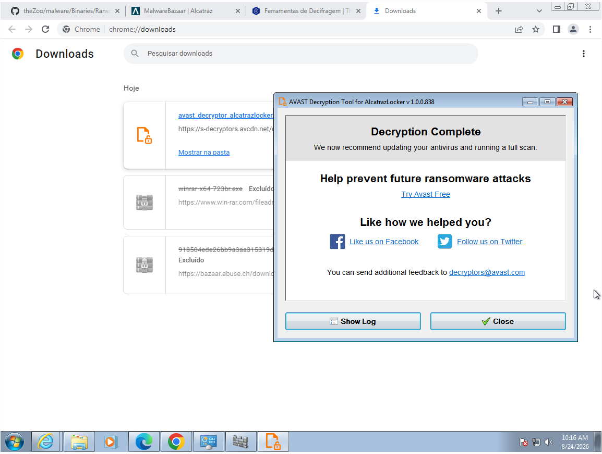

**Source:** Avast interface; capture by the author (2026).

The summary log reported `22/22` files decrypted in eight seconds on drive `C:`. This number describes the set processed by the tool and should not be interpreted as a complete system inventory. No pre-encryption and post-recovery hashes were preserved, so byte-for-byte equivalence of the restored files could not be demonstrated.

**Figure 10 — Summary showing 22 of 22 files decrypted**

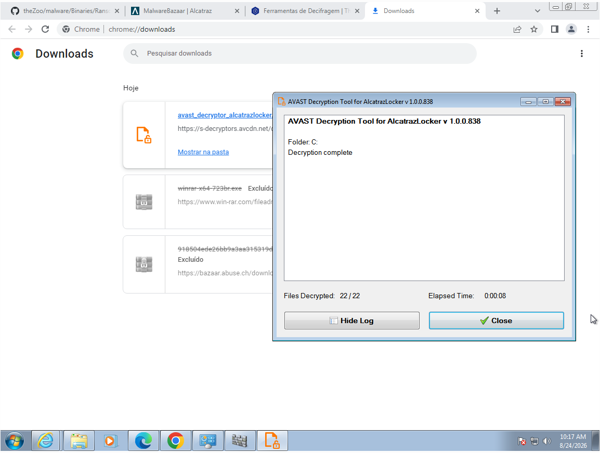

**Source:** Avast interface; capture by the author (2026).

In the inspected directory, recovered files reappeared without the `.Alcatraz` extension. The tool retained encrypted copies with the `.Alcatraz.backup` suffix, making it possible to distinguish restored files from encrypted backups.

**Figure 11 — Recovered files and encrypted copies carrying the `.backup` suffix**

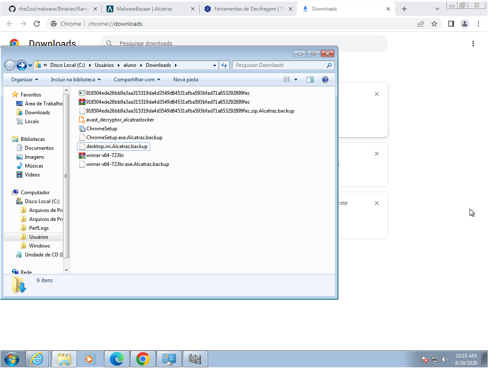

**Source:** Author's collection (2026).

Even after recovery, `ransomed.html` remained accessible on the desktop. The remaining note reinforces that file decryption is not equivalent to removing every incident artifact or proving malware eradication.

**Figure 12 — Ransom note still present after file recovery**

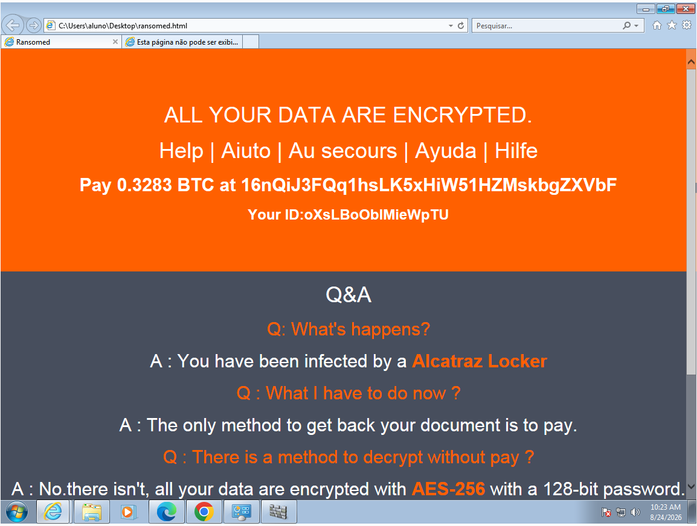

**Source:** Author's collection (2026).

## 7. Conclusion

The laboratory demonstrated behavior consistent with Alcatraz Locker: accessible files received the `.Alcatraz` extension, and the `ransomed.html` note was presented to the user. The tool referenced by No More Ransom recovered all 22 files in its processed set and retained encrypted copies with the `.backup` suffix. The experiment did not, however, establish complete eradication: the ransom note remained on the system, no post-recovery scan or persistence analysis was recorded, and the virtual machine's isolation and restoration details were not preserved.

The principal defensive finding is that data recovery and incident cleanup are separate stages. A complete response should preserve evidence, remove or contain malware before decryption, validate recovered files, perform a post-recovery scan, and restore the environment from a trusted source when integrity cannot be established. The recovery-tool SHA-256 must still be supplied before final publication. Future studies should compare hashes of test files before encryption and after recovery to establish byte-for-byte restoration.

## 8. References

1. ABUSE.CH. **MalwareBazaar: SHA-256 918504ede26bb9a3aa315319da4d3549d64531afba593bfad71a653292899fec (Alcatraz)**. [S. l.], 2022. Available at: https://bazaar.abuse.ch/sample/918504ede26bb9a3aa315319da4d3549d64531afba593bfad71a653292899fec/. Accessed: 27 Aug. 2026.
2. AVAST. **Free ransomware decryption tools: Alcatraz Locker**. [S. l.], [n. d.]. Available at: https://www.avast.com/ransomware-decryption-tools. Accessed: 27 Aug. 2026.
3. KŘOUSTEK, Jakub. **Avast releases four free ransomware decryptors**. Avast Blog, 1 Dec. 2016. Available at: https://blog.avast.com/avast-releases-four-free-ransomware-decryptors. Accessed: 27 Aug. 2026.
4. NO MORE RANSOM. **Decryption tools: Alcatraz Ransom**. [S. l.], [n. d.]. Available at: https://www.nomoreransom.org/en/decryption-tools.html. Accessed: 27 Aug. 2026.
5. AVAST; NO MORE RANSOM. **Avast Ransomware Decryption Tools: how-to guide**. [S. l.], [2017]. Available at: https://www.nomoreransom.org/uploads/Avast_how-to-guide.pdf. Accessed: 27 Aug. 2026.
6. YTISF. **theZoo: a live malware repository**. GitHub, [n. d.]. Available at: https://github.com/ytisf/theZoo. Accessed: 27 Aug. 2026.
7. MICROSOFT. **You received a notification: your Windows 7 PC is out of support**. [S. l.], [n. d.]. Available at: https://support.microsoft.com/en-us/topic/you-received-a-notification-your-windows-7-pc-is-out-of-support-3278599f-9613-5cc1-e0ee-4f81f623adcf. Accessed: 27 Aug. 2026.
