# Cerber Ransomware

[English](./CMDB-TR-004-Cerber-Report-EN.md) | **Português (Brasil)**

> **Universidade Federal de Pernambuco — UFPE** \
> **Centro de Tecnologia e Geociências — CTG** \
> **Pós-Graduação Lato Sensu em Segurança Ofensiva e Inteligência Cibernética** \
> **Caatinga Malware DB (CMDB) · Relatório técnico acadêmico**

**Subtítulo:** Análise dinâmica e avaliação defensiva do Trend Micro Ransomware File Decryptor em Windows 7

**Romário J. O. Veloso¹**

¹ Bacharelando em Engenharia Eletrônica, Universidade Federal de Pernambuco (UFPE), Recife — PE, Brasil.

**Contribuição do autor:** planejamento e execução do laboratório, coleta das evidências, análise dos resultados e redação do relatório.

> **Aviso de segurança:** este documento registra uma análise já realizada com ransomware real. Ele não é um roteiro para executar malware. Qualquer reprodução exige autorização formal, ambiente isolado e descartável, rede controlada e capacidade de restauração.

Relatório elaborado a partir do modelo do Caatinga Malware DB (CMDB), adaptado do _Cyber Malware Analysis Report Template v1_ (2021), da [FIRST Malware Analysis SIG](https://www.first.org/global/sigs/malware/ma-framework/), e da estrutura editorial da UFPE/CTG adotada pelo projeto.

## Controle do documento

| Campo              | Informação              |
| ------------------ | ----------------------- |
| Identificador      | `CMDB-TR-004`           |
| Versão             | `0.1.0`                 |
| Data de publicação | `2026-08-29` (rascunho) |
| Estado editorial   | Rascunho                |
| Local              | Recife — PE, Brasil     |

## Como citar

> VELOSO, Romário J. O. **Cerber ransomware: análise dinâmica e avaliação defensiva do Trend Micro Ransomware File Decryptor em Windows 7**. Caatinga Malware DB (CMDB). Recife: UFPE/CTG, 2026. Relatório técnico `CMDB-TR-004`, versão 0.1.0. Disponível em: https://github.com/UFPE-Seguranca-Ofensiva/caatinga-malware-db/blob/main/docs/reports/cerber/CMDB-TR-004-Cerber-Report-pt-BR.md. Acesso em: 29 ago. 2026.

## Controle de versões

| Versão | Data       | Descrição da alteração                                            | Responsável          |
| ------ | ---------- | ----------------------------------------------------------------- | -------------------- |
| 0.1.0  | 2026-08-29 | Versão inicial baseada nas evidências do laboratório desta data. | Romário J. O. Veloso |

## Assinatura da versão

| Papel                             | Nome                 | Data       | Versão validada |
| --------------------------------- | -------------------- | ---------- | --------------- |
| Autor responsável                 | Romário J. O. Veloso | 2026-08-29 | 0.1.0           |
| Revisor técnico                   | Pendente             | —          | —               |
| Orientador ou docente responsável | Pendente             | —          | —               |
| Aprovação editorial do CMDB       | Pendente             | —          | —               |

- **Pacote versionado:** não incluído neste relatório.
- **Artefato analisado:** executável identificado pelo SHA-256 `1cb6e2a2526f332fe132ab8905cd4cae65a1f7ef7aa4f9bf351f7f323f3b32c9`, conforme registro de origem e anotação do autor.

## Sumário

1. [Resumo](#1-resumo)
2. [Aviso legal](#2-aviso-legal)
3. [O que é o malware analisado](#3-o-que-é-o-malware-analisado)
4. [Atividades realizadas](#4-atividades-realizadas)
5. [Ambiente de laboratório](#5-ambiente-de-laboratório)
6. [Evidências da análise dinâmica](#6-evidências-da-análise-dinâmica)
7. [Conclusão](#7-conclusão)
8. [Referências](#8-referências)

## 1. Resumo

Este relatório documenta uma análise dinâmica acadêmica do ransomware Cerber em uma máquina virtual com Windows 7. A amostra inicialmente consultada no theZoo não apresentou infecção observável; outra amostra, localizada pelo autor no MalwareBazaar, produziu arquivos com extensão `.cerber`, notas `# DECRYPT MY FILES #` e alteração do papel de parede. Pelo fluxo do No More Ransom, o autor informou ter recebido um arquivo `.dmg`, cuja extensão alterou manualmente para `.exe`; o arquivo renomeado apresentou erro no Windows. Uma ferramenta obtida diretamente na página oficial da Trend Micro iniciou a varredura, mas a evidência mais recente registra apenas `1` arquivo infectado e `0` decifrados após `00:50:23`. Portanto, este ensaio não comprova recuperação bem-sucedida. Para a família Cerber, a ferramenta oferece suporte somente ao CERBER V1 e possui limitações relevantes de variante, tempo e integridade da recuperação.

**Palavras-chave:** Cerber; ransomware; análise dinâmica; decifragem; recuperação de arquivos.

## 2. Aviso legal

Este relatório destina-se ao ensino, à pesquisa e à defesa cibernética. Aplicam-se o [aviso legal](../../../DISCLAIMER.pt-BR.md), as [orientações de segurança](../../../SECURITY.pt-BR.md) e as regras de acesso e uso do repositório.

Os nomes, hashes e links são apresentados para identificação, rastreabilidade e defesa. Nenhuma parte do documento autoriza execução em sistemas de terceiros, evasão de controles, propagação ou uso ofensivo não consentido. Nenhuma amostra foi adicionada junto a este relatório.

## 3. O que é o malware analisado

A Microsoft publicou sua descrição do Cerber em março de 2016 e o classifica como ransomware oferecido no modelo _ransomware as a service_ (RaaS), então distribuído por anexos maliciosos, _exploit kits_ e _drive-by downloads_ [2]. Depois da cifragem, variantes documentadas renomeavam arquivos, aplicavam extensões como `.cerber` e criavam notas `# DECRYPT MY FILES #` em formatos HTML, TXT, VBS ou URL. O componente VBS podia usar a síntese de voz do Windows para anunciar a cifragem [2].

As evidências deste laboratório — extensão `.cerber`, notas com o mesmo nome e aviso sonoro relatado pelo autor — são compatíveis com essa família. Elas não identificam, porém, a variante exata. Também não há evidência para caracterizar a amostra como exploração de vulnerabilidade _zero-day_.

### 3.1. Amostras e rastreabilidade

| Origem ou etapa | SHA-256 | Resultado no ensaio | Observação |
|---|---|---|---|
| theZoo | `e67834d1e8b38ec5864cfa101b140aeaba8f1900a6e269e6a94c90fcbfe56678` | Não houve infecção observável | A causa não foi determinada; falha, incompatibilidade ou autoexclusão permanecem apenas hipóteses. |
| Candidata mostrada na Figura 1 | `4a2ad49c934f9ae6ca6b5d0c7cc34f5e12d349640012fa8cf8eb7e2d3acd6c9f` | Não vinculada ao resultado final | A captura registra uma etapa de busca; esse hash não é o da amostra abaixo. |
| MalwareBazaar, amostra informada como efetiva | `1cb6e2a2526f332fe132ab8905cd4cae65a1f7ef7aa4f9bf351f7f323f3b32c9` | Produziu os efeitos das Figuras 2 a 4, segundo o registro do autor | O executável não foi fornecido com o relatório; o hash não pôde ser recalculado localmente. |

O diretório público do theZoo contém uma entrada `Ransomware.Cerber` e arquivos de checksum [3]. A ausência de infecção observável com essa amostra não demonstra que ela seja inofensiva e tampouco comprova autoexclusão. O registro da amostra efetiva no MalwareBazaar a identifica como `Cerber`, `exe`, com 272.329 bytes e primeiro registro em `2020-11-06 10:39:16 UTC` [1].

O rascunho de origem também registra o MD5 `8b6bc16fd137c09a08b02bbe1bb7d670` para a amostra do theZoo. Esse algoritmo é mantido somente para correlação legada, não como verificação moderna de integridade.

### 3.2. Indicadores registrados pelo MalwareBazaar

| Indicador | Valor |
|---|---|
| SHA-256 | `1cb6e2a2526f332fe132ab8905cd4cae65a1f7ef7aa4f9bf351f7f323f3b32c9` |
| SHA3-384 | `f722176961c08b2df7ce130decde16d4accc239ca003ec352ccd7bd8607fe02d217f3c7b458a4c8e52ce4186688dcf00` |
| SHA-1 | `04b3bb677dcc069ec6c664fe6858514ac4bb7305` |
| MD5 | `fabda8e31024cb3b78870ff8d6c091c4` |
| imphash | `7bdf484e04ff3560b3a25691c25e7656` |
| Humanhash | `snake-tennessee-fillet-neptune` |
| Primeiro / último registro | `2020-11-06 10:39:16 UTC` / `2020-11-07 12:47:54 UTC` |
| Tamanho e tipo | 272.329 bytes; `exe`; MIME `application/x-dosexec` |

Os valores foram transcritos do MalwareBazaar [1]. SHA-1 e MD5 são mantidos somente para correlação com bases legadas; não substituem SHA-256 para verificação de integridade.

## 4. Atividades realizadas

- A entrada do Cerber no theZoo foi avaliada, sem infecção observável no ambiente usado.
- Outras candidatas foram pesquisadas no MalwareBazaar; o autor associou o ensaio efetivo ao SHA-256 `1cb6e2...b32c9`.
- Foram registrados a cifragem de arquivos, as notas de resgate, o aviso sonoro relatado e a alteração do papel de parede.
- A entrada CERBER V1 do No More Ransom e seu manual foram consultados.
- Segundo o autor, o arquivo obtido por esse fluxo tinha extensão `.dmg`; após a alteração manual para `.exe`, o Windows apresentou o erro da Figura 6. Não foi localizado um executável Windows utilizável nesse material.
- A ferramenta referenciada pela página oficial atual da Trend Micro foi aberta e uma varredura foi iniciada; não há captura de conclusão ou arquivo recuperado.

| Campo da amostra | Valor |
|---|---|
| Nome do arquivo | `1cb6e2a2526f332fe132ab8905cd4cae65a1f7ef7aa4f9bf351f7f323f3b32c9`, segundo o MalwareBazaar |
| Objeto analisado | Executável obtido pelo autor; artefato não disponibilizado para esta revisão |
| Proteção do pacote | Não verificável; pacote não fornecido |
| SHA-256 do pacote | Pendente — obrigatório antes da publicação final |
| SHA-256 do artefato extraído | `1cb6e2a2526f332fe132ab8905cd4cae65a1f7ef7aa4f9bf351f7f323f3b32c9`, transcrito da fonte e não recalculado nesta revisão |
| Fonte de obtenção | MalwareBazaar, operado pela abuse.ch |
| URL da fonte | [Registro específico da amostra](https://bazaar.abuse.ch/sample/1cb6e2a2526f332fe132ab8905cd4cae65a1f7ef7aa4f9bf351f7f323f3b32c9/) |
| Data de obtenção | Não registrada |
| Identificador na fonte | SHA-256 da amostra |
| Fontes de validação | MalwareBazaar e comportamento documentado pela Microsoft [1, 2] |
| Referências defensivas | No More Ransom, manual legado e solução atual da Trend Micro [4–6] |
| Tamanho e tipo | 272.329 bytes; `exe`; MIME `application/x-dosexec`, segundo o MalwareBazaar [1] |

> **Pendência de integridade:** sem acesso ao pacote efetivamente usado, não foi possível calcular o SHA-256 do ZIP nem confirmar o hash do executável. Esses valores devem ser obtidos no ambiente autorizado antes da publicação final; não devem ser inferidos pelo nome do arquivo.

## 5. Ambiente de laboratório

| Item | Descrição |
|---|---|
| Autorização e responsável | Atividade acadêmica informada pelo autor; responsável: Romário J. O. Veloso |
| Sistema operacional | Windows 7; edição, arquitetura e nível de atualização não registrados |
| Isolamento | Máquina virtual; hipervisor, snapshot e integrações não documentados |
| Rede | Houve acesso a serviços web; segmentação e filtragem de saída não documentadas |
| Controles de segurança | Segundo o autor, o Firewall do Windows e todas as configurações do Windows Defender foram desativados antes da execução da amostra; os estados exatos não foram preservados nas evidências fornecidas |
| Ferramentas e versões | Navegador web; arquivo identificado como `Trend Micro Ransomware Decryptor_V1.0.1001`, relatado como `.dmg` e posteriormente renomeado para `.exe`; `RansomwareFileDecryptor 1.0.1668 MUI`, obtido diretamente da Trend Micro |
| Integridade das ferramentas | Hashes dos pacotes e executáveis não registrados |
| Restauração | Snapshot ou imagem de restauração não documentados |
| Data da análise | `2026-08-29`, conforme as evidências |

O estado do **UAC (Controle de Conta de Usuário)** não foi registrado. O UAC é a proteção do Windows que solicita confirmação quando um programa tenta realizar alterações administrativas; ele é distinto do Firewall do Windows e do Windows Defender.

A desativação desses dois últimos controles é registrada apenas como condição histórica do ensaio e não como requisito ou recomendação. Ela reduziu as camadas defensivas do sistema e aumentou o risco de atividade de rede não controlada e de impacto no ambiente, especialmente porque o isolamento e a filtragem de saída não foram documentados.

As lacunas acima limitam a reprodutibilidade. O objeto baixado pelo No More Ransom não foi disponibilizado para esta revisão com nome original, hash e tipo de conteúdo, de modo que sua extensão `.dmg` permanece uma informação declarada pelo autor. Alterar uma extensão não converte o formato interno do arquivo; assim, a mensagem da Figura 6 não demonstra incompatibilidade de um decifrador Windows legítimo. Os horários visíveis nas capturas também não estabelecem uma cronologia estrita de todas as etapas da interface.

## 6. Evidências da análise dinâmica

As figuras foram organizadas a partir da imagem 10 fornecida pelo autor. Elas registram o ensaio, mas não substituem logs, hashes calculados sobre os arquivos usados ou uma imagem forense do sistema. A desativação do Firewall do Windows e do Windows Defender foi informada pelo autor, mas não aparece nas figuras incluídas e, portanto, permanece como condição declarada, não como constatação visual independente.

### 6.1. Triagem e infecção observada

A Figura 1 mostra uma das candidatas consultadas no MalwareBazaar. Seu SHA-256 começa por `4a2ad49c` e, por isso, ela não deve ser apresentada como a amostra efetiva de SHA-256 `1cb6e2...b32c9`.

**Figura 1 — Candidata consultada durante a busca no MalwareBazaar**

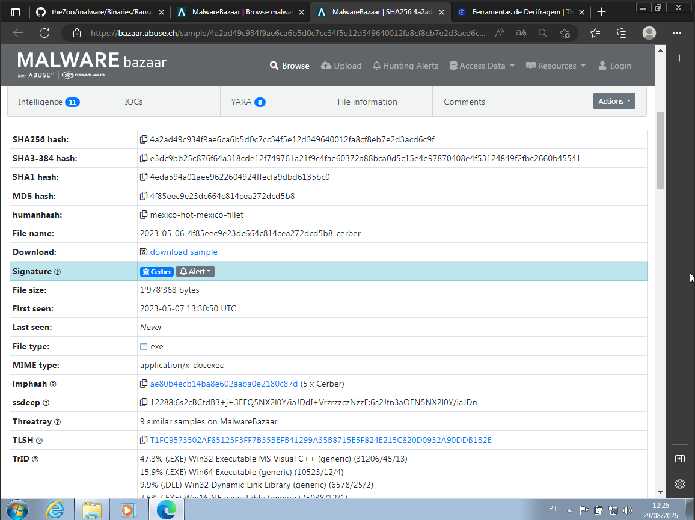

**Fonte:** Reprodução do [MalwareBazaar](https://bazaar.abuse.ch/sample/4a2ad49c934f9ae6ca6b5d0c7cc34f5e12d349640012fa8cf8eb7e2d3acd6c9f/); captura do autor (2026).

Após a execução da amostra que o autor associou ao hash `1cb6e2...b32c9`, o diretório passou a conter arquivos com extensão `.cerber` e diferentes versões da nota `# DECRYPT MY FILES #`.

**Figura 2 — Arquivos com extensão `.cerber` e notas de resgate**

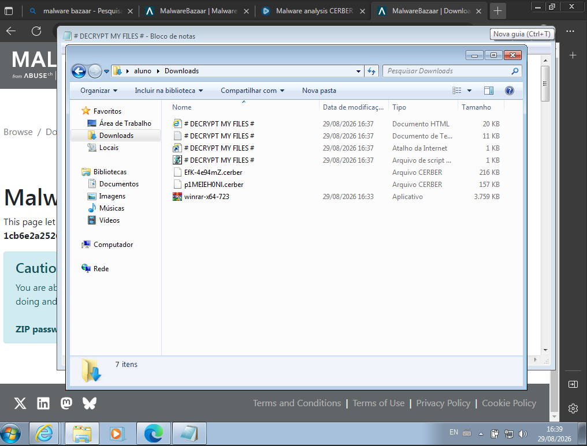

**Fonte:** Acervo do autor (2026).

A nota informa que os arquivos foram cifrados. O autor relatou também um aviso sonoro insistente; esse efeito não pode ser demonstrado por uma imagem estática, mas é compatível com o uso de síntese de voz documentado pela Microsoft para variantes do Cerber [2].

**Figura 3 — Nota de resgate apresentada no laboratório**

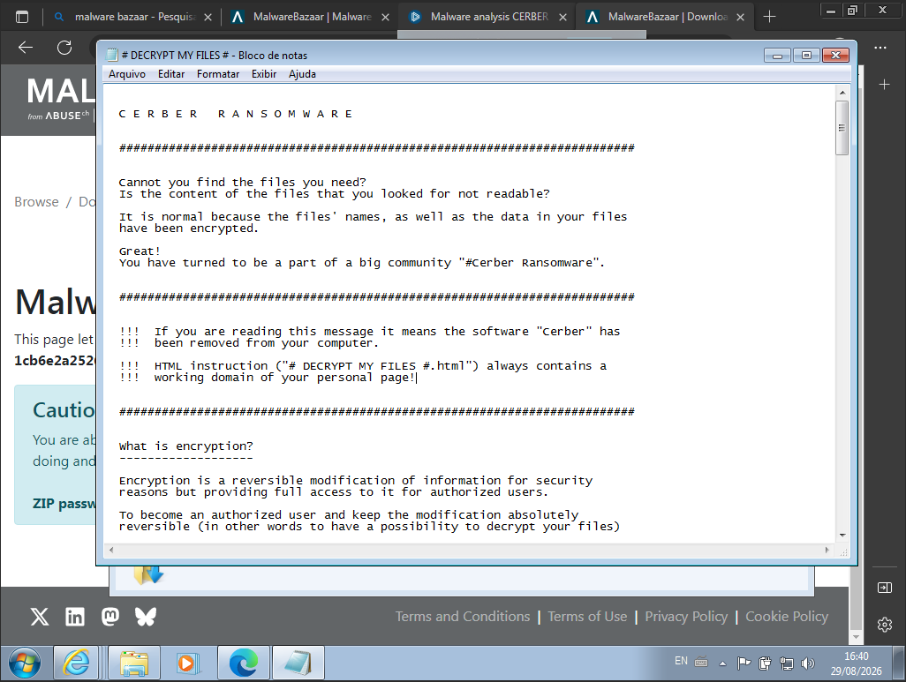

**Fonte:** Acervo do autor (2026).

O papel de parede foi substituído por uma mensagem de resgate com endereços temporários de pagamento.

**Figura 4 — Papel de parede alterado após a infecção**

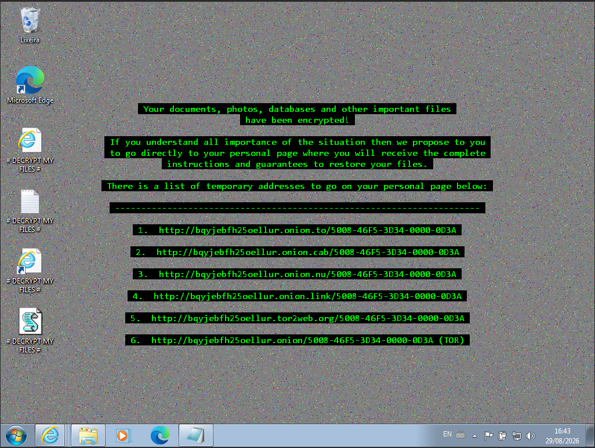

**Fonte:** Acervo do autor (2026).

### 6.2. Defasagem do material de recuperação

O No More Ransom mantém uma entrada para CERBER V1 e aponta para uma ferramenta da Trend Micro [4]. Segundo o autor, o arquivo recebido por esse caminho possuía extensão `.dmg`, formato de imagem de disco normalmente utilizado pelo macOS. Como não foi localizado um `.exe` utilizável nesse material, a extensão foi alterada manualmente de `.dmg` para `.exe` antes da tentativa registrada na Figura 6.

**Figura 5 — Entrada CERBER V1 e arquivo relatado como `.dmg` pelo autor**

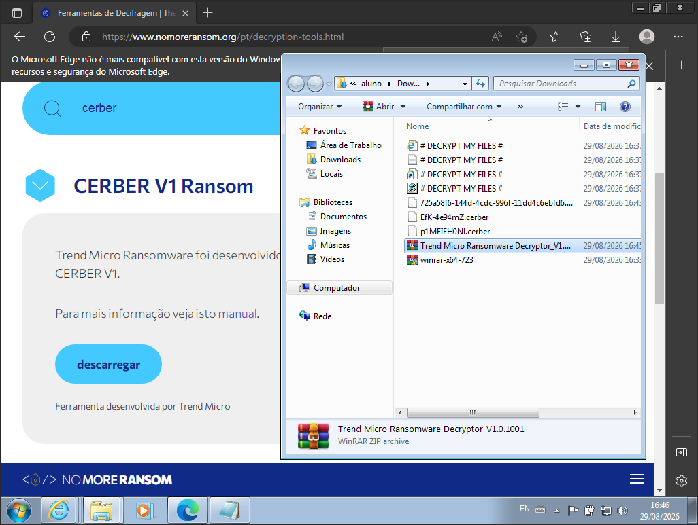

**Fonte:** Reprodução de No More Ransom; captura do autor (2026) [4].

Renomear um arquivo modifica apenas seu nome; não transforma uma imagem de disco da Apple em um executável PE para Windows. Por isso, o erro abaixo documenta a tentativa com o arquivo renomeado, não uma avaliação válida de um decifrador Windows oficial.

**Figura 6 — Erro após a alteração manual da extensão de `.dmg` para `.exe`**

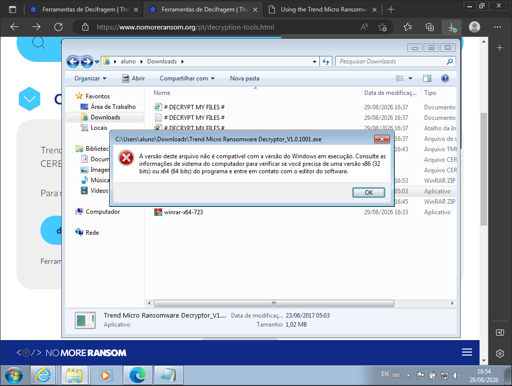

**Fonte:** Acervo do autor (2026).

O manual ligado à entrada foi produzido em 2016 e referencia a antiga solução `1114221` e um pacote ZIP da versão `1.0.1654` [5], o que diverge do arquivo `.dmg` relatado no ensaio. Como a extensão original não aparece por completo nas capturas e o objeto não foi disponibilizado para inspeção, essa divergência não pôde ser reproduzida de maneira independente. O resultado também não permite concluir que todos os decifradores do No More Ransom sejam não funcionais.

Sem localizar um `.exe` utilizável por esse fluxo, o autor consultou diretamente a solução atual `KA-0006362` da Trend Micro, atualizada em 30 de setembro de 2024 [6]. A captura do laboratório mostra o executável Windows `RansomwareFileDecryptor 1.0.1668 MUI` aberto a partir dessa fonte oficial.

### 6.3. Avaliação da ferramenta atual

**Figura 7 — Termos de uso da versão `1.0.1668 MUI`**

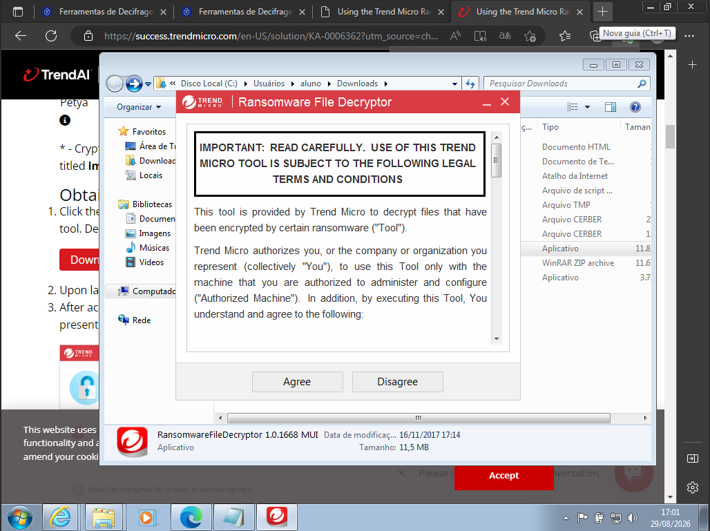

**Fonte:** Interface da Trend Micro; captura do autor (2026) [6].

A interface oferece seleção por família. Para a família Cerber, a Trend Micro lista apenas a variante **CERBER V1**, com arquivos no padrão `{10 caracteres aleatórios}.cerber` [6]. Embora a extensão observada seja compatível, a variante da amostra não foi confirmada; a data de primeiro registro em 2020 também não prova que o binário seja CERBER V1.

**Figura 8 — Lista de famílias disponível na ferramenta**

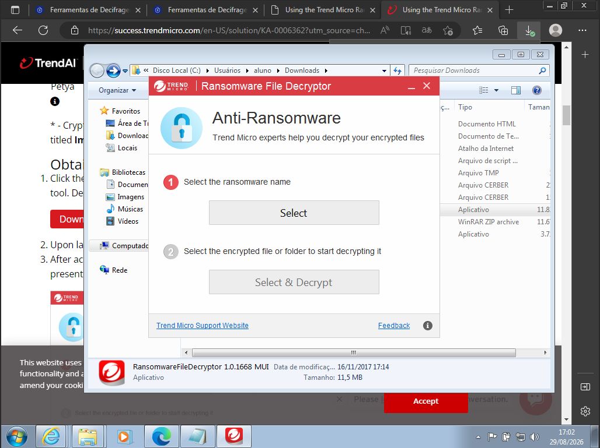

**Fonte:** Interface da Trend Micro; captura do autor (2026) [6].

**Figura 9 — Aviso de recuperação possivelmente parcial para CERBER V1**

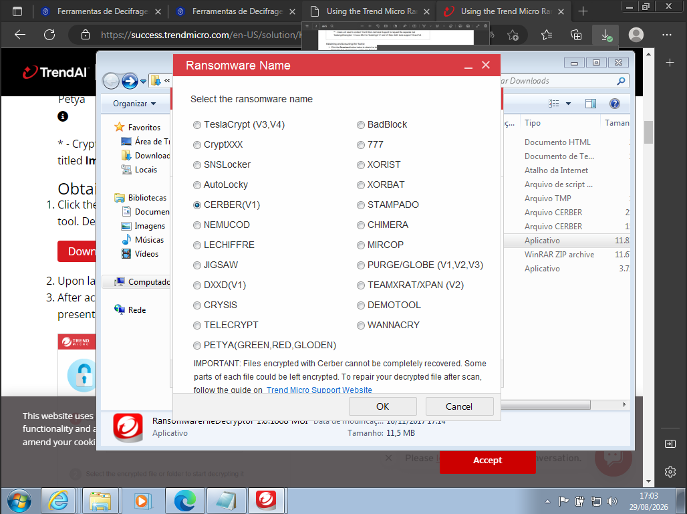

**Fonte:** Interface da Trend Micro; captura do autor (2026) [6].

**Figura 10 — CERBER selecionado na interface principal**

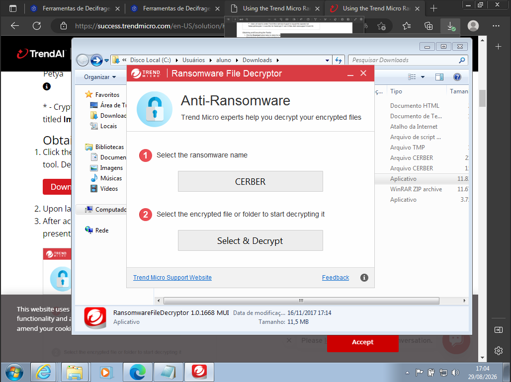

**Fonte:** Interface da Trend Micro; captura do autor (2026) [6].

O diretório `Downloads` foi selecionado como alvo. A Figura 12 preserva o registro inicial da varredura, com `1` arquivo infectado e `0` arquivos decifrados. Em uma captura posterior fornecida pelo autor durante a revisão, o processo continuava em andamento após `00:50:23` — 50 minutos e 23 segundos — com os mesmos contadores. Não foram fornecidos tela de conclusão, arquivo restaurado, comparação de conteúdo ou hashes antes e depois.

**Figura 11 — Seleção do diretório avaliado**

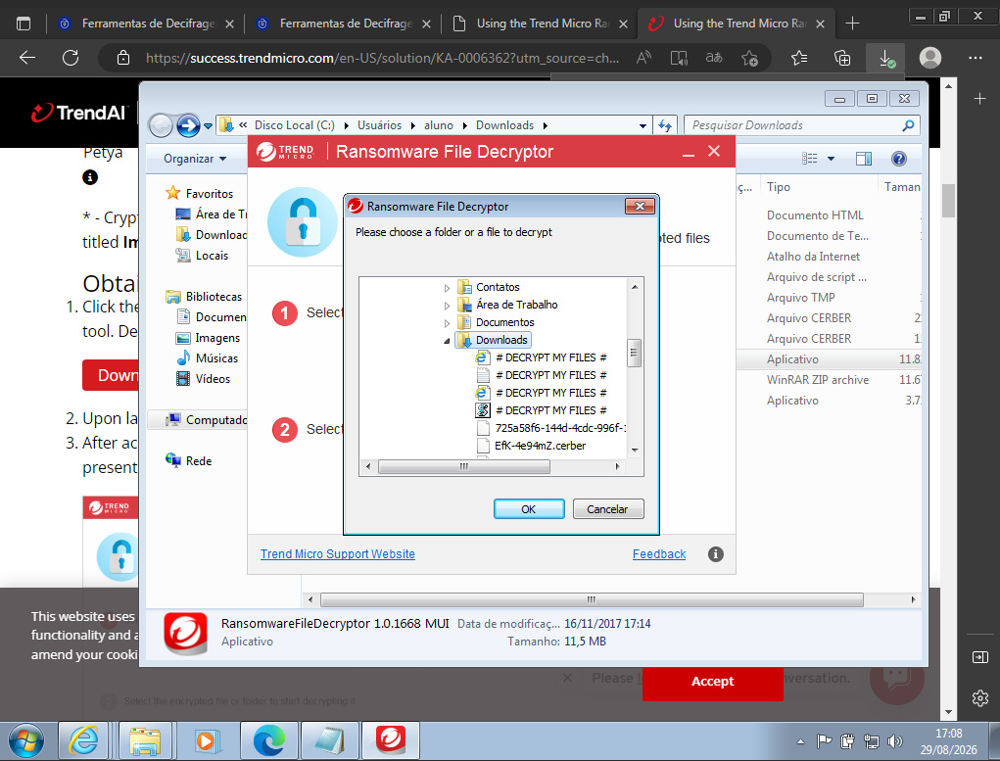

**Fonte:** Interface da Trend Micro; captura do autor (2026) [6].

**Figura 12 — Registro inicial da varredura, ainda sem arquivo decifrado**

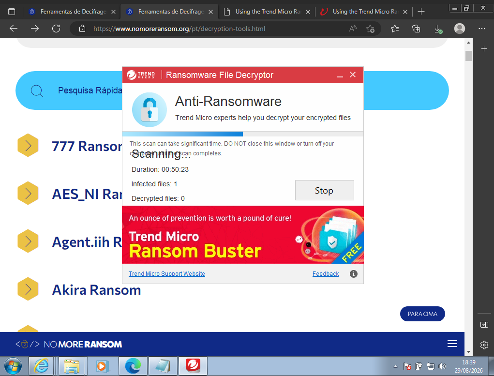

**Fonte:** Interface da Trend Micro; captura do autor (2026) [6].

### 6.4. Limitações e gargalo de tempo

A Trend Micro documenta quatro restrições relevantes para CERBER [6]:

- a decifragem deve ocorrer na própria máquina infectada, pois a ferramenta procura o primeiro arquivo cifrado para um cálculo crítico;
- o processo pode levar várias horas — média aproximada de quatro horas em um Intel i5 de dois núcleos usado como referência pelo fabricante;
- devido à complexidade do método, mais núcleos de CPU podem reduzir a probabilidade de sucesso; e
- alguns arquivos podem ser recuperados apenas parcialmente e exigir reparo posterior.

Essas restrições tornam o tempo um gargalo e impedem interpretar a ausência de recuperação após 50 minutos e 23 segundos como falha definitiva. Ao mesmo tempo, sem conclusão registrada, também não há base para afirmar sucesso.

**Figura 13 — CERBER V1 entre as famílias suportadas pela Trend Micro**

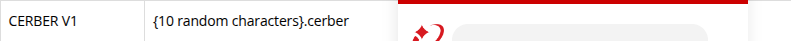

**Fonte:** Reprodução de Trend Micro [6], capturada em 29 ago. 2026.

**Figura 14 — Limitações oficiais da decifragem de CERBER**

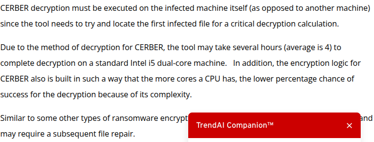

**Fonte:** Reprodução de Trend Micro [6], capturada em 29 ago. 2026.

As Figuras 15 e 16 são exemplos genéricos de conclusão publicados pela fabricante. Elas demonstram como a interface comunica um resultado bem-sucedido, mas **não representam o resultado deste laboratório** e não são específicas da amostra analisada.

**Figura 15 — Exemplo de conclusão com 86 de 86 arquivos, publicado pela fabricante**

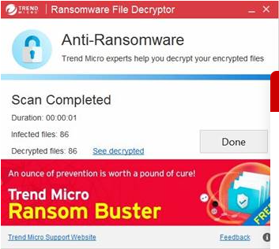

**Fonte:** Reprodução de Trend Micro [6], capturada em 29 ago. 2026.

**Figura 16 — Exemplo de conclusão com 27 de 27 arquivos, publicado pela fabricante**

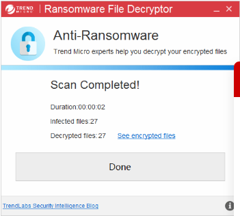

**Fonte:** Reprodução de Trend Micro [6], capturada em 29 ago. 2026.

## 7. Conclusão

O ensaio registrou comportamentos compatíveis com Cerber: arquivos `.cerber`, notas `# DECRYPT MY FILES #`, alteração do papel de parede e aviso sonoro relatado. A amostra do theZoo não apresentou infecção observável, mas as evidências não permitem atribuir uma causa. O arquivo `.dmg` relatado como proveniente do fluxo do No More Ransom foi renomeado para `.exe`; o erro resultante não representa uma avaliação válida de um executável Windows. A ferramenta obtida diretamente da solução oficial da Trend Micro iniciou a busca, porém não há evidência de conclusão ou recuperação.

O relatório deve permanecer como rascunho até que sejam registrados os hashes do pacote e do executável efetivamente usados, a variante seja validada, o ambiente seja descrito e uma execução completa seja documentada com logs e verificação dos arquivos recuperados. Para resposta a incidentes reais, a prioridade continua sendo isolamento, preservação das evidências, erradicação validada e restauração a partir de backups confiáveis; um decifrador não substitui essas medidas.

## 8. Referências

1. ABUSE.CH. **MalwareBazaar: SHA-256 `1cb6e2a2526f332fe132ab8905cd4cae65a1f7ef7aa4f9bf351f7f323f3b32c9` (Cerber)**. Disponível em: https://bazaar.abuse.ch/sample/1cb6e2a2526f332fe132ab8905cd4cae65a1f7ef7aa4f9bf351f7f323f3b32c9/. Acesso em: 29 ago. 2026.
2. MICROSOFT. **Ransom:Win32/Cerber**. Microsoft Security Intelligence, 12 mar. 2016; atualização em 10 jan. 2018. Disponível em: https://www.microsoft.com/en-us/wdsi/threats/malware-encyclopedia-description?name=Win32%2FCerber. Acesso em: 29 ago. 2026.
3. YTISF. **theZoo: Ransomware.Cerber**. GitHub. Disponível em: https://github.com/ytisf/theZoo/tree/master/malware/Binaries/Ransomware.Cerber. Acesso em: 29 ago. 2026.
4. NO MORE RANSOM. **Ferramentas de decifragem: CERBER V1 Ransom**. Disponível em: https://www.nomoreransom.org/pt/decryption-tools.html. Acesso em: 29 ago. 2026.
5. TREND MICRO. **Using the Trend Micro Ransomware File Decryptor Tool**. 2016. Disponível em: https://www.nomoreransom.org/uploads/TrendMicro_how-to_guide.pdf. Acesso em: 29 ago. 2026.
6. TREND MICRO. **Downloading and Using the Trend Micro Ransomware File Decryptor**. Solução `KA-0006362`, atualização em 30 set. 2024. Disponível em: https://success.trendmicro.com/en-US/solution/KA-0006362. Acesso em: 29 ago. 2026.
