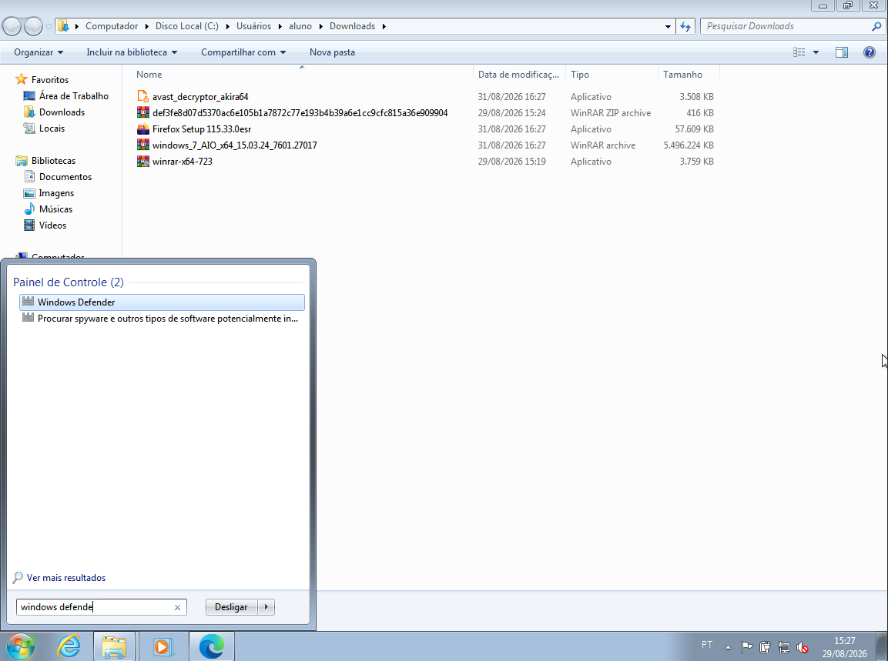
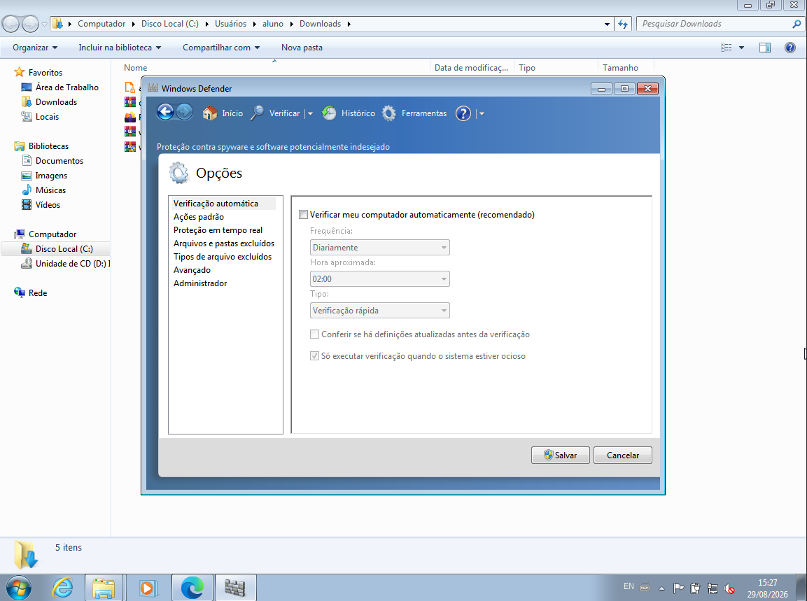
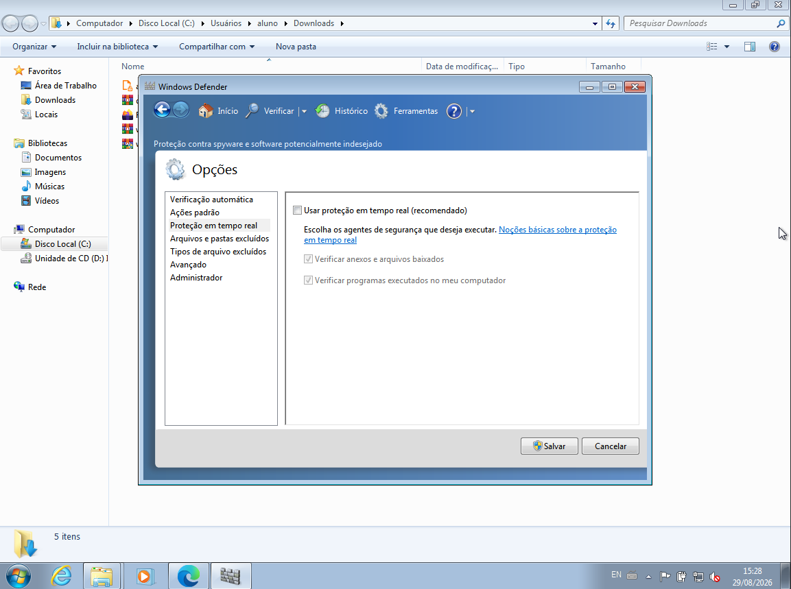
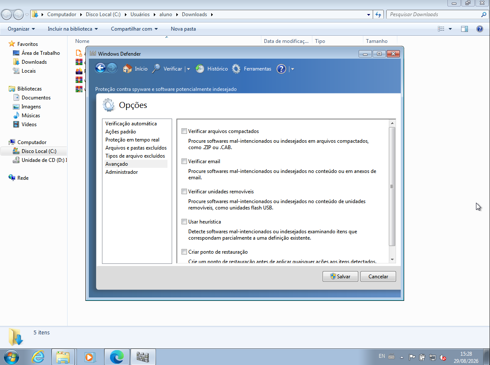
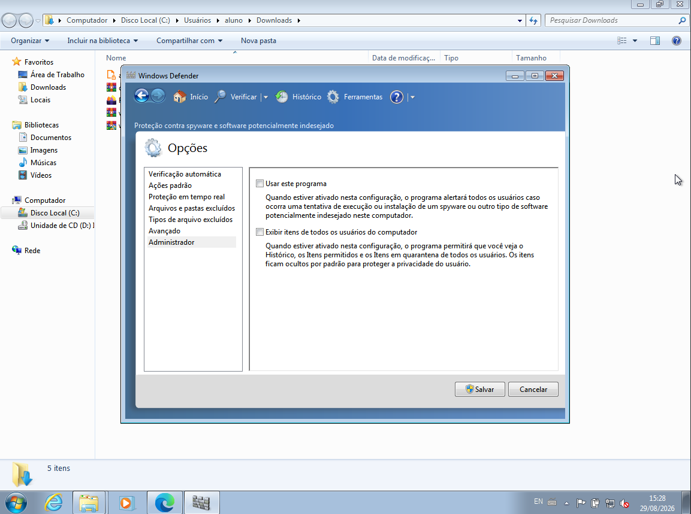
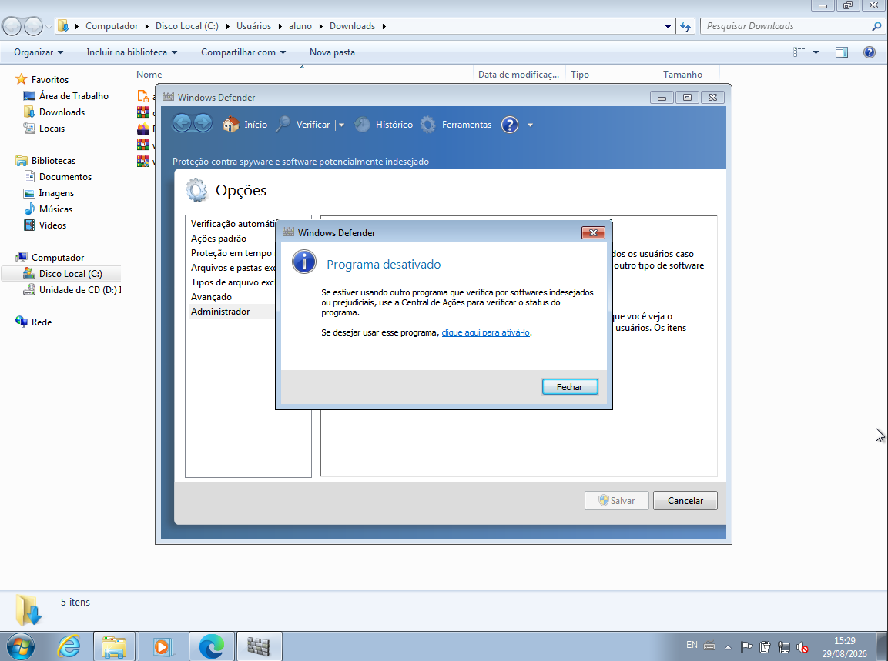
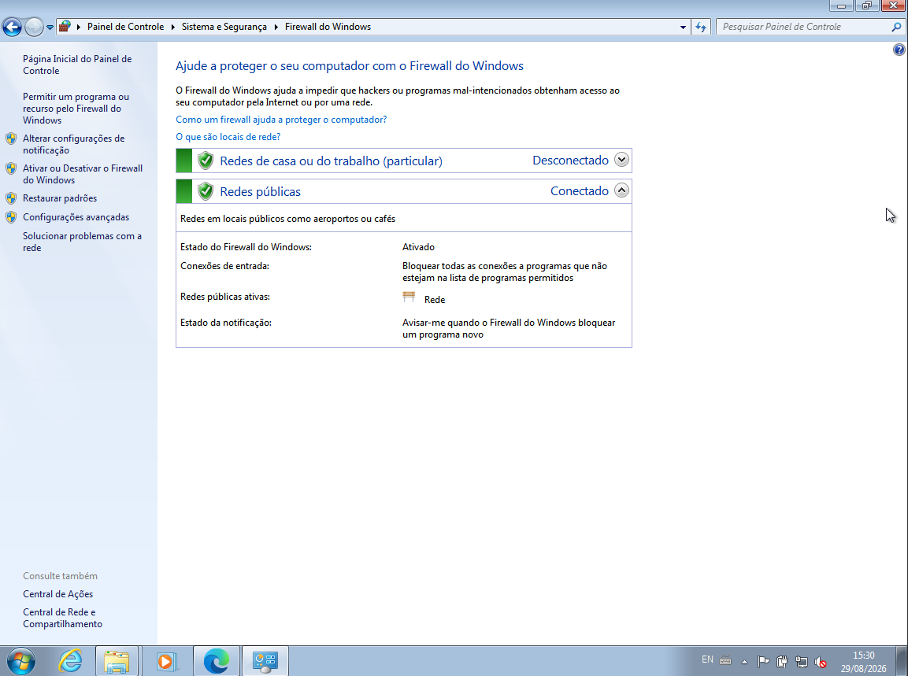
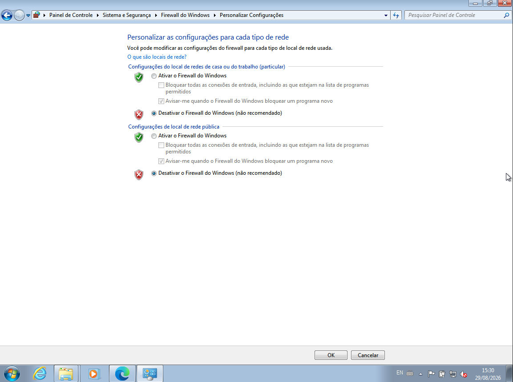

# Guia CMDB — configuração temporária dos controles de segurança do Windows 7 em laboratório

[English](./CMDB-GD-003-Windows-7-Security-Controls-Lab-Guide-EN.md) | **Português (Brasil)**

**Universidade Federal de Pernambuco (UFPE)**  
**Centro de Tecnologia e Geociências (CTG)**  
**Pós-Graduação Lato Sensu em Segurança Ofensiva e Inteligência Cibernética**  
**Caatinga Malware DB (CMDB)**

## Controle do documento

| Campo | Valor |
|---|---|
| Identificador | `CMDB-GD-003` |
| Versão | `0.1.0` |
| Estado | Rascunho |
| Data | 2026-09-01 |
| Idioma | Português brasileiro (`pt-BR`) |

## Autoria e contribuição

**Autor:** Romário J. O. Veloso  
**Afiliação:** Bacharelando em Engenharia Eletrônica, Universidade Federal de Pernambuco (UFPE), Recife — PE, Brasil.  
**Contribuição:** execução e registro do procedimento em laboratório, produção das capturas e redação inicial.  
**ORCID e e-mail institucional:** não informados.

### Citação sugerida

VELOSO, Romário J. O. *Guia CMDB — configuração temporária dos controles de segurança do Windows 7 em laboratório*. Recife: Universidade Federal de Pernambuco, 2026. Versão 0.1.0. Documento em elaboração.

## Histórico de versões

| Versão | Data | Responsável | Alteração |
|---|---|---|---|
| 0.1.0 | 2026-09-01 | Romário J. O. Veloso | Primeira organização editorial das evidências produzidas em laboratório. |

## Sumário

1. [Finalidade, escopo e público](#1-finalidade-escopo-e-público)
2. [Decisão de segurança](#2-decisão-de-segurança)
3. [Pré-requisitos e registro inicial](#3-pré-requisitos-e-registro-inicial)
4. [Configuração temporária do Windows Defender](#4-configuração-temporária-do-windows-defender)
5. [Configuração temporária do Firewall do Windows](#5-configuração-temporária-do-firewall-do-windows)
6. [Confirmação, encerramento e restauração](#6-confirmação-encerramento-e-restauração)
7. [Limitações](#7-limitações)
8. [Checklist de evidências](#8-checklist-de-evidências)
9. [Referências](#9-referências)
10. [Validação editorial](#10-validação-editorial)

## 1. Finalidade, escopo e público

Este guia registra o procedimento gráfico observado para desativar temporariamente o Windows Defender legado e, quando houver justificativa experimental, os perfis do Firewall do Windows em uma máquina virtual Windows 7.

O documento destina-se exclusivamente a estudantes e pesquisadores em laboratório acadêmico autorizado. Não se aplica a computadores pessoais, institucionais, de produção ou conectados a redes reais. A desativação não é obrigatória em toda análise: os controles devem permanecer ativos quando não impedirem a pergunta experimental.

Windows Defender e Firewall são controles distintos. O primeiro inspeciona software potencialmente indesejado conforme os recursos dessa geração; o segundo filtra tráfego de rede. Desativar um não desativa automaticamente o outro.

## 2. Decisão de segurança

O suporte ao Windows 7 terminou em 14 de janeiro de 2020 [1]. A Microsoft recomenda manter o Firewall habilitado porque sua desativação remove filtragem e outras proteções [2].

Antes de qualquer alteração:

- obtenha autorização e registre a justificativa;
- use VM descartável, sem dados pessoais ou credenciais;
- crie e teste um snapshot limpo;
- desative pastas compartilhadas, área de transferência, arrastar e soltar e passagem de USB;
- desconecte a interface virtual de redes externas **antes** de desativar o Firewall; e
- defina como retirar evidências sem reconectar a VM comprometida.

Se o ensaio exigir conectividade, mantenha o Firewall ativo e use regras específicas ou uma rede de simulação aprovada. Desativar o Firewall não cria isolamento.

## 3. Pré-requisitos e registro inicial

- VM Windows 7 exclusiva para o laboratório;
- conta administrativa autorizada;
- acesso ao console do hipervisor;
- snapshot ou imagem de restauração validada; e
- formulário para registrar configurações, horários e responsáveis.

Antes da mudança, registre a edição e o Service Pack do Windows, o estado da interface virtual, do Windows Defender e de cada perfil do Firewall, o identificador do snapshot, a data, o operador e o objetivo. As telas variam conforme edição, idioma, políticas e software instalado.

## 4. Configuração temporária do Windows Defender

### 4.1 Abrir o programa

No menu **Iniciar**, pesquise por `Windows Defender` e abra o resultado correspondente.

**Figura 1 — Acesso ao Windows Defender pelo menu Iniciar**

**Fonte:** Acervo do autor (2026).

### 4.2 Desativar a verificação automática

Em **Ferramentas > Opções > Verificação automática**, desmarque **Verificar meu computador automaticamente (recomendado)**. Registre o estado anterior.

**Figura 2 — Opção de verificação automática desmarcada**

**Fonte:** Acervo do autor (2026).

### 4.3 Desativar a proteção em tempo real

Em **Proteção em tempo real**, desmarque **Usar proteção em tempo real (recomendado)**. A alteração aumenta imediatamente a exposição da VM e só deve ocorrer após a confirmação do isolamento.

**Figura 3 — Proteção em tempo real desmarcada**

**Fonte:** Acervo do autor (2026).

### 4.4 Conferir as opções avançadas

Em **Avançado**, registre as opções existentes. A tela reúne comportamentos adicionais de verificação; ela não confirma sozinha que o programa foi desativado. Não altere opções sem relação com o plano experimental.

**Figura 4 — Opções avançadas observadas no Windows Defender**

**Fonte:** Acervo do autor (2026).

### 4.5 Desativar o uso do programa

Em **Administrador**, desmarque **Usar este programa** e selecione **Salvar**. A ação exige privilégio administrativo e desativa o Windows Defender legado nessa instalação.

**Figura 5 — Opção Usar este programa desmarcada**

**Fonte:** Acervo do autor (2026).

Confirme a mensagem exibida e feche a janela. A confirmação é evidência do estado mostrado pela interface, não prova de isolamento ou da ausência de outro software de segurança.

**Figura 6 — Confirmação visual da desativação do Windows Defender**

**Fonte:** Acervo do autor (2026).

## 5. Configuração temporária do Firewall do Windows

Esta etapa é opcional e exige justificativa separada. Confirme no **hipervisor** que a interface virtual está desconectada de redes externas antes de prosseguir.

### 5.1 Abrir a configuração dos perfis

Em **Painel de Controle > Sistema e Segurança > Firewall do Windows**, selecione **Ativar ou desativar o Firewall do Windows**.

**Figura 7 — Acesso à configuração dos perfis do Firewall**

**Fonte:** Acervo do autor (2026).

### 5.2 Desativar temporariamente os perfis

Selecione **Desativar o Firewall do Windows (não recomendado)** para os perfis incluídos no ensaio e confirme em **OK**. Na captura, a opção foi selecionada nos perfis doméstico/trabalho e público.

**Figura 8 — Perfis doméstico/trabalho e público configurados como desativados**

**Fonte:** Acervo do autor (2026).

Não interrompa o serviço do Firewall. A documentação da Microsoft alerta que parar o serviço pode provocar incompatibilidades [2].

## 6. Confirmação, encerramento e restauração

Antes do ensaio, registre o estado da verificação automática, da proteção em tempo real, do uso do Windows Defender, de cada perfil do Firewall, da interface virtual, das integrações host–convidado e do snapshot. Não conecte a VM à internet para permitir comunicação da amostra.

Depois de coletar as evidências, mantenha a VM desconectada. O encerramento preferencial é desligá-la e restaurar o snapshot limpo ou descartá-la. Reativar controles em um sistema que executou malware não comprova que ele voltou a ser confiável.

Se a política do laboratório exigir reutilização, ainda sem rede externa:

1. reative **Usar este programa**, proteção em tempo real e verificação automática;
2. reative o Firewall em todos os perfis;
3. reinicie e registre o estado dos controles;
4. execute as verificações definidas pelo laboratório; e
5. reconecte a interface apenas após validação formal.

## 7. Limitações

- As capturas representam uma instalação específica do Windows 7.
- O Windows Defender legado não equivale ao Microsoft Defender Antivirus atual.
- O estado exibido pela interface não demonstra o estado de todos os serviços ou soluções de terceiros.
- Desativar o Firewall remove filtragem local, mas não cria nem comprova isolamento.
- Restaurar controles não elimina persistência ou adulteração produzida por malware.

## 8. Checklist de evidências

- [ ] Autorização e objetivo registrados.
- [ ] Versão do Windows e configuração da VM registradas.
- [ ] Snapshot limpo identificado e testado.
- [ ] Rede e integrações do hipervisor verificadas.
- [ ] Estado anterior de cada controle preservado.
- [ ] Alterações e horários registrados.
- [ ] Evidências retiradas por procedimento aprovado.
- [ ] VM restaurada ou descartada e responsável registrado.

## 9. Referências

1. MICROSOFT. *Perguntas frequentes sobre o fim do suporte para o Windows 7*. Microsoft Learn. Disponível em: <https://learn.microsoft.com/pt-br/troubleshoot/windows-client/windows-7-eos-faq/windows-7-end-support-faq-general>. Acesso em: 1 set. 2026.
2. MICROSOFT. *Windows Firewall overview*. Microsoft Learn. Disponível em: <https://learn.microsoft.com/windows/security/operating-system-security/network-security/windows-firewall/>. Acesso em: 1 set. 2026.

## 10. Validação editorial

| Papel | Nome | Data | Versão validada |
|---|---|---|---|
| Autor | Romário J. O. Veloso | Pendente | Pendente |
| Revisor técnico | Pendente | Pendente | Pendente |
| Aprovação editorial/institucional | Pendente | Pendente | Pendente |

