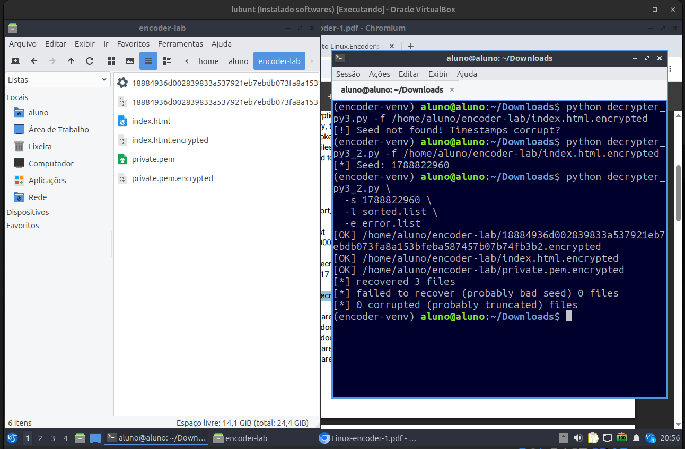

# Linux.Encoder.1 Ransomware

**English** | [Português (Brasil)](./CMDB-TR-007-Linux-Encoder-1-Report-pt-BR.md)

> **Federal University of Pernambuco — UFPE**  
> **Center for Technology and Geosciences — CTG**  
> **Lato Sensu Graduate Program in Offensive Security and Cyber Intelligence**  
> **Caatinga Malware DB (CMDB) · Academic technical report**

**Subtitle:** dynamic analysis, execution failure diagnosis, and controlled encryption reproduction in Linux

**Romário J. O. Veloso¹**

¹ Undergraduate student in Electronic Engineering, Federal University of Pernambuco (UFPE), Recife — PE, Brazil.

> **Safety notice:** this document records experiments already performed with malicious software for study and defense. Do not execute samples outside an isolated, authorized laboratory with no real data and prepared for restoration. Commands are presented as a technical record of the experiment, not as authorization for use on third-party systems.

Template adapted from the [FIRST Malware Analysis SIG](https://www.first.org/global/sigs/malware/ma-framework/) *Cyber Malware Analysis Report Template v1* (2021) and the UFPE/CTG editorial structure adopted by the Caatinga Malware DB project.

## Document control

| Field | Information |
|---|---|
| Identifier | `CMDB-TR-007` |
| Version | `0.1.0` |
| Publication date | `2026-09-05` |
| Editorial status | Draft |
| Location | Recife — PE, Brazil |

## How to cite

> VELOSO, Romário J. O. **Linux.Encoder.1 Ransomware: dynamic analysis, execution failure diagnosis, and controlled encryption reproduction in Linux**. Caatinga Malware DB (CMDB). Recife: UFPE/CTG, 2026. Technical report `CMDB-TR-007`, version 0.1.0. Available at: [permanent URL after publication]. Accessed: [date].

## Version history

| Version | Date | Change description | Responsible person |
|---|---|---|---|
| 0.1.0 | 2026-09-05 | Initial version consolidating sample identification, execution failures, `strace` and GDB analysis, RSA parameter preparation, controlled encryption, and recovery testing. | Romário J. O. Veloso |

## Version sign-off

| Role | Name | Date | Validated version |
|---|---|---|---|
| Responsible author | Romário J. O. Veloso | Pending | — |
| Technical reviewer | Pending | — | — |
| Advisor or responsible faculty member, when applicable | Pending | — | — |
| CMDB editorial approval | Pending | — | — |

- **Versioned artifact:** `CMDB-TR-007-Linux-Encoder-1-Report-EN.md`, version `0.1.0`.
- **Samples:** not distributed with this report.

## Table of contents

1. [Abstract](#1-abstract)
2. [Legal disclaimer](#2-legal-disclaimer)
3. [About the analyzed malware](#3-about-the-analyzed-malware)
4. [Activities performed](#4-activities-performed)
5. [Laboratory environment](#5-laboratory-environment)
6. [Dynamic analysis evidence](#6-dynamic-analysis-evidence)
7. [Conclusion](#7-conclusion)
8. [References](#8-references)

## 1. Abstract

This report documents the dynamic analysis of five ELF executables attributed to Linux.Encoder.1 ransomware, including 32-bit and 64-bit Linux variants and a FreeBSD build. The x86-64 sample with SHA-256 `18884936d002839833a537921eb7ebdb073fa8a153bfeba587457b07b74fb3b2` produced a segmentation fault when started without parameters. Triage with `file` and `strace` showed that the operating system loaded the binary and that it failed before accessing auxiliary files. GDB confirmed that `argv[1]` was `NULL` and was passed directly to `strcmp()`. Disassembly of `main()` revealed the expected parameters: an operating mode, an RSA key, and an optional HTML file. A disposable RSA key and synthetic content allowed the encryption path to be reached in the laboratory. A Python 3 adaptation of the historical decrypter recovered seed `1788822960` and produced three output files without reported errors. Because comparative hashes were not preserved, the outcome is classified as apparent functional recovery. The experiment shows that the initial failure was caused by missing arguments rather than incompatibility with Lubuntu.

**Keywords:** Linux.Encoder.1; ransomware; Linux; dynamic analysis; GDB; SHA-256; cryptography.

## 2. Legal disclaimer

This report is intended for teaching, research, and cyber defense. The repository [disclaimer](../../../DISCLAIMER.md), [security guidance](../../../SECURITY.md), and access and use rules apply.

Family names, hashes, and references are provided for identification, traceability, and research. This document does not authorize execution on third-party systems, control evasion, propagation, malicious persistence, or non-consensual offensive use.

The execution described here took place in a virtual laboratory. Before final publication, the report must explicitly record network state, host–guest integrations, the restoration snapshot, and the absence of real data from the exposed system.

## 3. About the analyzed malware

Linux.Encoder.1 was publicly documented in November 2015 as ransomware targeting Linux systems. Doctor Web described it as C code using the PolarSSL library. Its description records the loading of auxiliary message files, receipt of a public RSA key path, daemon creation, removal of the program's original files, and encryption in directories such as `/home`, `/root`, `/var/lib/mysql`, `/var/www`, `/etc/nginx`, `/etc/apache2`, and `/var/log` [1].

According to the same source, selected files are encrypted with AES-CBC-128, receive the `.encrypted` extension, and affected directories receive a `README_FOR_DECRYPT.txt` note. The target list covers documents, databases, web files, images, archives, keys, and other formats [1].

Bitdefender found that the first generation derived the AES key and initialization vector from `rand()` calls seeded with the system timestamp. This predictable construction made recovery possible without the operator's private RSA key [2]. Later iterations changed parts of the key generation and exhibited implementation and compatibility differences [3]. Results obtained with this sample must therefore not be generalized to every family variant.

There is strong external correlation for the x86-64 sample used in the experiment. Hybrid Analysis records SHA-256 `18884936d002839833a537921eb7ebdb073fa8a153bfeba587457b07b74fb3b2`, a size of 317,530 bytes, MD5 `22dc1db1a876721727cca37c21d31655`, and SHA-1 `98e057a4755e89fbfda043eaca1ab072674a3154`, identifying it as a statically linked x86-64 ELF [7]. Doctor Web lists the same SHA-1 for an unpacked Linux.Encoder.1 x64 variant [1].

## 4. Activities performed

- The package and five executables were triaged by architecture and operating system.
- Linux variants were executed in a controlled environment, and the initial failure was investigated with `strace` and GDB.
- `main()` was disassembled to identify arguments and encryption and decryption paths.
- A disposable RSA key and synthetic HTML content were prepared.
- Encryption was reproduced with the x86-64 variant.
- The historical recovery tool was adapted and executed, and its limitations were recorded.

### 4.1. Package traceability

| Field | Value |
|---|---|
| Observed name | `Linux.Encoder.1.zip` |
| Analyzed object | Compressed archive and extracted ELF executables |
| Source actually used | **Pending:** not preserved in the available notes |
| Public correlation | theZoo hosts a package with the same name and the same five SHA-256-formatted filenames [5, 6] |
| Protection of correlated package | ANY.RUN records extraction with the conventional password `infected` [6] |
| SHA-256 of the package actually used | **Pending — must be calculated locally before publication** |
| SHA-256 of the correlated public package | `3a94a6420474ab40a0dbc3bbe2f367c497e26df8dc161bb2f6e175bce217d738` [6] |
| Integrity note | The external hash does not replace calculation over the local archive actually analyzed |

### 4.2. Extracted artifacts

The observed filenames use the SHA-256 format and are useful for correlation, but the CMDB template requires each hash to be recalculated over the corresponding local file before publication.

| Observed identifier | Type identified in the laboratory | Experiment outcome |
|---|---|---|
| `18884936d002839833a537921eb7ebdb073fa8a153bfeba587457b07b74fb3b2` | 64-bit x86-64 SYSV ELF, statically linked, not stripped | Main analysis target; failed without arguments and encrypted after parameter preparation |
| `cfca38c408c95e45cdf797723dc5cdb0d6dadb1b8338a5fda6808ce9a04e6486` | 32-bit Intel i386 SYSV ELF, statically linked, not stripped | Direct execution produced a segmentation fault |
| `ee21378abf78e31d79f9170e76d01ffb74aa65ce885937fb5bc1e71dff68627d` | 64-bit x86-64 ELF for FreeBSD 10.1, statically linked, with `debug_info` | Not selected for Linux execution; an external source confirms SHA-1 `810806c3967e03f2fa2b9223d24ee0e3d42209d3` [8] |
| `f5ca1277b7fde07880a691f7f3794a11980a408c510442fde486793ee56ad291` | 32-bit i386 GNU/Linux ELF, statically linked, without a section header | Not prioritized |
| `fd042b14ae659e420a15c3b7db25649d3b21d92c586fe8594f88c21ae6770956` | 64-bit x86-64 GNU/Linux ELF, statically linked, without a section header | Not prioritized |

### 4.3. Recovery tool artifacts

The following package contains the adaptation used in the experiment and is stored separately from malware samples. MD5 is provided only for legacy correlation; SHA-256 is the preferred identifier.

| Artifact | SHA-256 | MD5 |
|---|---|---|
| [`Linux-Encoder1-decrypter.zip`](./Linux-Encoder1-decrypter.zip) | `99011a392de7b656fc6ee64840036961217c03b20a83a94d9a8968f63d4bd316` | `27e09b4290be4ff1022c88bf04e78f37` |
| [`Linux-Encoder1-decrypter.pass`](./Linux-Encoder1-decrypter.pass) | `0432db65a7703cb1073e524df8343657c50e6075940db40ec7b7a84ca354254f` | `1e76611a4074824cb8400722c1c45082` |

The values are also available from the `.sha256` and `.md5` manifests stored in this directory.

## 5. Laboratory environment

| Item | Description |
|---|---|
| Authorization and responsible person | Academic activity conducted by the author; responsible person: Romário J. O. Veloso |
| Operating system | Lubuntu/Linux virtual machine; exact version pending |
| Virtualization | Virtual machine; hypervisor version pending |
| Main sample architecture | x86-64 |
| Network | Effective state during execution was not preserved in the supplied evidence |
| Host–guest integrations | Clipboard, drag-and-drop, and shared-folder state pending |
| Tools | `file`, `readelf`, `strings`, `strace`, GDB `17.1`, OpenSSL; remaining versions pending |
| Synthetic material | Disposable RSA key pair and `index.html` created for the experiment |
| Restoration | Snapshot or restoration image recommended; actual use pending documentation |
| Main analysis date | `2026-09-05` |

## 6. Dynamic analysis evidence

### 6.1. Initial direct execution

The sample was first made executable and started without additional parameters. Both the x86-64 and i386 variants produced a segmentation fault. The main sample returned:

```text
Segmentation fault (core dumped)
```

Architecture incompatibility, missing libraries, loader problems, and variant-specific requirements were initially considered. `file` identified the main sample as:

```text
ELF 64-bit LSB executable, x86-64, version 1 (SYSV),
statically linked, not stripped
```

Because it was statically linked, a missing common dynamic dependency did not explain the failure. The i386 variant was also statically linked.

**Figure 1 — Linux.Encoder.1 sample set in the laboratory**


**Source:** Author's collection (2026).

### 6.2. Architecture differentiation

`file` showed that the package combined Linux and FreeBSD builds in both 32-bit and 64-bit forms. The `ee21378...` sample was compiled for FreeBSD 10.1 and therefore should not be treated as a regular Linux executable. Joe Sandbox independently records SHA-1 `810806c3967e03f2fa2b9223d24ee0e3d42209d3` for that file, which Doctor Web also lists for the x64 FreeBSD build [1, 8].

### 6.3. `strace`: identifying when the failure occurred

After direct execution ended in a segmentation fault, `strace` was used to determine whether Lubuntu loaded the executable and which operating-system interactions occurred immediately before termination. The tool records system calls but does not change process behavior or reveal the internal cause by itself.

```bash
ARQ=18884936d002839833a537921eb7ebdb073fa8a153bfeba587457b07b74fb3b2
strace -f -o /tmp/encoder64.trace "./$ARQ"
tail -n 80 /tmp/encoder64.trace
```

`-f` follows any child processes, while `-o` writes the trace to `/tmp/encoder64.trace`. The relevant final lines were:

```text
execve("./18884936...", ["./18884936..."], ...) = 0
arch_prctl(ARCH_SET_FS, ...) = 0
set_tid_address(...) = ...
brk(NULL) = ...
getcwd("/home/aluno/Downloads/Linux.Encoder.1", 1024) = 38
--- SIGSEGV {si_signo=SIGSEGV, si_code=SEGV_MAPERR, si_addr=NULL} ---
+++ killed by SIGSEGV (core dumped) +++
```

The `0` return from `execve()` shows that the operating system loaded and started the sample. `getcwd()` obtained the current working directory, after which `si_addr=NULL` recorded an attempted access to address `0x0`. No `open()` or `openat()` call related to an RSA key, HTML file, or other auxiliary artifact appeared before the failure. The trace therefore placed the crash near the start of the program and motivated GDB analysis.

### 6.4. GDB: failure cause and parameter identification

The sample was opened in GDB and stopped at `main()`. Under the System V AMD64 convention, `RDI` contained `argc`, while `RSI` pointed to `argv`:

```bash
gdb -q "./$ARQ"
```

```gdb
set debuginfod enabled off
set pagination off
break main
run
info registers rdi rsi
p/x *((char **)$rsi + 1)
```

`RDI = 1` confirmed that the executable name was the only argument. The next vector element returned `0x0`; therefore, `argc = 1` and `argv[1] = NULL`.

Continuing execution produced a fault in `strcmp()`:

```text
Program received signal SIGSEGV, Segmentation fault.
0x000000000042c930 in strcmp ()

#0  0x000000000042c930 in strcmp ()
#1  0x000000000040136d in main ()
```

At that point, `RDI = 0x0`, meaning that the first `strcmp()` argument was null. The relevant `main()` fragment confirmed that `argv[1]`, at an eight-byte offset in the argument vector, was passed without prior validation:

```asm
mov    0x8(%rbx),%r12
mov    $0x42f1f4,%esi
mov    %r12,%rdi
call   strcmp
```

Further disassembly showed `argv[2]` being passed to `loadRSA()` and, when present, `argv[3]` to `loadHtmlFile()`. Encryption-related calls included `encrypt_directory` and `up_encrypt`, while the alternative path included `decrypt_all` and `up_decrypt`. The expected form was therefore:

```text
<sample> <mode> <RSA-key-file> [HTML-file]
```

The evidence established that Lubuntu had loaded the sample normally. The crash occurred because a missing `argv[1]` was compared with an internal string.

**Figure 2 — Confirmation of `argc = 1` and `argv[1] = NULL`**


**Source:** Author's collection (2026).

### 6.5. Controlled parameter preparation

A dedicated laboratory directory was created, together with a disposable 2,048-bit RSA key pair and synthetic HTML content. The private key was retained only as a laboratory artifact; the sample received `public.pem`. The selected key size does not establish the size used by the original operators.

```bash
mkdir ~/encoder-lab
cd ~/encoder-lab
openssl genpkey -algorithm RSA -pkeyopt rsa_keygen_bits:2048 -out private.pem
openssl pkey -in private.pem -pubout -out public.pem
```

The resulting directory contained `index.html`, `private.pem`, and `public.pem`.

**Figure 3 — Synthetic auxiliary artifacts prepared in the laboratory**


**Source:** Author's collection (2026).

### 6.6. Controlled encryption reproduction

The x86-64 sample was invoked with the parameters identified during disassembly:

```text
./18884936d002839833a537921eb7ebdb073fa8a153bfeba587457b07b74fb3b2 encrypt public.pem index.html
```

This supplied `encrypt` as `argv[1]`, `public.pem` as `argv[2]`, and `index.html` as `argv[3]`. Unlike the parameterless attempt, the invocation reached the encryption path and created `.encrypted` artifacts in the virtual machine. This confirms functional execution of the identified parameter structure, but it does not establish complete or correct encryption of every laboratory file.

**Figure 4 — State after controlled encryption**


**Source:** Author's collection (2026).

### 6.7. Historical decryption tool

The No More Ransom guide refers to the historical package `Decrypter_0-1.3.zip`. Its procedure uses `sort_files.sh` to order `.encrypted` files by modification time and `decrypter.py` to reconstruct the pseudorandom generator seed and process affected files [4].

The historical `labs.bitdefender.com` address no longer returned the expected ZIP. The public `eugenekolo/linux-ransomware-decrypter` repository was located and contains both scripts [11]. Because no official SHA-256 for `Decrypter_0-1.3.zip` was found, the repository is treated only as a **candidate public copy**, not as a byte-identical authenticated copy of the original distribution.

#### 6.7.1. Python 3 adaptation

The consulted `decrypter.py` was written for Python 2. Experiment notes record that Python 3.14 initially rejected its syntax and binary-data handling. Since Python 2 was unavailable, a virtual environment with PyCryptodome was used and the script was adapted for Python 3.

Reported changes covered `print` syntax, explicit `bytes` handling, key and initialization-vector construction, and removal of `ord()` calls that are incompatible with Python 3 byte iteration. The goal was to retain the consulted seed-search and recovery algorithm while changing only compatibility points. The resulting file is an **experiment-derived artifact**, not an official Bitdefender tool.

#### 6.7.2. File ordering and seed recovery

The controlled encrypted files were ordered by modification time:

```bash
./sort_files.sh ~/encoder-lab > sorted.list
```

The recorded list contained the executable, `index.html`, and `private.pem`, all with `.encrypted` extensions and close timestamps. `index.html.encrypted` was then used to search for the seed:

```bash
python decrypter_py3_2.py \
  -f /home/aluno/encoder-lab/index.html.encrypted
```

The tool returned seed `1788822960`, consistent with the recorded file timestamp `1788822960.4686776090`.

#### 6.7.3. File recovery

The recovered seed was applied to the three entries in `sorted.list`:

```bash
python decrypter_py3_2.py \
  -s 1788822960 \
  -l sorted.list \
  -e error.list
```

The recorded output was:

```text
[OK] /home/aluno/encoder-lab/18884936...encrypted
[OK] /home/aluno/encoder-lab/index.html.encrypted
[OK] /home/aluno/encoder-lab/private.pem.encrypted
[*] recovered 3 files
[*] failed to recover (probably bad seed) 0 files
[*] 0 corrupted (probably truncated) files
```

**Figure 5 — File recovery with the adapted decrypter**



**Source:** Author's collection (2026).

The screenshot corroborates the reported seed, three `[OK]` entries, the final counters, and creation of files without the `.encrypted` extension. It demonstrates **apparent functional recovery** in the controlled set, but does not independently prove that recovered content is identical to the original content.

### 6.8. Limitations and interpretation

The experiment produced evidence for three stages: identification of the required parameters, reproduction of encryption, and output-file production by the adapted decrypter. During recovery, the tool reported three recovered files, no failures, and no truncated files; Figure 5 is consistent with that result.

This evidence is not equivalent to integrity validation. Hashes of the synthetic files before encryption and after recovery were not preserved, so byte-for-byte equality cannot be established. The proper conclusion for this version is **apparent functional recovery**, not proven complete recovery.

The result is also limited to three artifacts produced in a controlled environment. It does not predict performance on real systems with many files, distinct timestamps, truncated files, multiple seeds, or other Linux.Encoder variants.

Tool provenance has two additional limitations: the source is a candidate public copy without an official comparison hash, and the executed file was locally modified for Python 3. Final publication should record the adaptation's SHA-256, its diff from the consulted source, and hashes for the original, encrypted, and recovered files. Exact sample origin and the complete VM, network, and isolation configuration also remain pending.

A Matrix-like screensaver appearance was observed in the virtual machine, but this behavior is absent from the consulted Linux.Encoder.1 descriptions [1, 2]. Because XScreenSaver includes effects with that appearance [9], the event is not treated as a ransomware indicator without evidence that the sample changed the configuration.

## 7. Conclusion

The experiment showed that the x86-64 variant's initial failure was not caused by architecture, dependencies, or Lubuntu incompatibility. The binary loaded normally but accessed `argv[1]` without checking that it existed and passed the null pointer to `strcmp()`. `strace` placed the failure near process startup, while GDB and `main()` disassembly established its cause and revealed the expected parameters.

A disposable RSA key and synthetic HTML content allowed the `encrypt` invocation to reach the encryption routine. This functionally confirmed the reverse-engineering hypothesis, although missing pre- and post-execution hashes prevent a complete impact characterization.

The Python 3 adaptation of the historical decrypter recovered seed `1788822960` and produced three output files without reported failures. Missing comparative hashes prevent identity with the originals from being confirmed, and the candidate public copy could not be authenticated against the historical package. Future work should prioritize hashes, the code adaptation diff, VM configuration, complete logs, and test artifacts.

## 8. References

1. DOCTOR WEB. **Linux.Encoder.1**. Dr.Web Malware Description Library. Added to the database on 5 Nov. 2015; description published on 6 Nov. 2015. Available at: <https://vms.drweb.com/virus/?i=7704004>. Accessed: 5 Sep. 2026.

2. BOTEZATU, Bogdan. **Linux Ransomware Debut Fails on Predictable Encryption Key**. Bitdefender Labs, 9 Nov. 2015. Available at: <https://www.bitdefender.com/en-gb/blog/labs/linux-ransomware-debut-fails-on-predictable-encryption-key>. Accessed: 5 Sep. 2026.

3. BITDEFENDER LABS. **Third Iteration of Linux Ransomware Still not Ready for Prime-Time**. 2015. Available at: <https://www.bitdefender.com/en-gb/blog/labs/third-iteration-of-linux-ransomware-still-not-ready-for-prime-time>. Accessed: 5 Sep. 2026.

4. NO MORE RANSOM. **Linux.Encoder.1**. Decryption guide. Available at: <https://www.nomoreransom.org/uploads/Linux-encoder-1.pdf>. Accessed: 5 Sep. 2026.

5. YTISF. **theZoo: Linux.Encoder.1**. GitHub. Historical directory containing `Linux.Encoder.1.zip`, hash files, and password. Available at: <https://github.com/ytisf/theZoo>. Accessed: 5 Sep. 2026.

6. ANY.RUN. **Malware analysis: Linux.Encoder.1.zip — SHA-256 3a94a6420474ab40a0dbc3bbe2f367c497e26df8dc161bb2f6e175bce217d738**. Analysis dated 12 Apr. 2024. Available at: <https://any.run/report/3a94a6420474ab40a0dbc3bbe2f367c497e26df8dc161bb2f6e175bce217d738/f1c1b1a3-e602-4b22-99ec-88ab255f3e3e>. Accessed: 5 Sep. 2026.

7. HYBRID ANALYSIS. **Sample report: SHA-256 18884936d002839833a537921eb7ebdb073fa8a153bfeba587457b07b74fb3b2**. Falcon Sandbox. Available at: <https://www.hybrid-analysis.com/sample/18884936d002839833a537921eb7ebdb073fa8a153bfeba587457b07b74fb3b2?environmentId=300>. Accessed: 5 Sep. 2026.

8. JOE SECURITY. **Automated Malware Analysis Report — FreeBSD ELF; SHA-256 ee21378abf78e31d79f9170e76d01ffb74aa65ce885937fb5bc1e71dff68627d**. Joe Sandbox. Available at: <https://www.joesandbox.com/analysis/1583370/0/pdf?download=1>. Accessed: 5 Sep. 2026.

9. UBUNTU. **glmatrix — simulates the title sequence effect of the movie**. Ubuntu Manpages; `xscreensaver-gl` package. Available at: <https://manpages.ubuntu.com/manpages/resolute/man6/glmatrix.6x.html>. Accessed: 5 Sep. 2026.

10. FIRST MALWARE ANALYSIS SIG. **Cyber Malware Analysis Report Template v1**. FIRST, 2021. Available at: <https://www.first.org/global/sigs/malware/ma-framework/>. Accessed: 5 Sep. 2026.

11. KOLO, Eugene. **linux-ransomware-decrypter: Bitdefender's Linux.Encoder.1 Decrypter**. GitHub, 2015. Available at: <https://github.com/eugenekolo/linux-ransomware-decrypter>. Accessed: 5 Sep. 2026.

12. INTEL CORPORATION. **Intel 64 and IA-32 Architectures Software Developer's Manual: Volume 2 — Instruction Set Reference, A–Z**. Santa Clara: Intel Corporation. Available at: <https://www.intel.com/content/www/us/en/developer/articles/technical/intel-sdm.html>. Accessed: 7 Sep. 2026.
