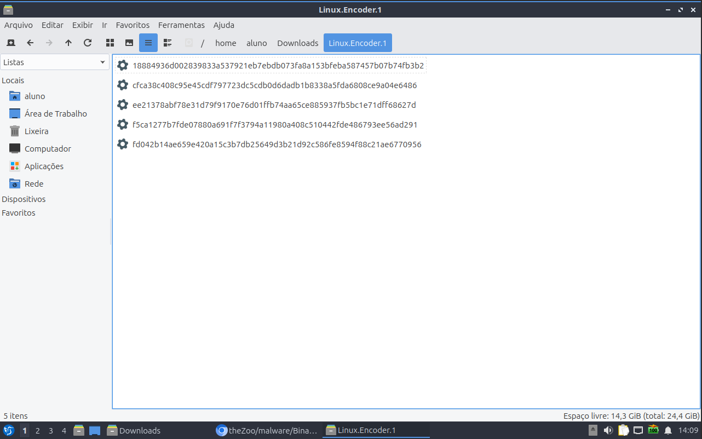
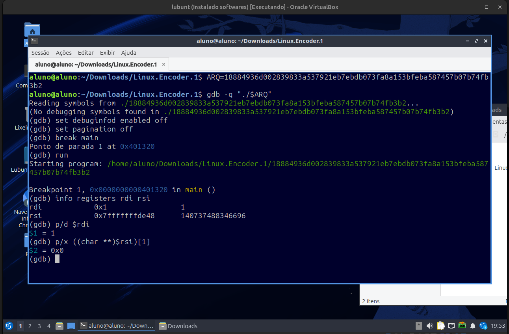
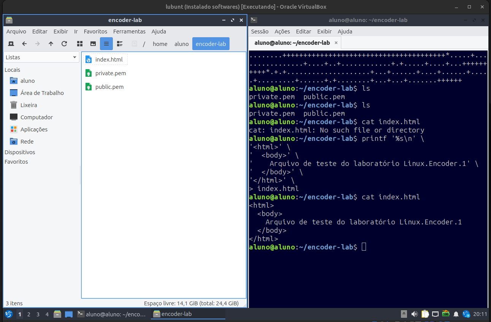
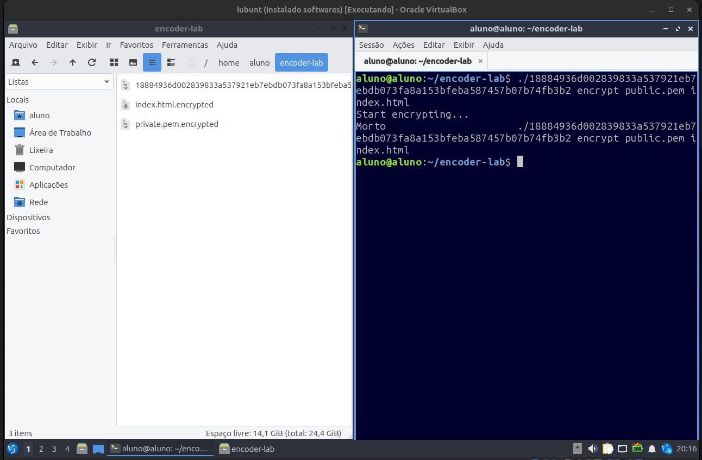

# Linux.Encoder.1 Ransomware

[English](./CMDB-TR-007-Linux-Encoder-1-Report-EN.md) | **Português (Brasil)**

> **Universidade Federal de Pernambuco — UFPE**  
> **Centro de Tecnologia e Geociências — CTG**  
> **Pós-Graduação Lato Sensu em Segurança Ofensiva e Inteligência Cibernética**  
> **Caatinga Malware DB (CMDB) · Relatório técnico acadêmico**

**Subtítulo:** análise dinâmica, diagnóstico de falhas de execução e reprodução controlada da cifragem em ambiente Linux

**Romário J. O. Veloso¹**

¹ Bacharelando em Engenharia Eletrônica, Universidade Federal de Pernambuco (UFPE), Recife — PE, Brasil.

> **Aviso de segurança:** este documento registra experimentos já realizados com software malicioso para estudo e defesa. Não execute amostras fora de laboratório isolado, autorizado, sem dados reais e preparado para restauração. Os comandos são apresentados como registro técnico do ensaio realizado, não como autorização para uso em sistemas de terceiros.

Modelo adaptado do _Cyber Malware Analysis Report Template v1_ (2021), da [FIRST Malware Analysis SIG](https://www.first.org/global/sigs/malware/ma-framework/), e da estrutura editorial da UFPE/CTG adotada pelo projeto Caatinga Malware DB.

## Controle do documento

| Campo              | Informação          |
| ------------------ | ------------------- |
| Identificador      | `CMDB-TR-007`       |
| Versão             | `0.1.0`             |
| Data de publicação | `2026-09-05`        |
| Estado editorial   | Rascunho            |
| Local              | Recife — PE, Brasil |

## Como citar

> VELOSO, Romário J. O. **Linux.Encoder.1 Ransomware: análise dinâmica, diagnóstico de falhas de execução e reprodução controlada da cifragem em ambiente Linux**. Caatinga Malware DB (CMDB). Recife: UFPE/CTG, 2026. Relatório técnico `CMDB-TR-007`, versão 0.1.0. Disponível em: [URL permanente após publicação]. Acesso em: [data].

## Controle de versões

| Versão | Data       | Descrição da alteração                                                                                                                                                     | Responsável          |
| ------ | ---------- | -------------------------------------------------------------------------------------------------------------------------------------------------------------------------- | -------------------- |
| 0.1.0  | 2026-09-05 | Versão inicial consolidando identificação das amostras, falhas de execução, análise com `strace` e GDB, preparação dos parâmetros RSA e reprodução controlada da cifragem. | Romário J. O. Veloso |

## Assinatura da versão

| Papel                                               | Nome                 | Data     | Versão validada |
| --------------------------------------------------- | -------------------- | -------- | --------------- |
| Autor responsável                                   | Romário J. O. Veloso | Pendente | —               |
| Revisor técnico                                     | Pendente             | —        | —               |
| Orientador ou docente responsável, quando aplicável | Pendente             | —        | —               |
| Aprovação editorial do CMDB                         | Pendente             | —        | —               |

- **Artefato versionado:** `CMDB-TR-007-Linux-Encoder-1-Report-pt-BR.md`, versão `0.1.0`.
- **Amostras:** não incluídas junto ao relatório.

## Sumário

1. [Resumo](#1-resumo)
2. [Aviso legal](#2-aviso-legal)
3. [O que é o malware analisado](#3-o-que-é-o-malware-analisado)
4. [Atividades realizadas](#4-atividades-realizadas)
5. [Ambiente de laboratório](#5-ambiente-de-laboratório)
6. [Evidências da análise dinâmica](#6-evidências-da-análise-dinâmica)
7. [Conclusão](#7-conclusão)
8. [Referências](#8-referências)

## 1. Resumo

Este relatório documenta a análise dinâmica de cinco executáveis ELF atribuídos ao ransomware Linux.Encoder.1, incluindo variantes Linux de 32 e 64 bits e uma compilação para FreeBSD. A amostra x86-64 de SHA-256 `18884936d002839833a537921eb7ebdb073fa8a153bfeba587457b07b74fb3b2` apresentou falha de segmentação quando iniciada sem parâmetros. A triagem com `file` e `strace` indicou que o binário era carregado normalmente e falhava antes de acessar arquivos auxiliares. No GDB, verificou-se que `argv[1]` era `NULL` e era encaminhado diretamente a `strcmp()`. A desmontagem de `main()` revelou os parâmetros esperados: modo de operação, chave RSA e, opcionalmente, um arquivo HTML. Com uma chave RSA descartável e conteúdo sintético, foi possível alcançar o fluxo de cifragem no laboratório. Uma adaptação para Python 3 do decriptador histórico encontrou a seed e produziu três arquivos de saída sem erros declarados; como não foram preservados hashes comparativos, o resultado é classificado como recuperação funcional aparente. O ensaio mostra que a falha inicial não decorria de incompatibilidade com o Lubuntu, mas da ausência dos argumentos esperados pelo programa.

**Palavras-chave:** Linux.Encoder.1; ransomware; Linux; análise dinâmica; GDB; SHA-256; criptografia.

## 2. Aviso legal

Este relatório destina-se ao ensino, à pesquisa e à defesa cibernética. Aplicam-se o [aviso legal](../../../DISCLAIMER.pt-BR.md), as [orientações de segurança](../../../SECURITY.pt-BR.md) e as regras de acesso e uso do repositório.

Nomes de famílias, hashes e referências são apresentados para identificação, rastreabilidade e pesquisa. O documento não autoriza execução em sistemas de terceiros, evasão de controles, propagação, persistência maliciosa ou uso ofensivo não consentido.

A execução descrita ocorreu em ambiente virtual de laboratório. Para publicação final, o relatório deve registrar de forma explícita o estado da rede, integrações host–guest, snapshot utilizado e a inexistência de dados reais no sistema exposto.

## 3. O que é o malware analisado

O Linux.Encoder.1 foi documentado publicamente em novembro de 2015 como ransomware voltado a sistemas Linux. A Doctor Web o descreve como código escrito em C com uso da biblioteca PolarSSL. A descrição registra o carregamento de arquivos auxiliares de mensagem, o recebimento de um caminho para chave RSA pública, a criação de um processo em modo daemon, a remoção dos arquivos originais do programa e a cifragem de arquivos em diretórios como `/home`, `/root`, `/var/lib/mysql`, `/var/www`, `/etc/nginx`, `/etc/apache2` e `/var/log` [1].

Segundo a mesma fonte, os arquivos selecionados são cifrados com AES-CBC-128, recebem a extensão `.encrypted` e diretórios atingidos recebem uma nota `README_FOR_DECRYPT.txt`. A lista de extensões-alvo inclui documentos, bancos de dados, arquivos web, imagens, arquivos compactados, chaves e outros formatos [1].

A Bitdefender analisou a primeira geração e verificou que a chave AES e o vetor de inicialização eram derivados de chamadas a `rand()` inicializadas a partir do timestamp do sistema. Essa construção previsível permitia recuperar a chave de cifragem sem obter a chave privada RSA do operador [2]. A empresa publicou posteriormente informações sobre novas iterações que modificaram partes da geração de chave e apresentaram diferenças de compatibilidade e implementação [3]. Consequentemente, resultados obtidos com esta amostra não devem ser generalizados para todas as versões da família.

Há correlação externa particularmente forte para a amostra x86-64 utilizada no ensaio. O Hybrid Analysis registra o SHA-256 `18884936d002839833a537921eb7ebdb073fa8a153bfeba587457b07b74fb3b2`, tamanho de 317.530 bytes, MD5 `22dc1db1a876721727cca37c21d31655` e SHA-1 `98e057a4755e89fbfda043eaca1ab072674a3154`, classificando-a como ELF x86-64 estaticamente ligado [7]. O mesmo SHA-1 aparece na base da Doctor Web como variante x64 não empacotada do Linux.Encoder.1 [1].

## 4. Atividades realizadas

Foram realizadas as seguintes atividades:

- triagem do pacote e identificação dos cinco executáveis por arquitetura e sistema operacional;
- execução controlada das variantes Linux e investigação da falha com `strace` e GDB;
- desmontagem de `main()` para identificar os argumentos e os fluxos de cifragem e decifragem;
- preparação de chave RSA e conteúdo HTML sintéticos;
- reprodução controlada da cifragem com a variante x86-64;
- adaptação e execução da ferramenta histórica de recuperação, com registro de suas limitações.

### 4.1. Rastreabilidade do pacote

| Campo                                                      | Valor                                                                                                   |
| ---------------------------------------------------------- | ------------------------------------------------------------------------------------------------------- |
| Nome observado                                             | `Linux.Encoder.1.zip`                                                                                   |
| Objeto analisado                                           | Arquivo compactado e executáveis ELF extraídos                                                          |
| #TODO por do thezoo Fonte efetivamente utilizada no ensaio | **Pendente:** não preservada nas notas fornecidas                                                       |
| Correlação pública                                         | O repositório theZoo mantém um pacote com o mesmo nome e o mesmo conjunto de cinco nomes SHA-256 [5, 6] |
| Proteção do pacote público correlacionado                  | O relatório público do ANY.RUN registra extração com a senha convencional `infected` [6]                |
| SHA-256 do pacote efetivamente usado                       | **Pendente — deve ser calculado localmente antes da publicação**                                        |
| SHA-256 do pacote público correlacionado                   | `3a94a6420474ab40a0dbc3bbe2f367c497e26df8dc161bb2f6e175bce217d738` [6]                                  |
| Observação de integridade                                  | O hash externo acima não deve substituir o cálculo do arquivo local efetivamente analisado              |

### 4.2. Artefatos extraídos

Os nomes abaixo correspondem aos arquivos observados no pacote. Como os nomes possuem formato de SHA-256, eles são úteis para correlação; entretanto, o template do CMDB exige recalcular o hash sobre cada arquivo antes da publicação.

| Identificador observado                                            | Tipo identificado no laboratório                                            | Resultado no ensaio                                                                                                 |
| ------------------------------------------------------------------ | --------------------------------------------------------------------------- | ------------------------------------------------------------------------------------------------------------------- |
| `18884936d002839833a537921eb7ebdb073fa8a153bfeba587457b07b74fb3b2` | ELF 64-bit, x86-64, SYSV, estaticamente ligado, não `stripped`              | Selecionado para análise principal; falhou sem argumentos e cifrou após preparação dos parâmetros                   |
| `cfca38c408c95e45cdf797723dc5cdb0d6dadb1b8338a5fda6808ce9a04e6486` | ELF 32-bit, Intel i386, SYSV, estaticamente ligado, não `stripped`          | Execução direta produziu falha de segmentação                                                                       |
| `ee21378abf78e31d79f9170e76d01ffb74aa65ce885937fb5bc1e71dff68627d` | ELF 64-bit x86-64 para FreeBSD 10.1, estaticamente ligado, com `debug_info` | Não selecionado para execução no Linux; fonte externa confirma SHA-1 `810806c3967e03f2fa2b9223d24ee0e3d42209d3` [8] |
| `f5ca1277b7fde07880a691f7f3794a11980a408c510442fde486793ee56ad291` | ELF 32-bit i386 GNU/Linux, estaticamente ligado, sem section header         | Não priorizado                                                                                                      |
| `fd042b14ae659e420a15c3b7db25649d3b21d92c586fe8594f88c21ae6770956` | ELF 64-bit x86-64 GNU/Linux, estaticamente ligado, sem section header       | Não priorizado                                                                                                      |

### 4.3. Artefatos da ferramenta de recuperação

O pacote abaixo contém a adaptação utilizada no ensaio e foi preservado separadamente das amostras de malware. MD5 é informado apenas para correlação legada; SHA-256 é o identificador preferencial.

| Artefato                                                           | SHA-256                                                            | MD5                                |
| ------------------------------------------------------------------ | ------------------------------------------------------------------ | ---------------------------------- |
| [`Linux-Encoder1-decrypter.zip`](./Linux-Encoder1-decrypter.zip)   | `99011a392de7b656fc6ee64840036961217c03b20a83a94d9a8968f63d4bd316` | `27e09b4290be4ff1022c88bf04e78f37` |
| [`Linux-Encoder1-decrypter.pass`](./Linux-Encoder1-decrypter.pass) | `0432db65a7703cb1073e524df8343657c50e6075940db40ec7b7a84ca354254f` | `1e76611a4074824cb8400722c1c45082` |

Os valores também estão disponíveis nos manifestos `.sha256` e `.md5` mantidos neste diretório.

## 5. Ambiente de laboratório

| Item                             | Descrição                                                                                |
| -------------------------------- | ---------------------------------------------------------------------------------------- |
| Autorização e responsável        | Atividade acadêmica conduzida pelo autor; responsável: Romário J. O. Veloso              |
| Sistema operacional              | Lubuntu/Linux em máquina virtual; versão exata **pendente de registro**                  |
| Virtualização                    | Máquina virtual; versão do hipervisor **pendente de registro**                           |
| Arquitetura da amostra principal | x86-64                                                                                   |
| Rede                             | Estado efetivo durante a execução **não preservado nas evidências fornecidas**           |
| Integrações host–guest           | Clipboard, drag-and-drop e pastas compartilhadas: **estado pendente de registro**        |
| Ferramentas                      | `file`, `readelf`, `strings`, `strace`, GDB `17.1`, OpenSSL; versões restantes pendentes |
| Material sintético               | Par RSA descartável e `index.html` criado especificamente para o ensaio                  |
| Restauração                      | Snapshot/imagem de restauração recomendados; uso efetivo **pendente de documentação**    |
| Data principal da análise        | `2026-09-05`                                                                             |

## 6. Evidências da análise dinâmica

### 6.1. Primeira tentativa: execução direta

A tentativa inicial consistiu em tornar a amostra executável e iniciá-la sem parâmetros adicionais. Tanto a variante x86-64 quanto a variante i386 apresentaram falha de segmentação. Na amostra principal, a execução direta produziu:

```text
Falha de segmentação (imagem do núcleo gravada)
```

A princípio, foram consideradas hipóteses de incompatibilidade de arquitetura, ausência de bibliotecas, problemas de loader ou requisitos específicos da variante.

A inspeção com `file` eliminou parte dessas hipóteses para a amostra principal:

```text
ELF 64-bit LSB executable, x86-64, version 1 (SYSV),
statically linked, not stripped
```

Um executável "estaticamente ligado" carrega dentro de si todas as bibliotecas de que precisa, em vez de buscá-las no sistema em tempo de execução. Por isso, a ausência de dependências dinâmicas comuns — a primeira suspeita ao ver um binário antigo falhar em um sistema mais novo — não explicava a falha aqui: a amostra não dependia de nenhuma biblioteca externa para iniciar. A variante i386 também era estaticamente ligada, o que tornou essa hipótese ainda menos provável para as duas.

**Figura 1 — Conjunto de amostras Linux.Encoder.1 no laboratório**



**Fonte:** Acervo do autor (2026).

### 6.2. Diferenciação das arquiteturas

O comando `file` demonstrou que o pacote reunia builds diferentes para Linux e FreeBSD, tanto em 32 como em 64 bits. Essa informação explicou por que a amostra `ee21378...` não deveria ser tratada como executável Linux comum: ela foi compilada para FreeBSD 10.1.

A análise externa do Joe Sandbox corrobora essa identificação e registra para esse arquivo o SHA-1 `810806c3967e03f2fa2b9223d24ee0e3d42209d3`, valor também listado pela Doctor Web para a build x64 FreeBSD [1, 8].

### 6.3. `strace`: identificação do momento da falha

Após a execução direta terminar em falha de segmentação, o `strace` foi usado para verificar se o executável chegava a ser carregado pelo Lubuntu e quais interações com o sistema ocorriam antes do encerramento. A ferramenta registra as chamadas feitas ao kernel, mas não altera o comportamento do processo nem revela, por si só, a causa interna da falha.

A variante x86-64 foi monitorada com:

```bash
ARQ=18884936d002839833a537921eb7ebdb073fa8a153bfeba587457b07b74fb3b2
strace -f -o /tmp/encoder64.trace "./$ARQ"
```

Como o rastreamento foi gravado em arquivo, suas últimas 80 linhas foram exibidas com:

```bash
tail -n 80 /tmp/encoder64.trace
```

A opção `-f` acompanha eventuais processos filhos, enquanto `-o` direciona o rastreamento para `/tmp/encoder64.trace`. A execução voltou a apresentar a falha esperada, e o trecho final do log continha:

```text
execve("./18884936...", ["./18884936..."], ...) = 0
arch_prctl(ARCH_SET_FS, ...) = 0
set_tid_address(...) = ...
brk(NULL) = ...
getcwd("/home/aluno/Downloads/Linux.Encoder.1", 1024) = 38
--- SIGSEGV {si_signo=SIGSEGV, si_code=SEGV_MAPERR, si_addr=NULL} ---
+++ killed by SIGSEGV (core dumped) +++
```

O retorno `0` de `execve()` mostra que o sistema carregou e iniciou a amostra com sucesso, afastando a hipótese de rejeição do binário x86-64. As chamadas seguintes pertencem à inicialização básica; `getcwd()` apenas obteve o diretório de trabalho atual. Logo depois, `si_addr=NULL` registrou uma tentativa de acesso ao endereço nulo (`0x0`).

Também não foram observadas chamadas `open()` ou `openat()` relacionadas à chave RSA, ao HTML ou a outros artefatos auxiliares. O rastreamento situou, portanto, a falha no início do programa, antes do acesso a esses arquivos, e motivou o uso do GDB para identificar sua causa.

### 6.4. GDB: causa da falha e identificação dos parâmetros

Como o `strace` não mostra o processamento interno do binário, a amostra foi aberta no GDB e interrompida na entrada de `main()`. Nesse ponto, segundo a convenção System V AMD64, `RDI` continha `argc` e `RSI` apontava para `argv`:

```bash
ARQ=18884936d002839833a537921eb7ebdb073fa8a153bfeba587457b07b74fb3b2
gdb -q "./$ARQ"
```

```gdb
set debuginfod enabled off
set pagination off
break main
run
info registers rdi rsi
```

O valor `RDI = 1` confirmou que somente o nome do executável havia sido recebido. A consulta ao elemento seguinte do vetor mostrou que o primeiro parâmetro não existia:

```gdb
p/x *((char **)$rsi + 1)
```

```text
$1 = 0x0
```

Portanto, no início de `main()`, `argc = 1` e `argv[1] = NULL`.

```gdb
continue
```

Ao continuar a execução, o programa falhou dentro de `strcmp()`:

```text
Program received signal SIGSEGV, Segmentation fault.
0x000000000042c930 in strcmp ()
```

```text
#0  0x000000000042c930 in strcmp ()
#1  0x000000000040136d in main ()
```

Nesse ponto da depuração, após a execução atingir a falha dentro de `strcmp()`, os registradores foram consultados com:

```gdb
info registers rdi rsi rip
```

A saída relevante foi:

```text
rdi            0x0
rsi            0x42f1f4
rip            0x42c930 <strcmp>
```

Na convenção de chamada System V AMD64, `RDI` e `RSI` transportam, respectivamente, o primeiro e o segundo argumento de uma função. Como a execução estava parada dentro de `strcmp()`, os valores indicavam que a função havia recebido um ponteiro nulo como primeiro argumento e um endereço de memória como segundo argumento.

O conteúdo apontado por `RSI` foi então consultado com:

```
x/s $rsi
```

A saída mostrou:

```
0x42f1f4: "encrypt"
```

Já a tentativa de interpretar o conteúdo apontado por `RDI`:

```
x/s $rdi
```

resultou em:

```
0x0: <error: Não é possível acessar a memória no endereço 0x0>
```

Assim, naquele momento, a chamada realizada pela amostra correspondia aproximadamente a:

```
strcmp(NULL, "encrypt");
```

Essa observação explicou diretamente o `SIGSEGV`: a função `strcmp()` tentou acessar o primeiro argumento, mas ele apontava para o endereço nulo.

Para identificar de onde esse valor havia surgido e compreender como os argumentos recebidos por `main()` eram utilizados, a função principal foi desmontada com:

```
disassemble main
```

No início de `main()`, o endereço do vetor `argv`, originalmente recebido em `RSI`, era preservado em `RBX`:

```
mov    %rsi,%rbx
```

Como cada ponteiro ocupa oito bytes em x86-64, os elementos desse vetor aparecem nos seguintes deslocamentos:

```
0x00(%rbx) → argv[0]
0x08(%rbx) → argv[1]
0x10(%rbx) → argv[2]
0x18(%rbx) → argv[3]
```

A desmontagem mostrou que `argv[1]` era recuperado e encaminhado diretamente para `strcmp()`:

```
mov    0x8(%rbx),%r12
mov    $0x42f1f4,%esi
mov    %r12,%rdi
call   strcmp
```

A sequência pode ser interpretada como:

```
argv[1]
  ↓
R12
  ↓
RDI
  ↓
strcmp(argv[1], "encrypt")
```

Como a amostra havia sido iniciada sem parâmetros adicionais, a inspeção realizada anteriormente em `main()` mostrou:

```
p/d $rdi
```

```
$... = 1
```

e:

```
p/x ((char **)$rsi)[1]
```

```
$... = 0x0
```

Portanto, naquele início de execução:

```
argc = 1
argv[1] = NULL
```

Isso explica por que o primeiro argumento posteriormente recebido por `strcmp()` era nulo.

A desmontagem também revelou o uso dos argumentos seguintes. O trecho:

```
mov    0x10(%rbx),%rdi
mov    $0x1,%esi
call   loadRSA
```

mostrou que `argv[2]` era utilizado pela rotina `loadRSA()`.

Outro trecho:

```
mov    0x18(%rbx),%rdi
call   strdup
...
call   loadHtmlFile
```

mostrou que, quando presente, `argv[3]` era utilizado no processamento de um arquivo HTML.

Além dos argumentos de linha de comando, a desmontagem permitiu observar etapas posteriores do fluxo interno da amostra, incluindo chamadas como:

```
loadTextFile()
createDaemon()
unlink()
encrypt_directory()
up_encrypt()
```

no caminho relacionado à cifragem, e:

```
loadRSA()
createDaemon()
unlink()
decrypt_all()
up_decrypt()
```

no caminho relacionado à decifragem.

Essas funções não correspondem necessariamente a novos argumentos de linha de comando; representam operações internas realizadas após a escolha do modo de execução.

Com base nessas evidências, a estrutura dos argumentos esperados pela amostra pôde ser reconstruída como:

```
argv[0] → caminho/nome do executável
argv[1] → modo de operação
argv[2] → arquivo utilizado por loadRSA()
argv[3] → arquivo HTML opcional
```

ou, de forma resumida:

```
<amostra> <modo> <arquivo-chave-RSA> [arquivo-HTML]
```

A análise com GDB demonstrou, portanto, que a falha inicial não ocorria porque o Lubuntu fosse incapaz de executar o binário. A amostra era carregada normalmente, porém havia sido iniciada sem os parâmetros esperados. Como o programa não verificava se `argv[1]` existia antes de utilizá-lo em `strcmp()`, o valor `NULL` era passado à função, provocando o `SIGSEGV`.

**Figura 2 — Confirmação de `argc = 1` e `argv[1] = NULL`**



**Fonte:** Acervo do autor (2026).

### 6.5. Preparação controlada dos parâmetros

Para evitar qualquer dependência de material real de operadores, foi criado um diretório dedicado de laboratório e gerado um par RSA descartável de 2.048 bits:

```bash
mkdir ~/encoder-lab
cd ~/encoder-lab

openssl genpkey \
  -algorithm RSA \
  -pkeyopt rsa_keygen_bits:2048 \
  -out private.pem

openssl pkey \
  -in private.pem \
  -pubout \
  -out public.pem
```

Em seguida, foi criado um arquivo HTML sintético utilizado apenas como artefato de teste:

```
printf '%s\n' \
'<html>' \
'  <body>' \
'    Arquivo de teste do laboratório Linux.Encoder.1' \
'  </body>' \
'</html>' \
> index.html
```

O conteúdo criado pode ser verificado com:

```
cat index.html
```

Ao final, o diretório continha:

```
index.html
private.pem
public.pem
```

A presença dos três arquivos pode ser confirmada com:

```
ls
```

A chave `private.pem` foi preservada apenas como artefato do laboratório. A amostra recebeu a chave pública `public.pem`. O tamanho de 2.048 bits foi uma escolha do ensaio e não deve ser interpretado como prova do tamanho usado pelos operadores originais.

### 6.6. Reprodução controlada da cifragem

A amostra x86-64 foi copiada para o diretório de laboratório, marcada como executável e invocada com os argumentos descobertos na análise. A forma registrada no ensaio foi:

```text
./18884936d002839833a537921eb7ebdb073fa8a153bfeba587457b07b74fb3b2 encrypt public.pem index.html
```

Se a amostra ainda estiver em ~/Downloads/Linux.Encoder.1, copie antes:

```bash
cp ~/Downloads/Linux.Encoder.1/18884936d002839833a537921eb7ebdb073fa8a153bfeba587457b07b74fb3b2 ~/encoder-lab/
cd ~/encoder-lab
chmod +x 18884936d002839833a537921eb7ebdb073fa8a153bfeba587457b07b74fb3b2
```

e depois execute:

```text
./18884936d002839833a537921eb7ebdb073fa8a153bfeba587457b07b74fb3b2 encrypt public.pem index.html
```

A equivalência dos argumentos foi:

```text
argv[0] = executável
argv[1] = "encrypt"
argv[2] = "public.pem"
argv[3] = "index.html"
```

Diferentemente da execução sem parâmetros, essa invocação alcançou o ramo de cifragem e o autor observou arquivos sendo cifrados no ambiente virtual. Isso confirma, na prática, a hipótese levantada pela desmontagem de `main()`: os três argumentos identificados eram de fato os esperados pelo programa, e a amostra é funcional quando invocada corretamente. O resultado não comprova, porém, que a cifragem tenha sido completa ou correta em todos os arquivos do laboratório — apenas que o processo de cifragem foi iniciado e produziu efeito observável.

O resultado é classificado nesta revisão como **reprodução funcional da cifragem**, e não como caracterização completa do impacto, pois o log integral e os hashes dos arquivos antes e depois da execução não foram preservados.

A documentação da Doctor Web indica que o Linux.Encoder.1 normalmente produz arquivos `.encrypted` e notas `README_FOR_DECRYPT.txt` [1]. Esses comportamentos devem ser registrados como **referência da família** até serem confirmados e preservados especificamente neste ensaio.

**Figura 3 — Preparação dos arquivos auxiliares no diretório de laboratório**



**Fonte:** Acervo do autor (2026).

**Figura 4 — Estado após a execução controlada**



**Fonte:** Acervo do autor (2026).

### 6.7. Ferramenta histórica de decriptação

O guia do No More Ransom para o Linux.Encoder.1 referencia o pacote histórico:

```text
Decrypter_0-1.3.zip
```

O procedimento emprega `sort_files.sh` para ordenar os arquivos `.encrypted` pelo tempo de modificação e `decrypter.py` para reconstruir a seed do gerador pseudoaleatório e processar os arquivos afetados [4].

O endereço histórico hospedado sob `labs.bitdefender.com` não forneceu mais o ZIP esperado. Foi localizado o repositório `eugenekolo/linux-ransomware-decrypter`, que se apresenta como uma cópia do decriptador e contém os dois scripts [11]. Como não foi encontrado um SHA-256 oficial do `Decrypter_0-1.3.zip`, esse repositório é tratado apenas como **cópia pública candidata**, sem equivalência byte a byte comprovada com a distribuição original.

#### 6.7.1. Adaptação para Python 3

O `decrypter.py` consultado foi escrito para Python 2. As notas do ensaio registram que sua execução com Python 3.14 falhou inicialmente por incompatibilidades de sintaxe e representação de dados binários. Como Python 2 não estava disponível, foi criado um ambiente virtual com PyCryptodome e o script foi adaptado para Python 3.

As alterações relatadas abrangeram a sintaxe de `print`, o tratamento de valores binários como `bytes`, a construção da chave e do vetor de inicialização e a remoção de chamadas a `ord()` incompatíveis com o comportamento de `bytes` no Python 3. O objetivo foi manter o algoritmo consultado e alterar somente os pontos necessários à execução no ambiente atual. O arquivo resultante deve ser considerado um **artefato derivado do experimento**, e não uma ferramenta oficial da Bitdefender.

#### 6.7.2. Ordenação dos arquivos e recuperação da seed

Os arquivos cifrados no diretório controlado foram ordenados pelo tempo de modificação:

```bash
./sort_files.sh ~/encoder-lab > sorted.list
```

Segundo o registro do ensaio, a lista continha o executável, `index.html` e `private.pem`, todos com a extensão `.encrypted` e timestamps próximos. O arquivo `index.html.encrypted` foi então utilizado para procurar a seed:

```bash
python decrypter_py3.py \
  -f /home/aluno/encoder-lab/index.html.encrypted
```

A ferramenta retornou `1788822960`, valor coerente com o timestamp `1788822960.4686776090` registrado para o arquivo na lista ordenada.

#### 6.7.3. Recuperação dos arquivos

A seed encontrada foi aplicada aos três elementos de `sorted.list`:

```bash
python decrypter_py3.py \
  -s 1788822960 \
  -l sorted.list \
  -e error.list
```

A saída registrada foi:

```text
[OK] /home/aluno/encoder-lab/18884936...encrypted
[OK] /home/aluno/encoder-lab/index.html.encrypted
[OK] /home/aluno/encoder-lab/private.pem.encrypted
[*] recovered 3 files
[*] failed to recover (probably bad seed) 0 files
[*] 0 corrupted (probably truncated) files
```

**Figura 5 — Recuperação dos arquivos com o decriptador adaptado**


**Fonte:** Acervo do autor (2026).

A captura corrobora a seed informada, os três retornos `[OK]`, os contadores finais da ferramenta e a criação de arquivos sem a extensão `.encrypted`. Ela demonstra uma **recuperação funcional aparente** no conjunto controlado, mas não comprova, isoladamente, que o conteúdo recuperado seja idêntico ao original.

### 6.8. Limitações e interpretação

O experimento reuniu evidências de três etapas: identificação dos parâmetros exigidos pela amostra, reprodução da cifragem e produção de arquivos de saída pelo decriptador adaptado. Na etapa de recuperação, a ferramenta declarou três arquivos recuperados, nenhuma falha e nenhum arquivo truncado. A captura da Figura 5 é compatível com esse resultado.

Essa evidência não equivale, contudo, a uma validação de integridade. Não foram preservados hashes dos arquivos sintéticos antes da cifragem e após a recuperação; portanto, não é possível afirmar igualdade byte a byte entre originais e recuperados. A conclusão adequada nesta versão é **recuperação funcional aparente**, e não recuperação integral comprovada.

O resultado também se limita a três artefatos produzidos em ambiente controlado. Ele não permite estimar o desempenho da ferramenta em sistemas reais com grande quantidade de arquivos, timestamps distintos, arquivos truncados, múltiplas seeds ou outras variantes do Linux.Encoder.

A proveniência da ferramenta possui duas ressalvas adicionais: o código de origem é uma cópia pública candidata sem hash oficial de comparação, e o arquivo executado foi modificado localmente para Python 3. Antes da publicação final, devem ser registrados o SHA-256 dessa adaptação, seu diff em relação ao código consultado e os hashes dos arquivos originais, cifrados e recuperados. Também permanecem pendentes a origem exata das amostras e a configuração completa da VM, da rede e dos mecanismos de isolamento.

## 7. Conclusão

O experimento demonstrou que a falha inicial da variante x86-64 não decorria de arquitetura, dependências ou incompatibilidade com o Lubuntu. O binário era carregado normalmente, mas acessava `argv[1]` sem verificar sua existência e enviava o ponteiro nulo a `strcmp()`. O `strace` localizou a falha no início da execução, e o GDB e a desmontagem de `main()` estabeleceram sua causa e revelaram os parâmetros esperados.

Com uma chave RSA descartável e um HTML sintético, a chamada no modo `encrypt` alcançou a rotina de cifragem, confirmando funcionalmente a hipótese. O resultado ainda não constitui caracterização integral do impacto, pois faltam hashes anteriores e posteriores, log completo e validação da recuperação.

A adaptação do decriptador histórico para Python 3 encontrou a seed `1788822960` e produziu três arquivos de saída, sem falhas declaradas pela ferramenta. A ausência de hashes comparativos impede confirmar igualdade com os originais, e a cópia pública utilizada não pôde ser autenticada contra o pacote histórico. Uma revisão futura deve priorizar a preservação dos hashes, da adaptação do código, da configuração da VM, dos logs e dos artefatos de teste.

## 8. Referências

1. DOCTOR WEB. **Linux.Encoder.1**. Dr.Web Malware Description Library. Adicionado à base em 5 nov. 2015; descrição publicada em 6 nov. 2015. Disponível em: <https://vms.drweb.com/virus/?i=7704004>. Acesso em: 5 set. 2026.

2. BOTEZATU, Bogdan. **Linux Ransomware Debut Fails on Predictable Encryption Key**. Bitdefender Labs, 9 nov. 2015. Disponível em: <https://www.bitdefender.com/en-gb/blog/labs/linux-ransomware-debut-fails-on-predictable-encryption-key>. Acesso em: 5 set. 2026.

3. BITDEFENDER LABS. **Third Iteration of Linux Ransomware Still not Ready for Prime-Time**. 2015. Disponível em: <https://www.bitdefender.com/en-gb/blog/labs/third-iteration-of-linux-ransomware-still-not-ready-for-prime-time>. Acesso em: 5 set. 2026.

4. NO MORE RANSOM. **Linux.Encoder.1**. Guia de decriptação. Disponível em: <https://www.nomoreransom.org/uploads/Linux-encoder-1.pdf>. Acesso em: 5 set. 2026.

5. YTISF. **theZoo: Linux.Encoder.1**. GitHub. Diretório histórico contendo `Linux.Encoder.1.zip`, arquivos de hash e senha. Disponível em: <https://github.com/ytisf/theZoo>. Acesso em: 5 set. 2026.

6. ANY.RUN. **Malware analysis: Linux.Encoder.1.zip — SHA-256 3a94a6420474ab40a0dbc3bbe2f367c497e26df8dc161bb2f6e175bce217d738**. Análise de 12 abr. 2024. Disponível em: <https://any.run/report/3a94a6420474ab40a0dbc3bbe2f367c497e26df8dc161bb2f6e175bce217d738/f1c1b1a3-e602-4b22-99ec-88ab255f3e3e>. Acesso em: 5 set. 2026.

7. HYBRID ANALYSIS. **Sample report: SHA-256 18884936d002839833a537921eb7ebdb073fa8a153bfeba587457b07b74fb3b2**. Falcon Sandbox. Disponível em: <https://www.hybrid-analysis.com/sample/18884936d002839833a537921eb7ebdb073fa8a153bfeba587457b07b74fb3b2?environmentId=300>. Acesso em: 5 set. 2026.

8. JOE SECURITY. **Automated Malware Analysis Report — FreeBSD ELF; SHA-256 ee21378abf78e31d79f9170e76d01ffb74aa65ce885937fb5bc1e71dff68627d**. Joe Sandbox. Disponível em: <https://www.joesandbox.com/analysis/1583370/0/pdf?download=1>. Acesso em: 5 set. 2026.

9. UBUNTU. **glmatrix — simulates the title sequence effect of the movie**. Ubuntu Manpages; pacote `xscreensaver-gl`. Disponível em: <https://manpages.ubuntu.com/manpages/resolute/man6/glmatrix.6x.html>. Acesso em: 5 set. 2026.

10. FIRST MALWARE ANALYSIS SIG. **Cyber Malware Analysis Report Template v1**. FIRST, 2021. Disponível em: <https://www.first.org/global/sigs/malware/ma-framework/>. Acesso em: 5 set. 2026.

11. KOLO, Eugene. **linux-ransomware-decrypter: Bitdefender's Linux.Encoder.1 Decrypter**. GitHub, 2015. Disponível em: <https://github.com/eugenekolo/linux-ransomware-decrypter>. Acesso em: 5 set. 2026.

12. INTEL CORPORATION. Intel 64 and IA-32 Architectures Software Developer’s Manual: Volume 2 — Instruction Set Reference, A-Z. Santa Clara: Intel Corporation. Disponível em: Intel Software Developer's Manuals. Acesso em: 7 set. 2026.
