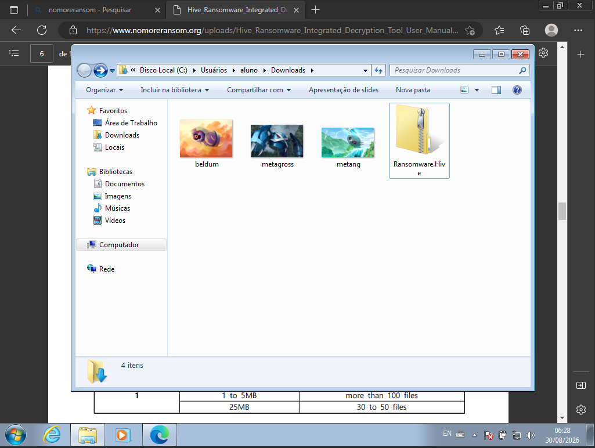
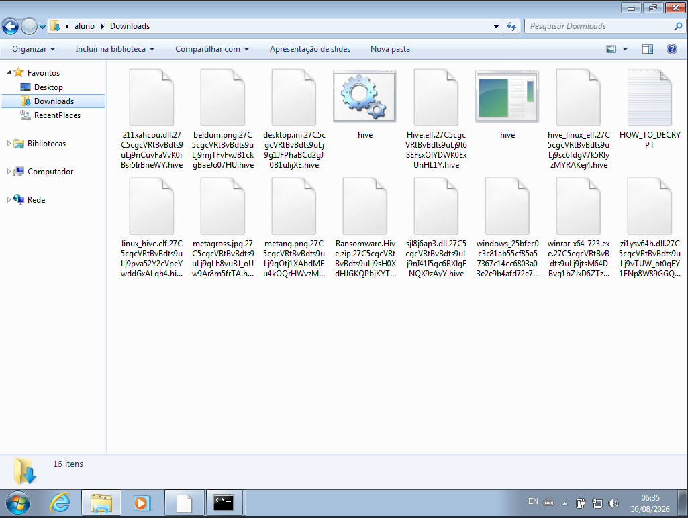
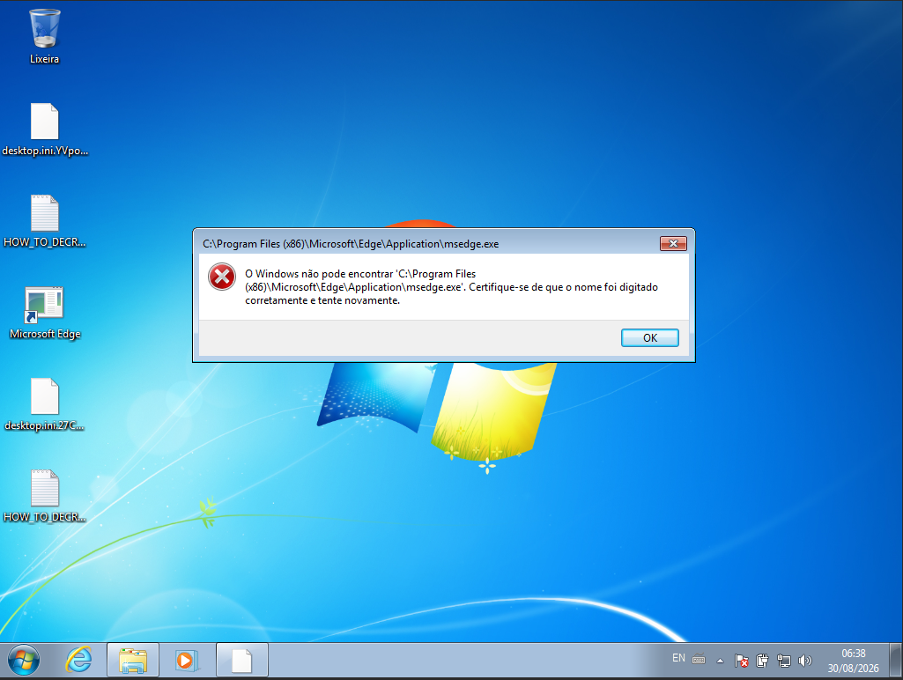
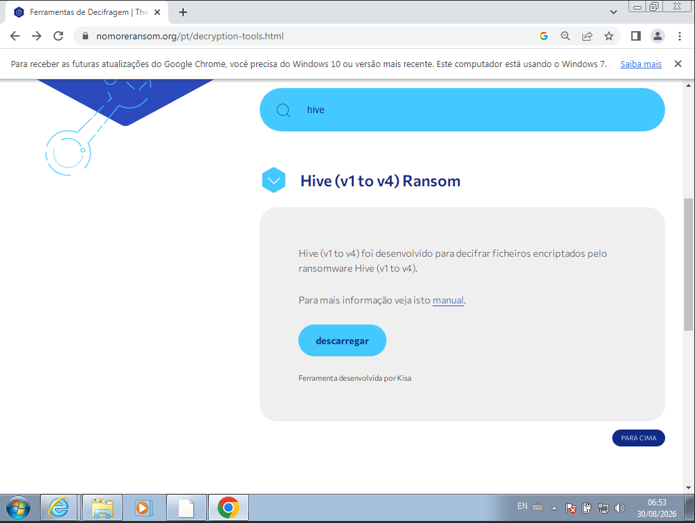
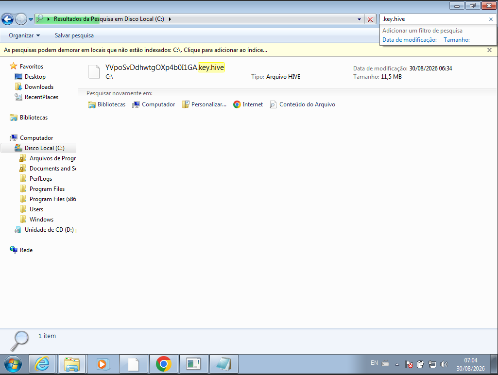
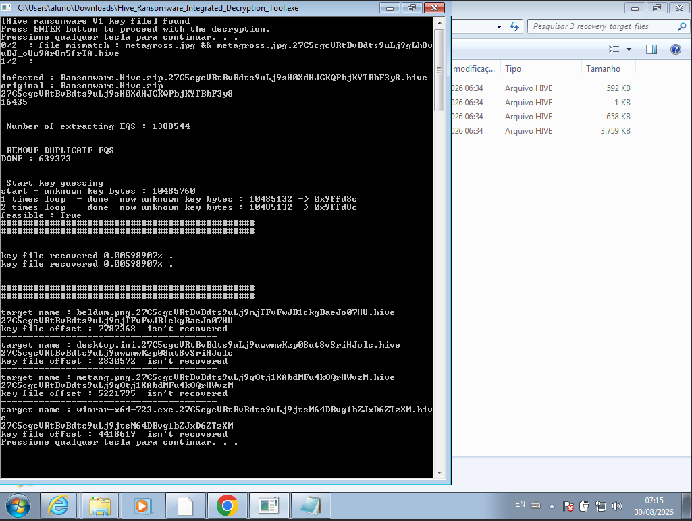
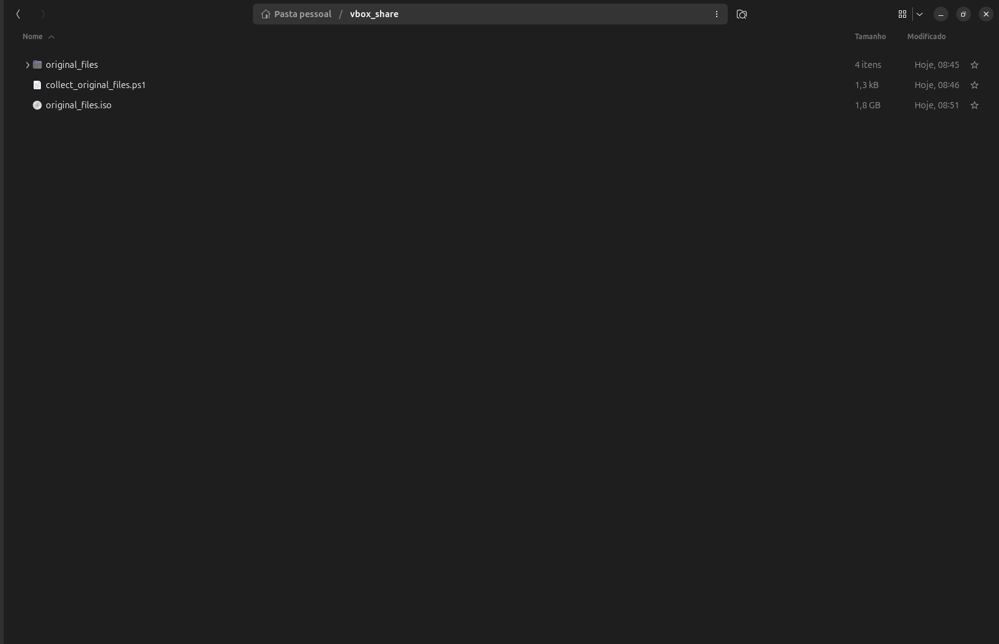
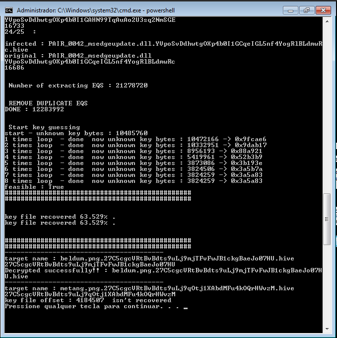

# Hive Ransomware V1

**English** | [Português (Brasil)](./CMDB-TR-005-HiveV1-Report-pt-BR.md)

> **Federal University of Pernambuco — UFPE** <br>
> **Center for Technology and Geosciences — CTG** <br>
> **Graduate Certificate Program in Offensive Security and Cyber Intelligence** <br>
> **Caatinga Malware DB (CMDB) · Academic technical report**

**Subtitle:** Dynamic analysis and experimental evaluation of the KISA integrated decryptor on Windows 7

**Romário J. O. Veloso¹**

¹ Undergraduate student in Electronic Engineering, Federal University of Pernambuco (UFPE), Recife — PE, Brazil.

**Author contribution:** laboratory planning and execution, evidence collection, development of auxiliary procedures, result analysis, and report writing.

> **Safety notice:** this document records an analysis already performed with real ransomware. It is not an execution guide. Any reproduction requires formal authorization, an isolated and disposable environment, controlled networking, and restoration capability.

This report follows the Caatinga Malware DB (CMDB) model, adapted from the FIRST Malware Analysis SIG's [*Cyber Malware Analysis Report Template v1*](https://www.first.org/global/sigs/malware/ma-framework/) (2021) and the UFPE/CTG editorial structure adopted by the project.

## Document control

| Field | Information |
|---|---|
| Identifier | `CMDB-TR-005` |
| Version | `0.1.0` |
| Publication date | `2026-08-30` (draft) |
| Editorial status | Draft |
| Location | Recife — PE, Brazil |

## Suggested citation

> VELOSO, Romário J. O. **Hive Ransomware V1: dynamic analysis and experimental evaluation of the KISA integrated decryptor on Windows 7**. Caatinga Malware DB (CMDB). Recife: UFPE/CTG, 2026. Technical report `CMDB-TR-005`, version 0.1.0. Available at: https://github.com/UFPE-Seguranca-Ofensiva/caatinga-malware-db/blob/main/docs/reports/hivev1/CMDB-TR-005-HiveV1-Report-EN.md. Accessed: 30 Aug. 2026.

## Version history

| Version | Date | Change description | Responsible person |
|---|---|---|---|
| 0.1.0 | 2026-08-30 | Initial version based on the laboratory evidence and notes. | Romário J. O. Veloso |

## Version sign-off

| Role | Name | Date | Validated version |
|---|---|---|---|
| Responsible author | Romário J. O. Veloso | 2026-08-30 | 0.1.0 |
| Technical reviewer | Pending | — | — |
| Advisor or responsible faculty member | Pending | — | — |
| CMDB editorial approval | Pending | — | — |

- **Versioned artifact:** `CMDB-TR-005-HiveV1-Report-EN.md`, version `0.1.0`.
- **Malicious package:** not included with this report.
- **Analyzed artifact:** Windows file identified by theZoo-published SHA-256 `25bfec0c3c81ab55cf85a57367c14cc6803a03e2e9b4afd72e7bbca9420fe7c5`.

## Table of contents

1. [Abstract](#1-abstract)
2. [Legal disclaimer](#2-legal-disclaimer)
3. [About the analyzed malware](#3-about-the-analyzed-malware)
4. [Activities performed](#4-activities-performed)
5. [Laboratory environment](#5-laboratory-environment)
6. [Dynamic analysis evidence](#6-dynamic-analysis-evidence)
7. [Conclusion](#7-conclusion)
8. [References](#8-references)

## 1. Abstract

This report documents an academic dynamic analysis of Hive Ransomware V1 in a Windows 7 virtual machine and a recovery attempt with the *Hive Ransomware Integrated Decryption Tool*, developed by the Korea Internet & Security Agency (KISA). Execution produced files carrying identifiers and the `.hive` extension, a `HOW_TO_DECRYPT` note, and unavailability of several files and applications in the observed environment. To obtain original/encrypted pairs, the experiment combined previously preserved files with components from a second, similar Windows 7 installation, transferred to the infected VM through an ISO that, according to the author, was mounted as read-only. Of 43 candidate pairs recorded by the author, 25 were accepted under the operational `feasible : True` criterion and 18 were rejected. The best run displayed 63.529% coverage of the key-table material. Although the tool reported success for one target, subsequent validation reported by the author did not find a valid PNG structure. The outcome is therefore classified as partial recovery of cryptographic material without confirmed intact recovery of the target file.

**Keywords:** Hive; ransomware; dynamic analysis; decryption; file recovery; KISA.

## 2. Legal disclaimer

This report is intended solely for teaching, research, and cyber defense. Names, hashes, and links are provided for identification, traceability, and incident response. No part of this document authorizes execution on third-party systems, propagation, control evasion, or non-consensual offensive use.

The sample remains dangerous even after the criminal group's infrastructure was disrupted. No malicious binary is included with this report. The ransom-note screenshot was also omitted because it exposed Tor addresses and case-specific credentials; its relevant content is summarized without reproducing those details.

## 3. About the analyzed malware

Hive was identified in June 2021 and operated under the *ransomware as a service* (RaaS) model, in which developers maintain the malware and affiliates conduct attacks. A joint CISA, FBI, and HHS advisory records corporate and critical-infrastructure targets, double-extortion mechanisms, and variants for Windows, Linux, VMware ESXi, and FreeBSD [1].

Documented intrusion chains included remote-access credentials, phishing, and exploitation of known vulnerabilities. This laboratory executed a sample directly in a VM and did not reproduce an intrusion chain. This study contains no evidence of exploitation of a zero-day vulnerability [1].

In January 2023, authorities in the United States, Germany, and the Netherlands seized servers and disrupted part of the infrastructure used by the group. That operation does not neutralize historical binaries, which remain capable of causing harm when executed [2].

### 3.1. Sample and traceability

The artifact was associated with theZoo's [`Ransomware.Hive`](https://github.com/ytisf/theZoo/tree/master/malware/Binaries/Ransomware.Hive) entry, as shown by its [SHA-256](https://github.com/ytisf/theZoo/blob/master/malware/Binaries/Ransomware.Hive/Ransomware.Hive.sha256) and [MD5](https://github.com/ytisf/theZoo/blob/master/malware/Binaries/Ransomware.Hive/Ransomware.Hive.md5) manifests [7].

The Windows artifact actually executed was recorded by the author as `windows_25bfec0c3c81ab55cf85a57367c14cc6803a03e2e9b4afd72e7bbca9420fe7c5`. The values below were checked against the manifests published by theZoo, but were not recalculated during this review because neither the package nor the artifact was available in this version's document set.

| Artifact in the source inventory | theZoo-published SHA-256 | Legacy MD5 | Scope in this experiment |
|---|---|---|---|
| `windows_25bfec0c3c81ab55cf85a57367c14cc6803a03e2e9b4afd72e7bbca9420fe7c5` | `25bfec0c3c81ab55cf85a57367c14cc6803a03e2e9b4afd72e7bbca9420fe7c5` | `DA13022097518D123A91A3958BE326DA` | Executed on Windows 7, according to the author's record |

MD5 is retained only for correlation with legacy databases; SHA-256 is the primary identifier. The source package contains other artifacts listed in its manifests, but they are not reproduced here because they were outside the documented analysis.

### 3.2. Recovery-method validation-set hashes

The paper describing the method later used by the decryptor lists five Hive samples in its Table 1 [6]. These are the SHA-256 values for which the research documents analysis and experimental validation of the method. They **are not an exclusive list of hashes accepted by the decryptor**: the tool identifies the version from the encrypted key file and states support for Hive V1–V4, subject to the limitations in its manual [4].

| SHA-256 reported in the paper [6] | Exact match in MalwareBazaar | Record metadata |
|---|---|---|
| `2f26ea19a8fdb167b8593e8eec03c37248b6e5008f0b9ee5fb7d326cbe6500bf` | Not located | — |
| `50ad0e6e9dc72d10579c20bb436f09eeaa7bfdbcb5747a2590af667823e85609` | Not located | Appears only as a similar sample in the `612e5f…` record [9] |
| `88f7544a29a2ceb175a135d9fa221cbfd3e8c71f32dd6b09399717f85ea9afd1` | [Located](https://bazaar.abuse.ch/sample/88f7544a29a2ceb175a135d9fa221cbfd3e8c71f32dd6b09399717f85ea9afd1/) [8] | `Hive` signature; executable; first seen 3 July 2021 |
| `612e5ffd09ca30ca9488d802594efb5d41c360f7a439df4ae09b14bce45575ec` | [Located](https://bazaar.abuse.ch/sample/612e5ffd09ca30ca9488d802594efb5d41c360f7a439df4ae09b14bce45575ec/) [9] | `Hive` signature; executable; first seen 30 July 2021 |
| `e1a7ddbf735d5c1cb9097d7614840c00e5c4d5107fa687c0ab2a2ec8948ef84e` | Not located | — |

In the query performed on **1 September 2026**, only two of the five values returned an exact-match public record in MalwareBazaar. The absence of a record for the remaining values means only that they were not located in that database on that date; it does not show that they are benign, nonexistent, or incompatible. The artifact executed in this experiment has a different SHA-256 (`25bfec0c…`) and must not be treated as identical to the paper's samples without binary comparison.

The `88f754…` record also links the unpacked artifact `2f7d37c22e6199d1496f307c676223dda999c136ece4f2748975169b4a48afe5` [8]. This value and the similarity relationship between `612e5f…` and `50ad0e…` are auxiliary database correlations, not additional exact matches among the five hashes or evidence of further decryptor compatibility.

## 4. Activities performed

- The correct Hive entry in theZoo and its checksum manifests were consulted.
- The author prepared three images as reference files and executed the Windows artifact in an authorized academic VM.
- File renaming, the ransom note, and access failures affecting files and applications were recorded.
- The KISA tool for Hive V1–V4, indexed by No More Ransom, was evaluated.
- Original/encrypted pairs were prepared from known files and from a second, similar Windows 7 installation.
- According to the author's record, a writable VM-to-host share was replaced with an ISO mounted as read-only media.
- Candidate pairs were evaluated incrementally and classified using the `feasible` state reported by the tool.
- The file produced after the success message was checked against the expected PNG structure.

| Sample field | Value |
|---|---|
| File name | `windows_25bfec0c3c81ab55cf85a57367c14cc6803a03e2e9b4afd72e7bbca9420fe7c5` |
| Analyzed object | Windows artifact extracted from `Ransomware.Hive.zip`, according to the author |
| Package protection | Protected ZIP; conventional password `infected`, according to the experiment record |
| Package SHA-256 | Not recorded — required before any future inclusion of the package |
| Artifact SHA-256 | `25bfec0c3c81ab55cf85a57367c14cc6803a03e2e9b4afd72e7bbca9420fe7c5`, published by theZoo and not recalculated in this review |
| Acquisition source | `ytisf/theZoo` |
| Source URL | [Ransomware.Hive](https://github.com/ytisf/theZoo/tree/master/malware/Binaries/Ransomware.Hive) |
| Acquisition date | Not recorded |
| Source identifier | Artifact name and SHA-256 |
| Validation source | theZoo [SHA-256 manifest](https://github.com/ytisf/theZoo/blob/master/malware/Binaries/Ransomware.Hive/Ransomware.Hive.sha256) [7] |
| Defensive references | KISA and No More Ransom [3–5] |
| Size and type | Not recorded |

> **Integrity pending:** before the package is ever published, its final ZIP SHA-256 and the SHA-256 of every extracted artifact must be calculated in the authorized environment. A filename or third-party hash does not replace this local verification.

## 5. Laboratory environment

| Item | Description |
|---|---|
| Authorization and responsible person | Academic activity reported by the author; responsible person: Romário J. O. Veloso |
| Infected system | Windows 7 virtual machine; edition, architecture, and patch level not recorded |
| Auxiliary clean system | Second Windows 7 VM named `win_7_clean` |
| Host and virtualization | Ubuntu host and VirtualBox; versions not recorded |
| Network | Web services were accessed; segmentation and egress filtering were not documented |
| Security controls | According to the author, Windows Defender and Windows Firewall were disabled before execution; historical condition, not a recommendation |
| Tools | WinRAR and Hive Ransomware Integrated Decryption Tool; versions not recorded |
| File transfer | VirtualBox share initially accessible; according to the author, later replaced with an ISO mounted as read-only media |
| Restoration | Snapshot or restoration image not documented |
| Analysis date | `2026-08-30`, according to the captures |

The state of **User Account Control (UAC)** was not recorded. UAC helps prevent unauthorized administrative changes by requesting consent or credentials when applicable; it is distinct from Windows Firewall and Windows Defender.

Disabling the controls reduced defensive realism and increased experiment risk. A VirtualBox shared folder was also found to be accessible from the infected VM. The supplied evidence is insufficient for a forensic claim that the host remained intact; changing to read-only media only reduced the exposure surface in subsequent stages. In future work, tools and clean files should be obtained and verified outside the infected VM and transferred through controlled media.

## 6. Dynamic analysis evidence

The eight figures below were selected from 27 captures. Repetitive, excessively operational, or Tor-address-and-credential-bearing images were excluded to preserve clarity and safety.

### 6.1. Preparation and observed effects

According to the author's record, three images were preserved before execution to support later comparison between originals and encrypted versions.

**Figure 1 — Reference files prepared before execution**



**Source:** Author's collection (2026).

After execution, the observed directory contained artifacts with appended identifiers and the `.hive` extension, as well as a `HOW_TO_DECRYPT` note.

**Figure 2 — Renamed artifacts and ransom note**



**Source:** Author's collection (2026).

The note claimed that data had been encrypted, demanded purchase of a decryptor, and threatened disclosure. Its capture was not published because it exposed case-specific access information. The author also observed unavailable files and applications. Figure 3 specifically shows that Windows could not find `msedge.exe` at the expected path; on its own, it does not establish whether the executable was encrypted, removed, or made inaccessible through another effect.

**Figure 3 — Observed application unavailability**



**Source:** Author's collection (2026).

This report does not claim that “all” data was encrypted: the evidence demonstrates broad impact in the observed environment but is not a complete system inventory.

### 6.2. Tool selection and required material

No More Ransom still indexes the Hive V1–V4 decryptor as a KISA tool [5].

**Figure 4 — Hive V1–V4 decryptor entry on No More Ransom**



**Source:** Reproduction of [No More Ransom's Portuguese-language page](https://www.nomoreransom.org/pt/decryption-tools.html); capture by the author (2026) [5].

The displayed `.key.hive` artifact is 11,801 KB (approximately 11.5 MiB), a size consistent with the KISA manual's approximate 10 MB description for Hive V1 [4].

**Figure 5 — Encrypted key file located in the laboratory**



**Source:** Author's collection (2026).

The decryptor organizes four input types [4]:

| Structure | Purpose |
|---|---|
| `0_Encrypted_keyfile` | Encrypted key file created during infection |
| `1_infected_files` | Encrypted files for which a corresponding original is available |
| `2_original_files` | Originals corresponding to the files in the preceding structure |
| `3_recovery_target_files` | Encrypted files selected for recovery |

Targets may differ from the known pairs. Each original must have the same name and file version as its encrypted counterpart, and both sets must contain the same number of files. Preserving paths was an additional heuristic in this experiment, not an official requirement of the tool [4]. The method stems from research by Kim et al. into a weakness in Hive's encryption and partial recovery of key-table material through known files [6].

### 6.3. Pair construction and validation

An image downloaded again from the Web had a different SHA-256 from the preserved copy. This establishes only that the two files were not byte-identical; the cause of the difference was not determined. A static ZIP was accepted under the `feasible` criterion but provided only 0.00598907% initial coverage.

**Figure 6 — Insufficient initial key-material coverage**



**Source:** Author's collection (2026).

To expand the known pairs, files from a second, similar Windows 7 installation were collected with their paths. A writable shared folder had been exposed to the infected VM; according to the author's record, the flow was corrected to pass through the Ubuntu host and an ISO mounted as read-only.

```text
Clean Windows 7 → Ubuntu host → read-only ISO → infected Windows 7
```

**Figure 7 — ISO created on the host for controlled transfer**



**Source:** Author's collection (2026).

The auxiliary procedure correlated files by path and found 43 candidate pairs. As each candidate was added, `feasible : True` was used as an operational acceptance criterion; `False` caused that candidate to be rejected from subsequent runs.

The related reusable procedures are separated into the [synthetic-data guide](../../guides/synthetic-reference-data/CMDB-GD-001-Synthetic-Reference-Data-Guide-EN.md), [ISO media guide](../../guides/iso-media/CMDB-GD-004-ISO-Data-Media-Guide-EN.md), [SHA-256 validation guide](../../guides/sha256-validation/CMDB-GD-002-SHA256-Recovery-Validation-Guide-EN.md), and [Windows 7 security-controls guide](../../guides/windows-7-security-controls/CMDB-GD-003-Windows-7-Security-Controls-Lab-Guide-EN.md).

| Local outcome | Count | Proportion |
|---|---:|---:|
| Candidates | 43 | 100% |
| Accepted as `GOOD` | 25 | 58.14% |
| Rejected as `BAD` | 18 | 41.86% |

These labels indicate consistency for that run, not proven binary identity or universal pair validity. A matching name and path do not guarantee identical content across installations. The totals of 43, 25, and 18 pairs were taken from the author's notes; the complete classification logs are not included with this report.

### 6.4. Outcome and independent verification

The best run displayed 63.529% coverage of the key-table material. This percentage is not the fraction of files recovered: each target may depend on specific regions that remain unavailable.

**Figure 8 — Best recorded coverage and tool status**



**Source:** Author's collection (2026).

The decryptor displayed `Decrypted successfully!!` for the `beldum` target. Subsequent inspection reported by the author, however, found that the initial bytes did not match the expected PNG signature (`89 50 4E 47 0D 0A 1A 0A`), and the file was not validated as an intact image. Neither the produced file nor a record of that check accompanies the report, so this finding remains a reported result rather than an independent reproduction. Another target remained without the required offset. The tool message is therefore a processing status, not sufficient proof of recovery.

The manual warns that 100% recovery is difficult and provides indicative ranges for Hive V1 [4]:

| Known volume stated in the manual | Indicative file count |
|---|---:|
| Up to 50 KB | 500–1,000 |
| Between 1 and 5 MB | More than 100 |
| Approximately 25 MB | 30–50 |

The 25 accepted matches in this experiment do not support an expectation of complete recovery. Duration and coverage also vary with the number, size, and non-redundant contribution of the pairs. The auxiliary procedures used here were created for the experiment and are not part of the official tool. The results are limited to the Hive V1 instance identified in this experiment; the tool's stated V1–V4 support must not be generalized to later variants.

## 7. Conclusion

The experiment recorded effects consistent with Hive Ransomware V1 and experimentally demonstrated the KISA decryptor's dependence on correct original/encrypted pairs. According to the procedure recorded by the author, a second, similar VM and an ISO mounted as read-only expanded the set without leaving a writable folder exposed to the infected VM.

According to the author's notes, of 43 candidates, 25 remained consistent under the tool's operational criterion. The best run displayed 63.529% coverage of the key-table material, but no target file had intact recovery confirmed. The final classification is **partial recovery of cryptographic material without confirmed intact recovery of the test file**.

In a real incident, priorities should be device isolation, evidence preservation, trusted-environment eradication, and restoration from verified backups. A decryptor does not replace those measures. Any subsequent attempt should preserve hashes for originals, encrypted files, tools, and outputs; results should be validated by signature, opening, and, when a known original exists, SHA-256 comparison.

## 8. References

1. CYBERSECURITY AND INFRASTRUCTURE SECURITY AGENCY; FEDERAL BUREAU OF INVESTIGATION; DEPARTMENT OF HEALTH AND HUMAN SERVICES. **#StopRansomware: Hive Ransomware**. Cybersecurity Advisory AA22-321A, 2022. Available at: https://www.cisa.gov/sites/default/files/publications/aa22-321a_joint_csa_stopransomware_hive.pdf. Accessed: 30 Aug. 2026.
2. UNITED STATES DEPARTMENT OF JUSTICE. **U.S. Department of Justice Disrupts Hive Ransomware Variant**. 26 Jan. 2023. Available at: https://www.justice.gov/archives/opa/pr/us-department-justice-disrupts-hive-ransomware-variant. Accessed: 30 Aug. 2026.
3. KOREA INTERNET & SECURITY AGENCY. **KISA and Kookmin University DF&C Laboratory Develop and Distribute an Integrated Hive Recovery Tool**. 28 June 2022. In Korean. Available at: https://www.krcert.or.kr/kr/bbs/view.do?bbsId=B0000127&menuNo=205021&nttId=66789. Accessed: 30 Aug. 2026.
4. KOREA INTERNET & SECURITY AGENCY. **Ransomware Integrated Decryption Tool User Manual: Hive Version 1 to Version 4**. June 2022. Available at: [KISA manual](https://www.nomoreransom.org/uploads/Hive_Ransomware_Integrated_Decryption_Tool_User_Manual%28ENG%29.pdf). Accessed: 30 Aug. 2026.
5. NO MORE RANSOM. **Decryption tools: Hive (v1 to v4) Ransom**. Available at: https://www.nomoreransom.org/en/decryption-tools.html. Accessed: 30 Aug. 2026.
6. KIM, Giyoon; KIM, Soram; KANG, Soojin; KIM, Jongsung. **A Method for Decrypting Data Infected with Hive Ransomware**. *Journal of Information Security and Applications*, vol. 71, art. 103387, 2022. DOI: https://doi.org/10.1016/j.jisa.2022.103387.
7. YTISF. **theZoo: Ransomware.Hive**. GitHub. Available at: [directory](https://github.com/ytisf/theZoo/tree/master/malware/Binaries/Ransomware.Hive), [SHA-256 manifest](https://github.com/ytisf/theZoo/blob/master/malware/Binaries/Ransomware.Hive/Ransomware.Hive.sha256), and [MD5 manifest](https://github.com/ytisf/theZoo/blob/master/malware/Binaries/Ransomware.Hive/Ransomware.Hive.md5). Accessed: 30 Aug. 2026.
8. MALWAREBAZAAR. **Hive sample: SHA-256 88f7544a29a2ceb175a135d9fa221cbfd3e8c71f32dd6b09399717f85ea9afd1**. abuse.ch. Available at: https://bazaar.abuse.ch/sample/88f7544a29a2ceb175a135d9fa221cbfd3e8c71f32dd6b09399717f85ea9afd1/. Accessed: 1 Sept. 2026.
9. MALWAREBAZAAR. **Hive sample: SHA-256 612e5ffd09ca30ca9488d802594efb5d41c360f7a439df4ae09b14bce45575ec**. abuse.ch. Available at: https://bazaar.abuse.ch/sample/612e5ffd09ca30ca9488d802594efb5d41c360f7a439df4ae09b14bce45575ec/. Accessed: 1 Sept. 2026.
